# _**Boiler CTF**_


## _**Enumeração**_
Primeiro, vamos começar com um scan <mark>Nmap</mark>  
O primeiro, para descobrir portas, o segundo, portas adicionais, e o terceiro, versões e softwares  
> ```bash
> nmap [ip_address]
> nmap -p- -sS -T5 [ip_address]
> nmap -p [ports_discovered] -A [ip_address]
> ```
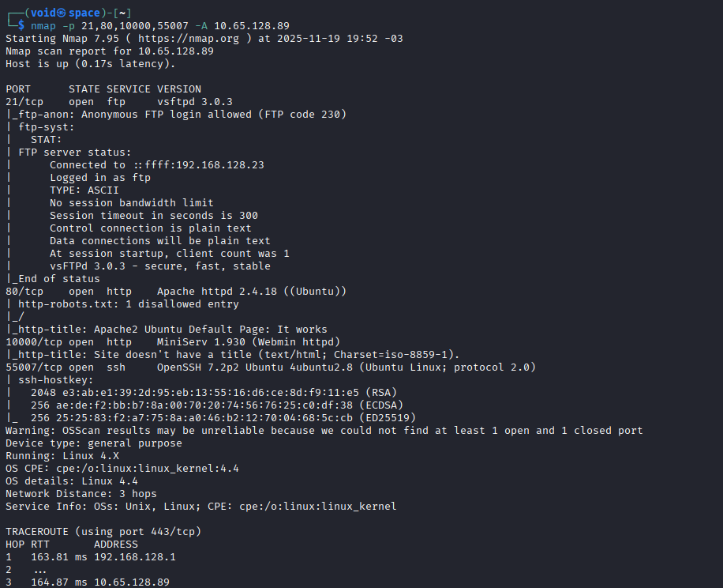

Temos alguns serviços descobertos
* FTP, com login anônimo disponível
* Website, na porta 80, com _robots.txt_, disponível
* MiniServ
* SSH na porta 55007

Vamos realizar login no serviço **FTP** e verificar por arquivos  
Um arquivo foi encontrado: **.info.txt**  
Lendo, temos a seguinte string: _Whfg jnagrq gb frr vs lbh svaq vg. Yby. Erzrzore: Rahzrengvba vf gur xrl!_  
Parece ser **cifra de césar**  
Tentando decifrar, temos o seguinte  

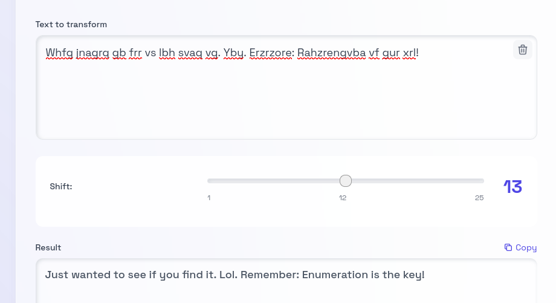

Visitando o website, temos apenas a página inicial do Apache  
Seguindo para a porta do _MiniServ_, temos uma página de login  

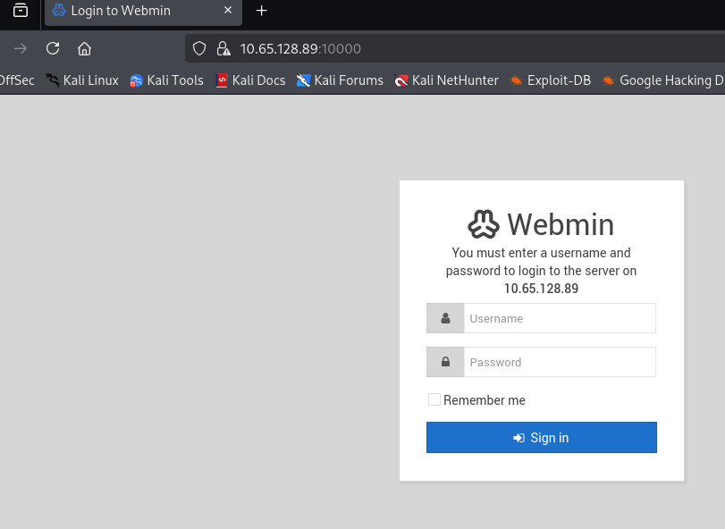

Procurando por vulnerabilidades com <mark>searchsploit</mark>, temos diversos  
Mas nenhum é possível com o atual estado que temos  
Vamos voltar e visitar o diretório _/robots.txt_ que foi apontado pelo Nmap anteriormente na porta 80  
Temos resultado  

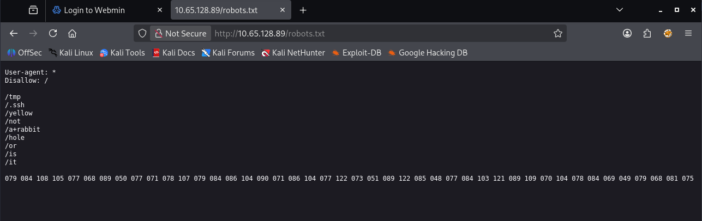

Diversos diretórios e uma longa string de números  
Escrito, ```not a+rabbit role or is it```  
Primeiro, a string  
Pedindo para o **Gemini** decodificar, temos o seguinte  

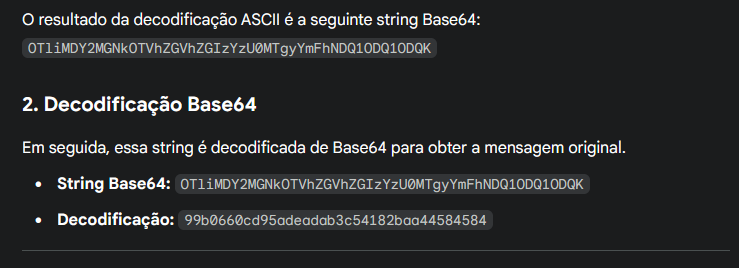

Parece ser MD5  
Decodificando, temos a palavra _kidding_  
Vamos para os diretórios agora  
Nenhum dos diretórios parece ser possível de acessar neste endereço  
Vamos tentar um scan de diretórios com <mark>Gobuster</mark>
> ```bash
> gobuster dir --url http://[ip_address]/ -w ../seclists/Discovery/Web-Content/common.txt
> ```
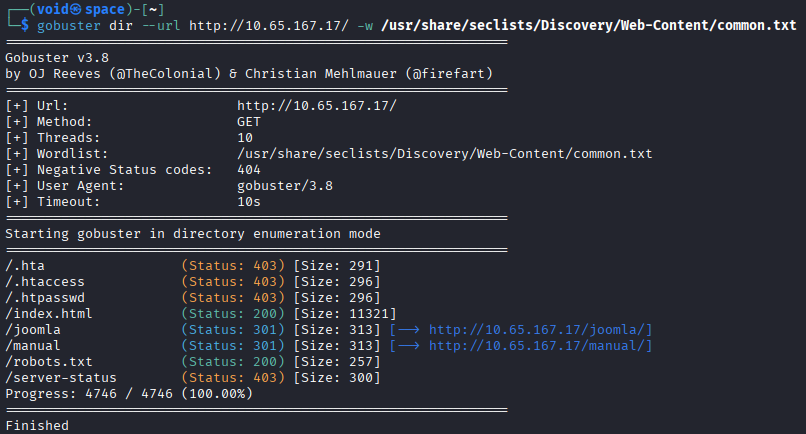

Temos alguns resultados interessantes  
Sabemos que, em _robots.txt_, não iremos encontrar nada  
Em _manual_, encontramos a versão do servidor e seu próprio manual  
Em _joomla_, encontramos uma página explicando sobre a sala a primeira vista  
Nosso **CMS** é então, _joomla_  
Vamos continuar enumerando com <mark>Gobuster</mark>
> ```bash
> gobuster dir --url http://[ip_address]/joomla -w ../seclists/Discovery/Web-Content/common.txt
> ```
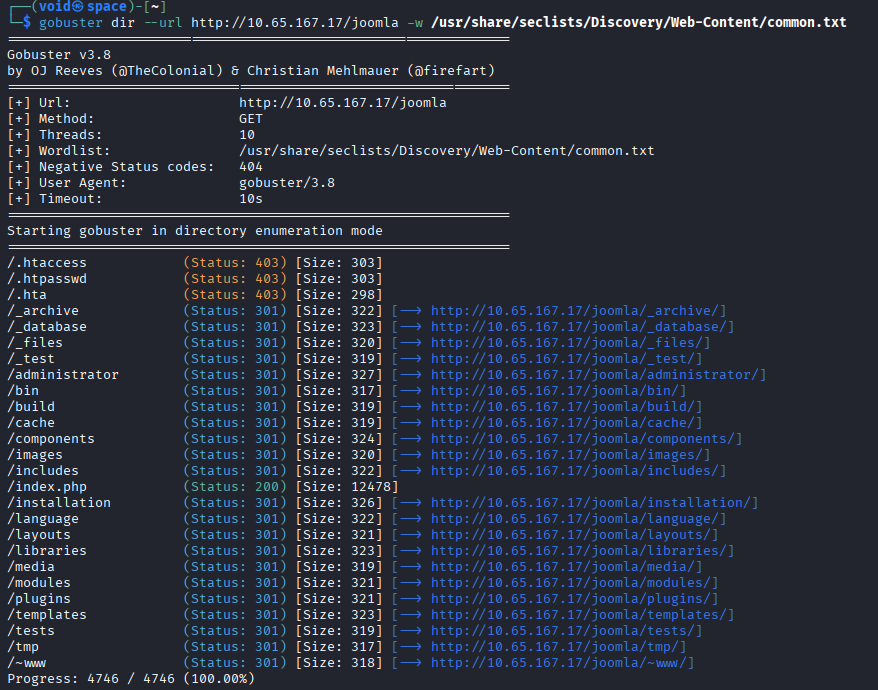

Nestes novos diretórios descobertos, os primeiros, até _administrator_, são apenas para distração aparentemente  
Em _administrator_, temos uma página de login do CMS  
Investigando por um tempo, não foi possível obter nenhum resultado conclusivo  
Voltando para um diretório que chama a atenção, _/_test_ e vasculhando, é possível notar que, a URL muda conforme clicamos em **OS**  

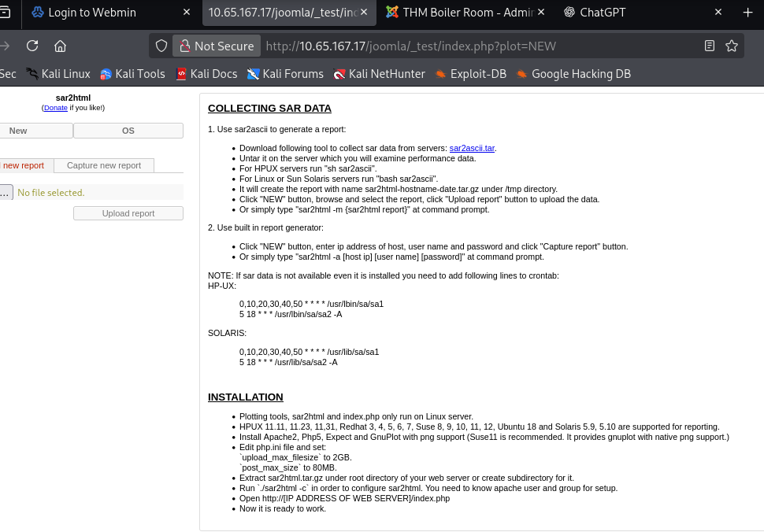

Parece que temos um vetor de ataque para _code injection_  
Tentamos o seguinte ```<script>alert('xss');</script>  
E temos confirmação de que o site é vulnerável a **XSS**  

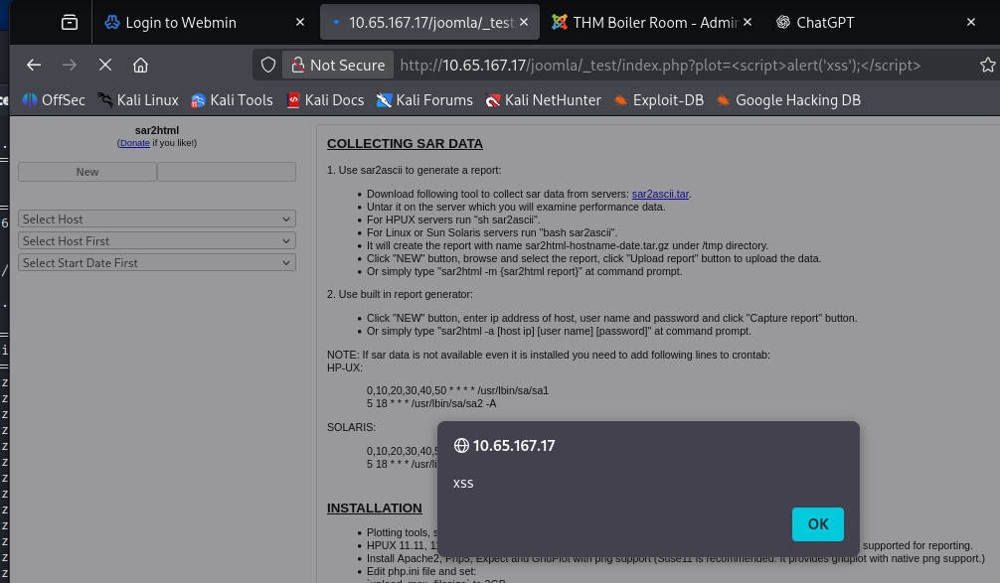

Podemos tentar outros métodos como **LFI** e **Code Injection**  
Tentando o seguinte comando, ```|ls -la;```, conseguimos ter retorno no site  

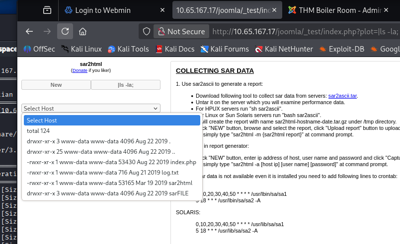

Temos alguns arquivos  
Vamos tentar o seguinte:
*  primeiro, confirmamos se podemos executar códigos em _python_ através da URL
*  segundo, criamos um _payload_ para obtermos uma shell reversa

Não parece ter efeito  
Vamos tentar ler algum dos arquivos que descobrimos  
Lendo, temos o que parece ser a senha de usuário para login via **SSH**  

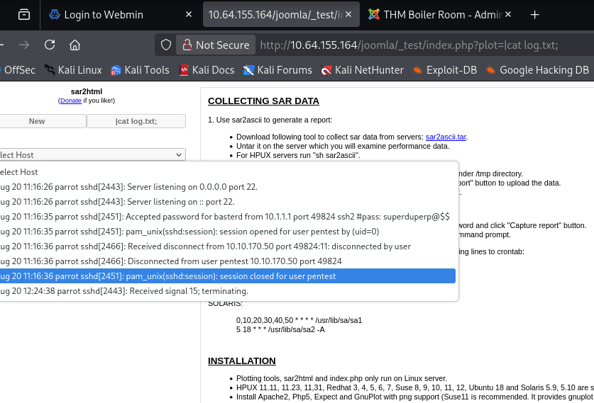

Vamos tentar  
Conseguimos!  

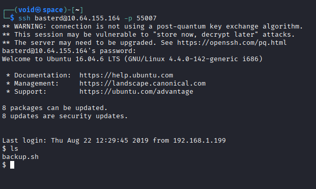

De primeira, temos um arquivo _backup.sh_  
Lendo, um usuário e uma senha  
Vamos novamente tentar login via SSH  
E conseguimos  

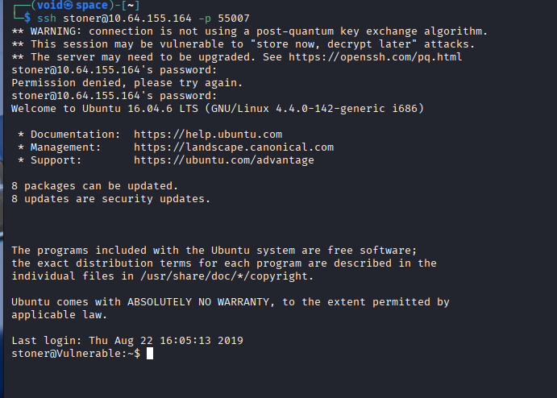

## _**Escalando privilégios**_
Primeiro, verificamos algumas informações e tentamos ```sudo -l``` para escalarmos privilegios  

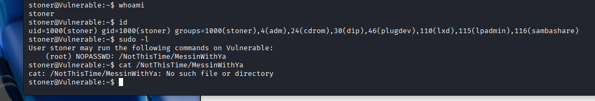

Mais uma informação do qual não é útil  
Continuando com outros comandos  
Primeiro, ```find / -perm -u=s -type f 2>/dev/null```  
Algo chama a atenção no retorno, o comando _find_  
Verificando em GFTOBins, podemos executar o comando abaixo para ganhar acesso _root_  
> ```bash
> /usr/bin/find . -exec /bin/sh -p \; -quit
> ```
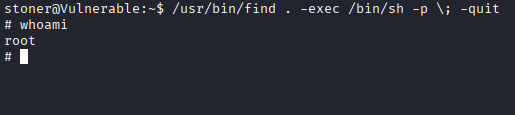

Agora, ir atrás das flags!
