# _**CTF Collection Volume 2**_

## _**Write-up**_
Primeiro, vamos começar com um scan de rede com a ferramneta <mark>Nmap</mark>
> ```bash
> nmap -p- -sS -T4 [ip_address]
> nmap -p [ports_discovered] -A [ip_address]
> ```
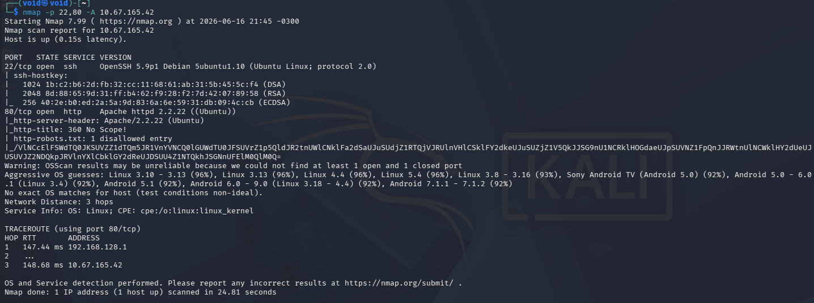

Temos um website apenas  
Vamos tentar utilizar uma 'nova ferramentra' para buscar por vulnerabilidades e mais informações: <mark>Nikto</mark>
> ```bash
> nikto -h http://[ip_address]
> ```
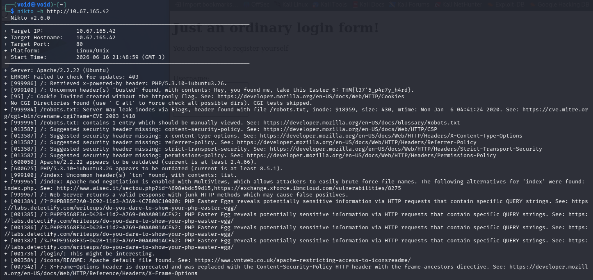

Vamos utilizar a ferramenta <mark>Gobuster</mark> para buscar por diretórios escondidos no website
> ```bash
> gobuster dir --url http://[ip_address] -w ../seclists/Discovery/Web-Content/big.txt
> ```
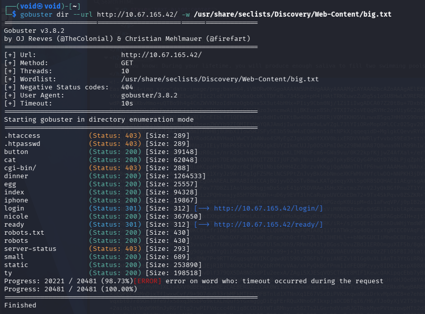

Vamos agora, começar pela busca das flags iniciais  
Primeiro, vamos verificar com as ferramentas de desenvolvedor, a página inicial  
Encontramos uma flag!  
Basta utilizar _cyberchef_ para descriptografar a string em base64  
Esta é a flag 14  

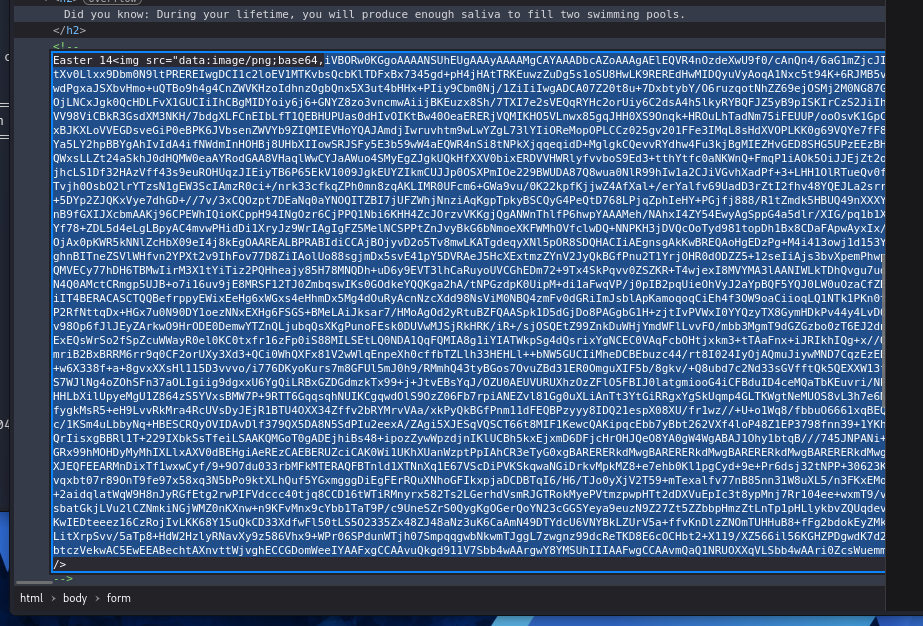

Vasculhando ainda mais, encontramos uma string no _Debugger_  
Utilizando cyberchef, deciframos para obter a flag 12  

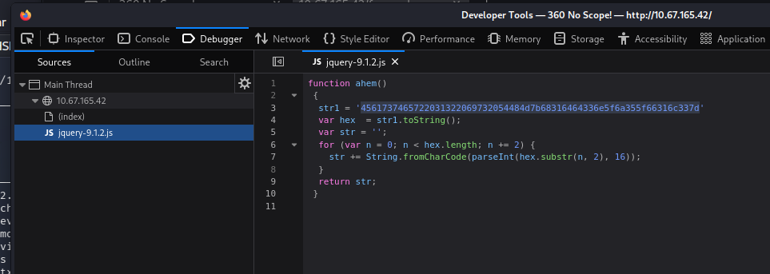

Também encontramos credenciais: _username:DesKel, password:heIsDumb_  
Cliando no botão para destruir o mundo, encontramos a flag 13!  

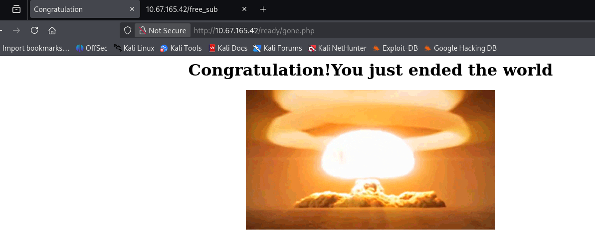

Com a ferramenta de desenvolvedor, ao clicarmos no botão vermelho, é possível ver que a flag 9 está na requisição _pós clique_  
Basta utilizar a ferramenta <mark>BurpSuite</mark> para capturar o pacote e a flag!  

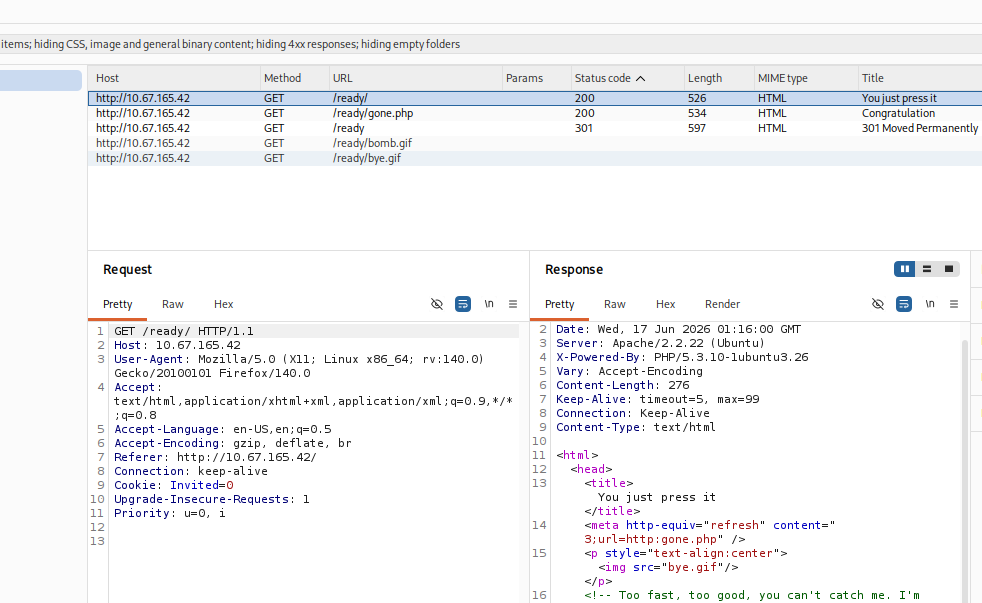

Seguindo, temos links para _jogo1_ e _jogo2_  
Cada um tem um desafio. Iremos voltar para eles mais pra frente  
Como o resultado de scan de página web, vamos verificar elas  
Em _robots.txt_, temos uma string em _base64_ e abaixo, outra string, provavelmente em _hex_  
A string em _base64_ não nos levou a nada, mas deve ter algo escondido  
Quanto a string em _hex_, nos levou a primeira flag!  

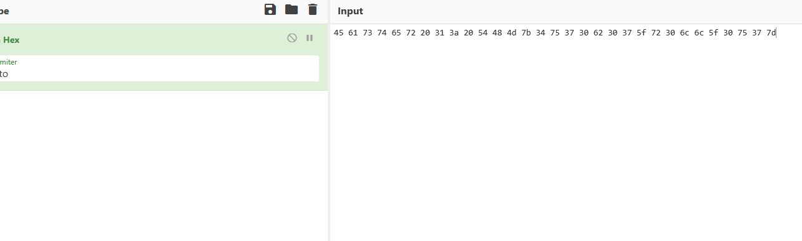

Acessando os outros diretórios, encontramos mais uma flag, a 19!  

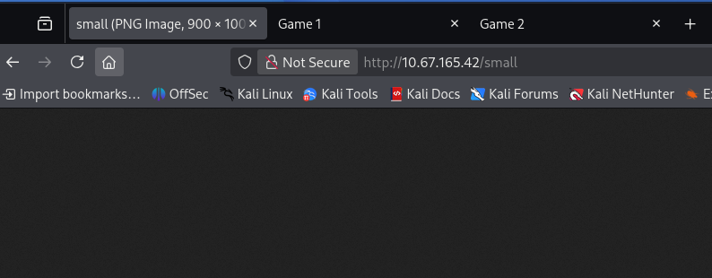

Verificando a página de login, temos uma nova flag ao verificar o código da página  

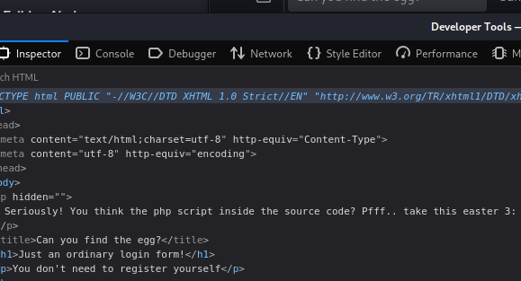

Vamos tentar utilizar as credenciais previamente encontradas para tentativa de login  
Sem sucesso com nome e senha  
Voltando ao resultado do scan _nikto_, temos uma flag logo de cara, a flag 6  
Agora, para o jogo 1, temos uma string que não conseguimos decodificar  
Porém, ao digitar letras, elas são transformadas em números, e algumas, correspondem aos números abaixo  

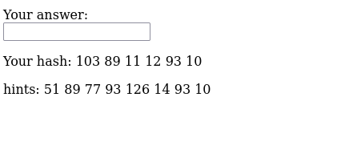

Após tentar letra por letra, incluindo maiúsculas, encontramos a chave  
Inserindo, conseguimos obter a flga 15!  

Para o segundo jogo, é preciso pressionar os 3 botões ao mesmo tempo  
Vamos capturar uma resposta ao clicar apenas em um botão com o Burp  
Alterando a requisição com o **Repeater**, conseguimos obter a flag 16!  


Voltando a página inicial, temos os botões de menu  
Investigando, ele nos da a dica de que prefere _ovos_  
Embora não esteja no menu, podemos capturar um pacote com Burp e alterar a requisição para enviarmos _egg_  
E assim, obtemos uma nova flag!  

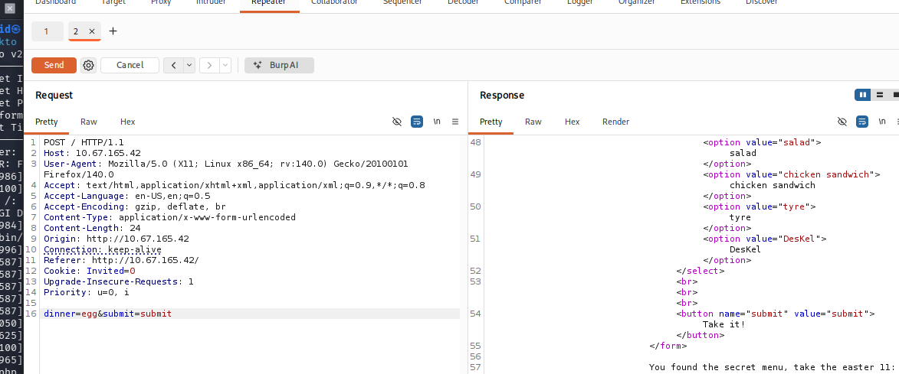

Sem precisar comprar um iPhone, alteramos o modo de visualização nas ferramentas de desenvolvedor para **modo responsivo**  
Então, colocamos o _User agent_ indicado e pressionamos F5 para obter a flag 8!  

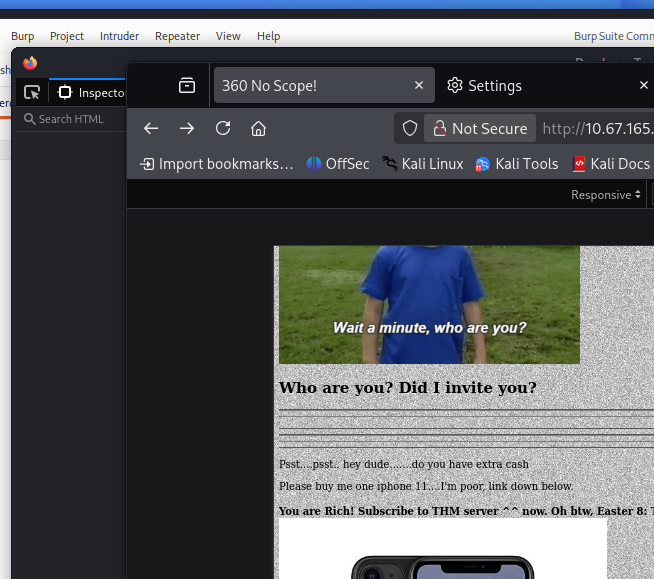

Daquela _string em base64_ do arquivo _robots.txt_, temos o que parece ser uma flag, mas é um diretório web  
Acessando, encontramos a flag com as ferramentas de desenvolvedor  

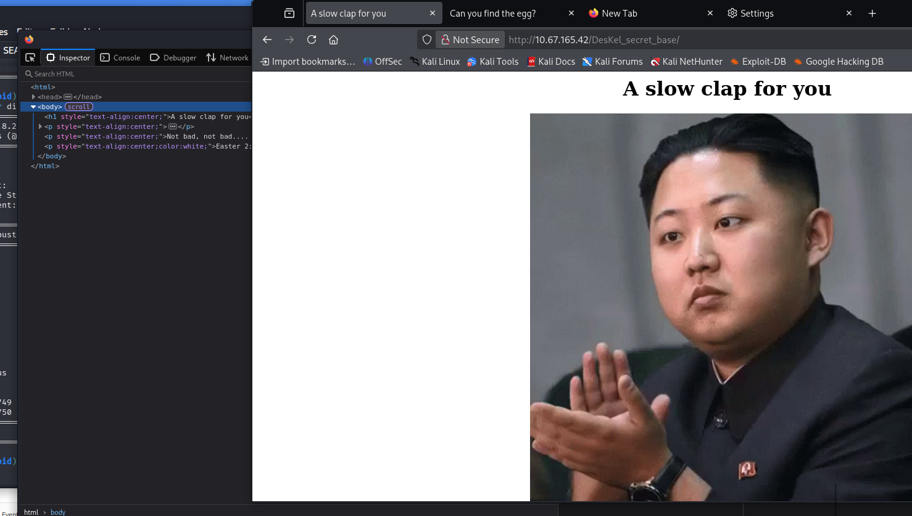

Anteriormente, esta mesma string, estava tentando como senha para o usuário DesKel, mas nada  
Inspecionando o código da página, encontramos a flag 3!  

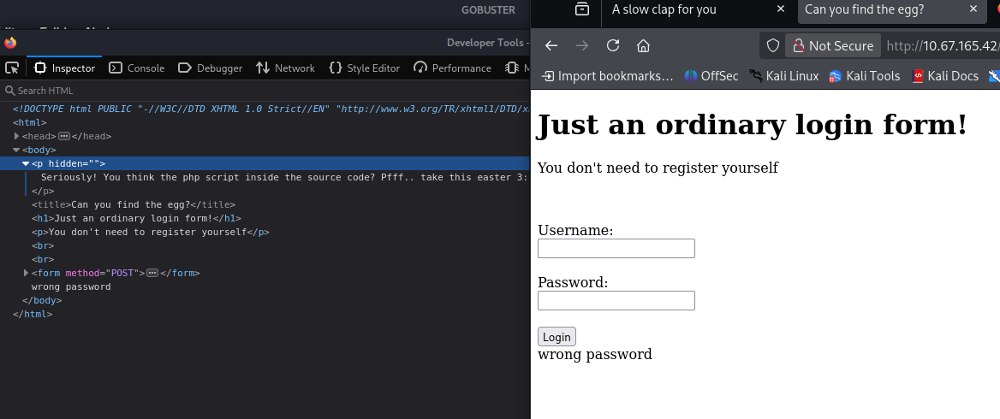

Aquela gigante string binária, decodificada é uma flag, mas para isso, é preciso adicionar um 0 no início  

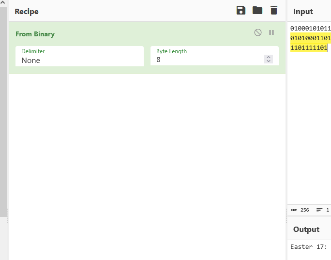

A página de login deve ter algo a mais escondido  
Por dica, vamos tentar SQLi com o comando abaixo
> ```bash
> sqlmap -u "http://[ip_address]/login/" --data="username=admin&password=admin" --technique=T --level=5 --risk=3 --time-sec=2 --batch --dump
> ```
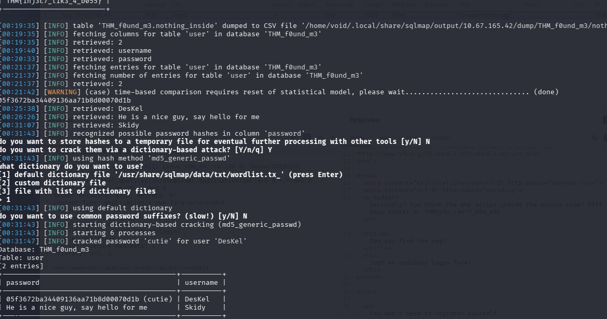

Conseguimos encontrar a flag 4, senha para DesKel, usuário Skidy e um banner!  
Realizando login, conseguimos obter a flag 5!  
Para a flag 10, temos que executar o comando ```curl -s --referer "tryhackme.com" http://[ip_address]/free_sub/``` para obtê-la  
Para a flag 7, executamos o comando ```curl -s --cookie "Invited=1" http://[ip_address]/ | grep "easter 7"``` para obtê-la  
Para a flag 11, executamos o comando ```curl -s -d "dinner=egg" -X POST http://[ip_address]/ | grep menu -B 1``` para obtê-la  
Para a flag 18, executamos o comando ```curl -s -H "egg: Yes" http://[ip_address]/  | grep -i "Easter 18"``` para obtê-la  
Para a flag 20, executamos o comando ```curl -s -d "username=DesKel&password=heIsDumb" -X POST http://[ip_address]/ | grep -A1 "easter 20"``` para obtê-la  


