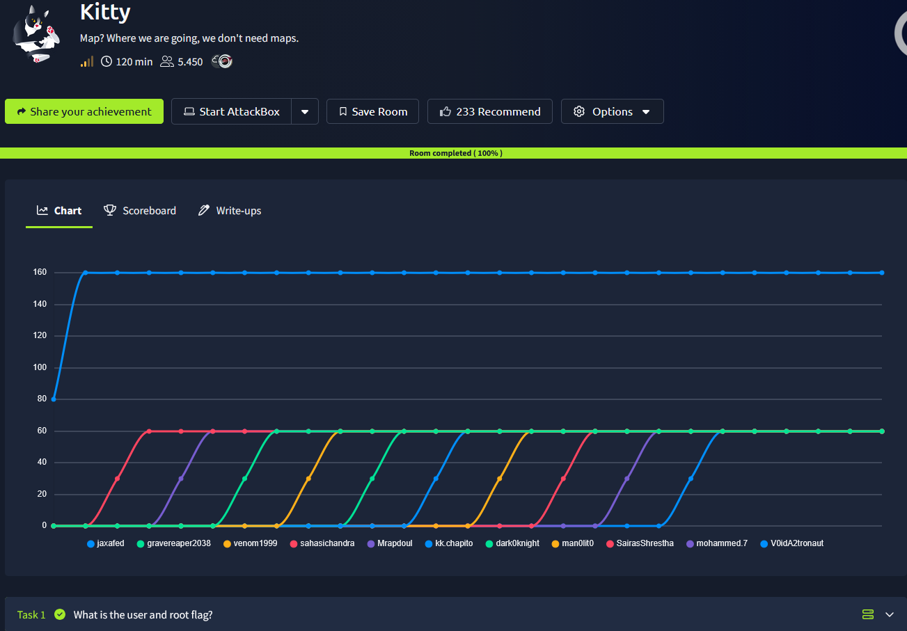
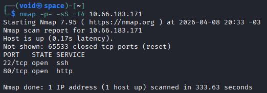
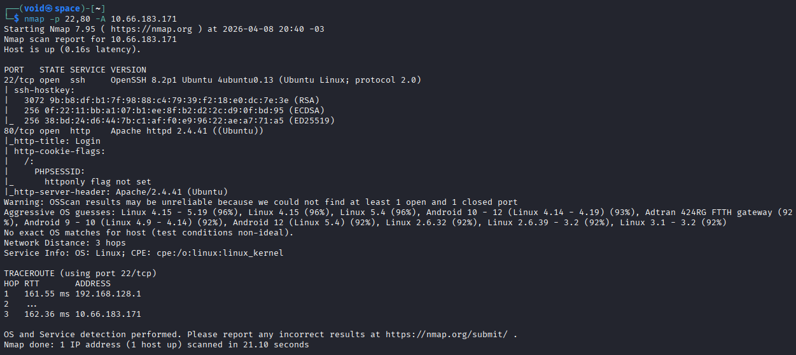
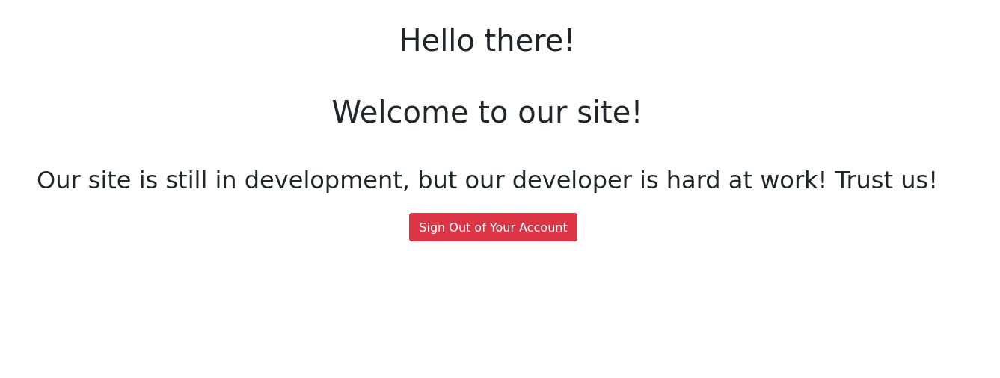
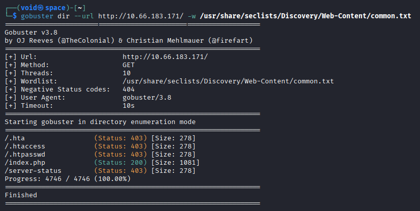
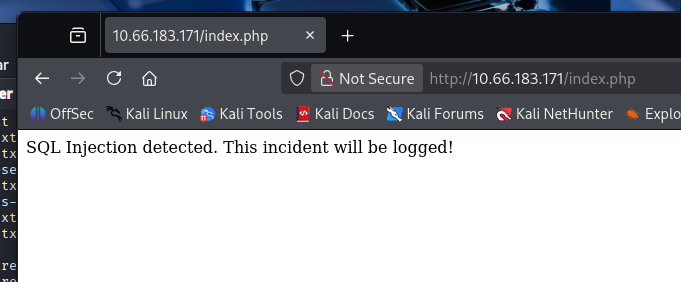
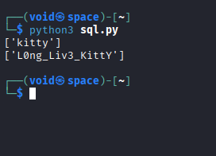
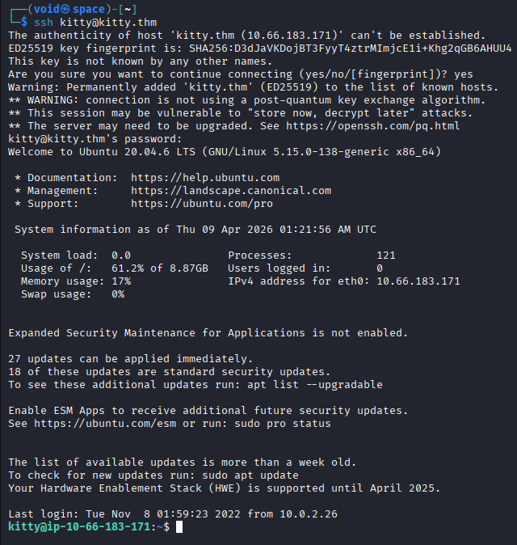
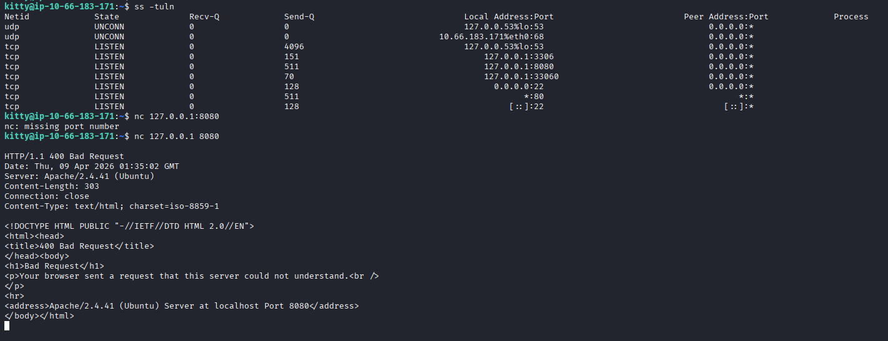
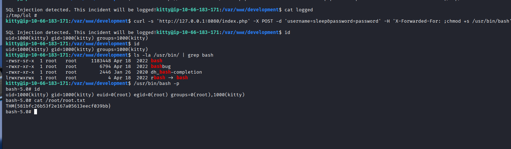

#_**Kitty CTF**_


## _**Enumeração**_
Primeiro, vamos escanear a rede com a ferramenta <mark>Nmap</mark>
> ```bash
> nmap -p- -sS -T4 [ip_address]
> nmap -p [ports_discovered] -sV [ip_address]
> ```




Parece que temos 2 serviços ativos  
* SSH na porta 22
* HTTP  na porta 80

Vamos visitar o website  
Logo que acessamos, temos uma página de login  
Ao tentarmos criar uma conta, foi possível com: <mark>user</mark>:teste e <mark>passwd</mark>:teste123  
Realizando login com as credenciais, somos levados a página inicial  

  

Tentando diferentes credenciais como _admin:admin_, não conseguimos realizar login  
Para continuar, vamos utilizar a ferramenta <mark>Gobuster</mark> para encontrar diretórios escondidos  

> ```bash
> gobuster dir --url [site_url] -w [path_to_wordlist]
> ```


Parece que não encontramos nada  
Vamos continuar procurando e quem sabe realizando novos testes para encontrar diretórios escondidos  
Com a página de login, podemos tentar um <mark>SQL Injection</mark>  



Temos uma resposta  
Podemos tentar realizar uma verificação de caracteres para SQLI com nosso usuário criado  
Obtemos login com a _string_: **' AND 1=1 -- -**  
É possível então, que caracteres como **", ' e -** não estejam sendo filtrados  
Isso torna o aplicativo vulnerável, já que esses caracteres podem ser usados ​​em ataques de injeção de SQL  
Vamos tentar obter _DB_Credential_ ou, as credenciais do banco de dados vulnerável  
Como esse ataque é muito trabalhoso, [procuramos um script online](https://jaxafed.github.io/posts/tryhackme-kitty/)  
O script verifica cada caractere imprimível e compara os tamanhos das respostas, que mudam com um login bem-sucedido  
Se um caractere estiver no conjunto, ele é adicionado e o trabalho continua com ele  



Podemos tentar login tanto no site, quanto via SSH  



Vamos explorar o usuário para encontrar brechas ou vulnerabilidades  
Encontramos uma porta no estado **LISTENING** em _localhost/127.0.0.1_  
Tentando se conectar com ```netcat```, temos uma resposta HTTP  



Investigando mais a fundo, encontramos o arquivo de configuração do site em: _/var/www/development/index.php_  
Verificando o arquivo, é constado que, ao encontrar uma _SQLI_, o seu conteúdo é enviado para a variável **$IP** e depois para _/var/www/development/logged_  

Executando <mark>Linpeas</mark> na máquina-alvo, podemos encontrar um arquivo fora do comum: _logchecker.sh_  
Procurando pelo arquivo e lendo ele, vemos que ele é responsável por limpar **logged**  
Como é possível controlar o que é escrito em _/var/www/development/logged_, podemos controlar o parâmetro **$IP**  
Vamos executar nosso _SQL injection_ contendo nosso _payload_  
> ```bash
> curl -s 'http://127.0.0.1:8080/index.php' -X POST -d 'username=sleep&password=password' -H 'X-Forwarded-For: ;chmod +s /usr/bin/bash '
> ```

Após, vamos executar os comandos abaixo para confirmar a execução do payload e obtermos _root_  
> ```bash
> ls -la /usr/bin | grep bash
> /usr/bin/bash -p
> ```

