# _**Nax CTF**_
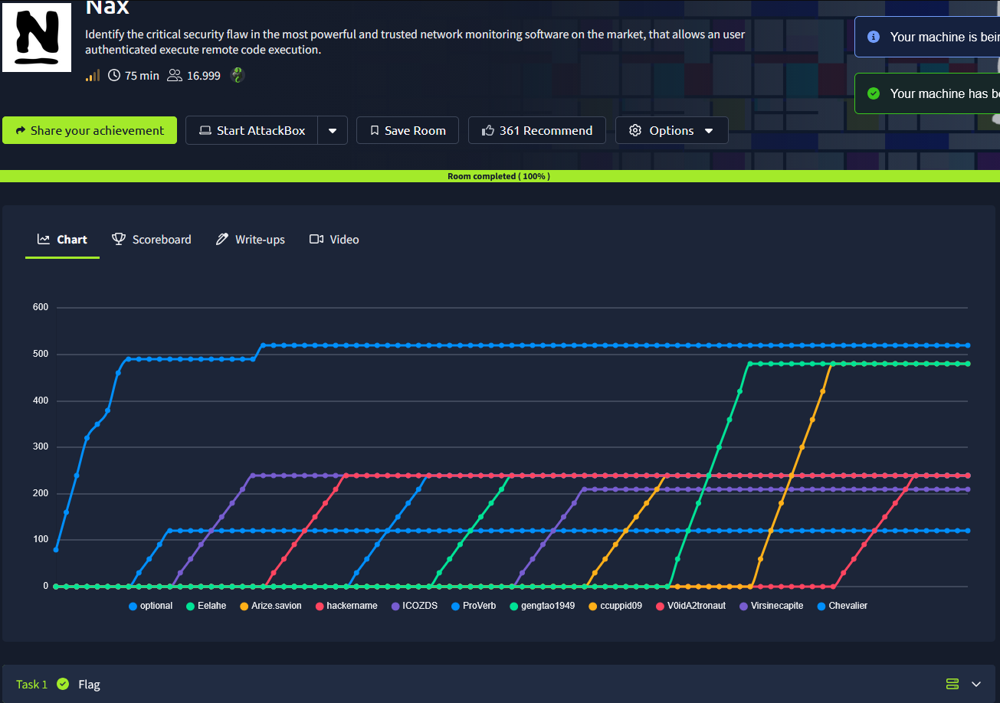

## _**Enumeração**_
Primeiro, vamos começar com um scan de rede com <mark>Nmap</mark>
> ```bash
> nmap -p- -T3 [ip_address]
> nmap -p [ports_discovered] -sV -O [ip_address]
> ```
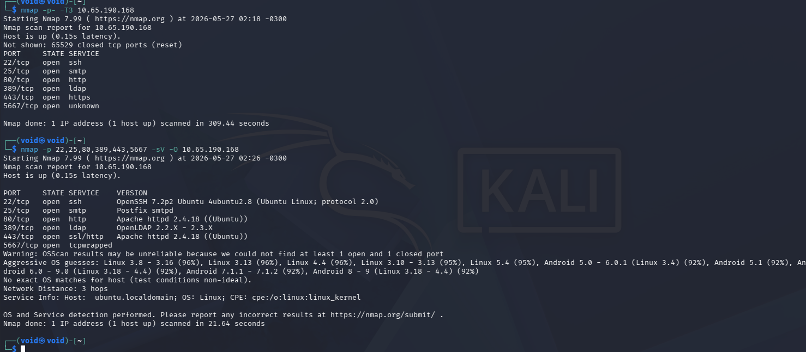

Parece que temos alguns serviços:
* http
* https
* ldap
* smtp

Vamos, primeiro investigar as versões dos serviços **LDAP** e **SMTP**  
Com a ferramenta <mark>searchsploit</mark>, encontramos um DoS para LDAP e um _Remote Code Injection_ para SMTP  
Não temos como determinar a versão do SMTP, então ignoramos  

Para o segundo passo, vamos investigar os websites  
Tanto para a porta 80, quanto a porta 443, temos a imagem abaixo

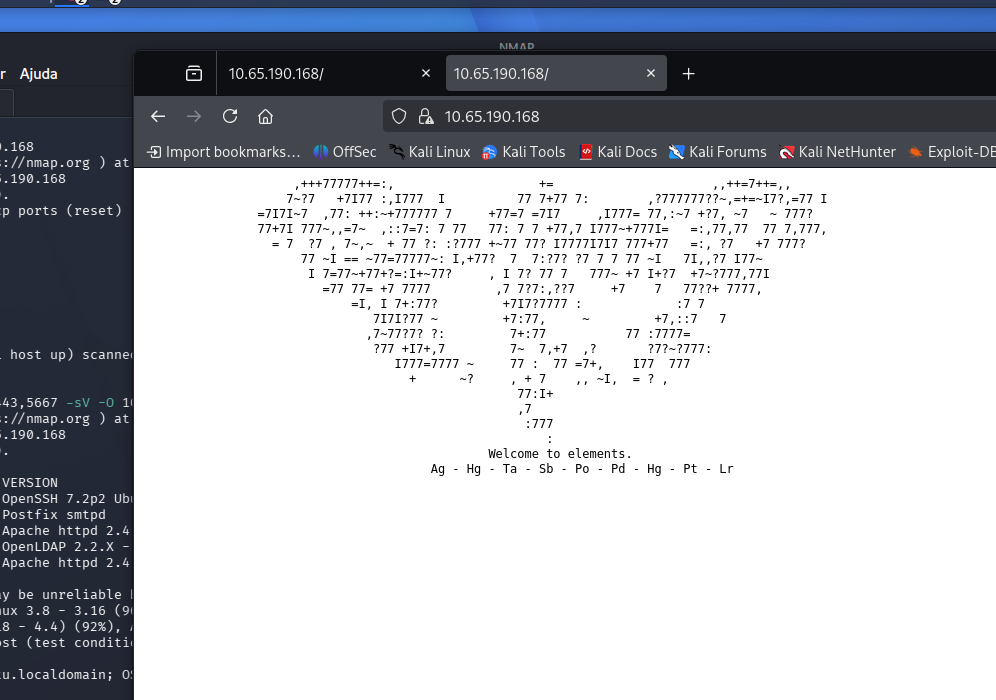

Parece que temos uma linguagem ou código e os símbolos dos elementos abaixo  
Talves sejam importantes:
* prata | nº atômico = 47
* mercúrio | nº atômico = 80
* tântalo | nº atômico = 73
* antimônio | nº atômico = 51
* polônio | nº atômico = 84
* paládio | nº atômico = 46
* mercúrio | nº atômico = 80
* platina | nº atômico = 78
* laurêncio | nº atômico = 103  

Voltando, vamos tentar uma enumeração aprofundada do serviço **SMTP**  
Utilizando **Telnet**, conseguimos conexão no serviço com: ```Telnet [ip_address] 25```  
Pesquisando sobre, encontramos que, com <mark>smtp-user-enum</mark>, podemos tentar identificar usuários
> ```bash
> smtp-user-enum -M VRFY -U [userlist_name].txt -t [target_ip_address].com
> ```


Encontramos 2:
* root
* mysql

Tentando com a ferramenta <mark>Metasploit</mark>, temos o resultado abaixo

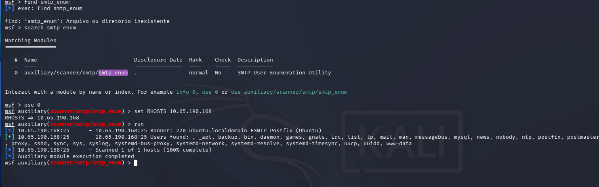

Podem ser úteis para depois  
Vamos tentar procurar por diretórios no website via <mark>Gobuster</mark>
> ```bash
> gobuster dir --url [ip_address]:[port] -w ../seclists/../Web-Services/common.txt
> ```
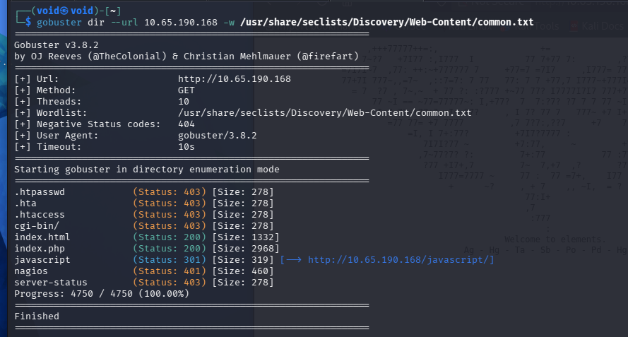

Verificando por mais pistas no website, temos um comentáiro: **/nagiosxi**  
Podemos tentar acessar também  

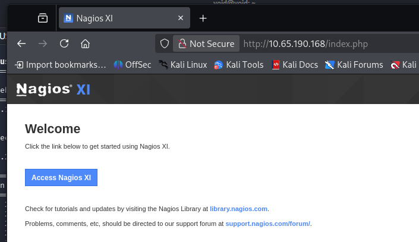

Acessando **/nagiosxi**, temos uma página de loing


Vamos utilizar novamente a ferramenta <mark>Gobuster</mark> para enumerar diretórios no website  
> ```bash
> gobuster dir --url [ip_address]/nagiosxi/ -w ../seclists/../Web-Content/common.txt
> ```
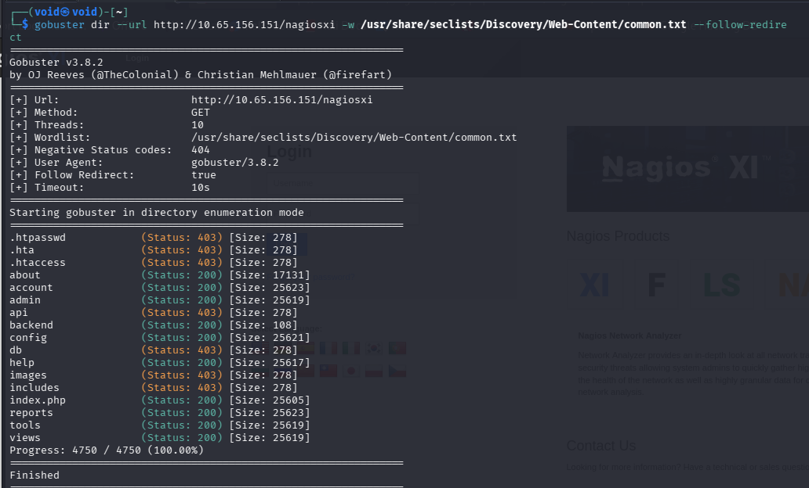

A URL que mais chama atenção: _/login.php?redirect=/nagiosxi/index.php%3f&noauth=1_  
Pesquisando mais sobre **Nagios XI**, encontramos que, uma das credenciais _default_ é:
* usuário: nagiosadmin

Vamos tentar um **brute force** com <mark>BurpSuite</mark> com este nome de usuário  
O sistema deu crash antes mesmo de completar a lista  
Vamos voltar para o que parece ser a dica inicial, os valores dos elementos  
Inserindo cada um junto no <mark>CyberChef</mark>, nada  
Separando um por um temos  

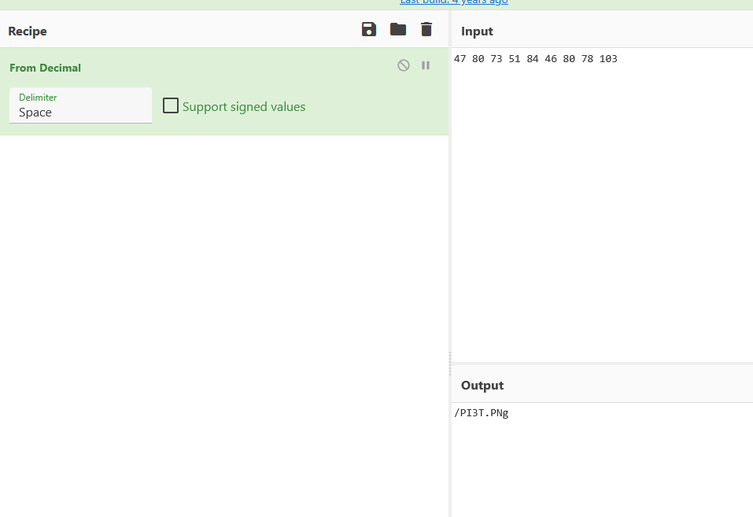

Parece que temos um diretório escondido  
Vamos realizar o _download_ da imagem e procurar por pistas  
Com <mark>Strings</mark>, conseguimos encontrar o nome do dono do arquivo  
Pesquisando o seu nome, encontramos o seguinte:  


Um pioneiro na arte abstrata  
Pesquisando mais sobre Piet no contexto de CTFs, temos:

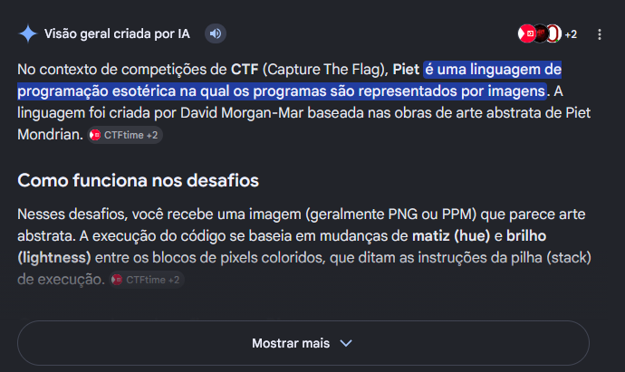

Procurando por ferramentas online sobre como escrever na linguagem ou como traduzir para texto legível, encontramos um website específico  
Realizamos _upload_ para convertemos e temos erro  
[Outra ferramenta:](https://github.com/PhilippRados/pint), encontrada no GitHub  
Realizamos o _download_ como instruido, passamos o necessário para PATH e executamos  
Temos resultado  

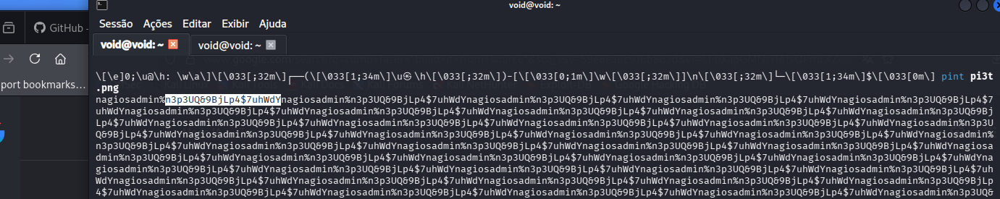

Encontramos credenciais, vamos tentar realizar login  
Confirmado a de usuário: **nagiosadmin**  
Temos login!  

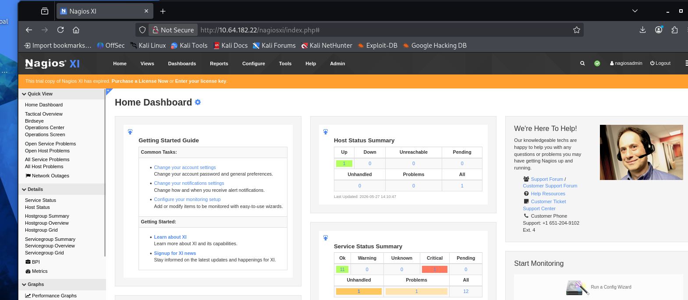

Procurando pela versão do Nagios e exploits no google, temos a seguinte CVE  

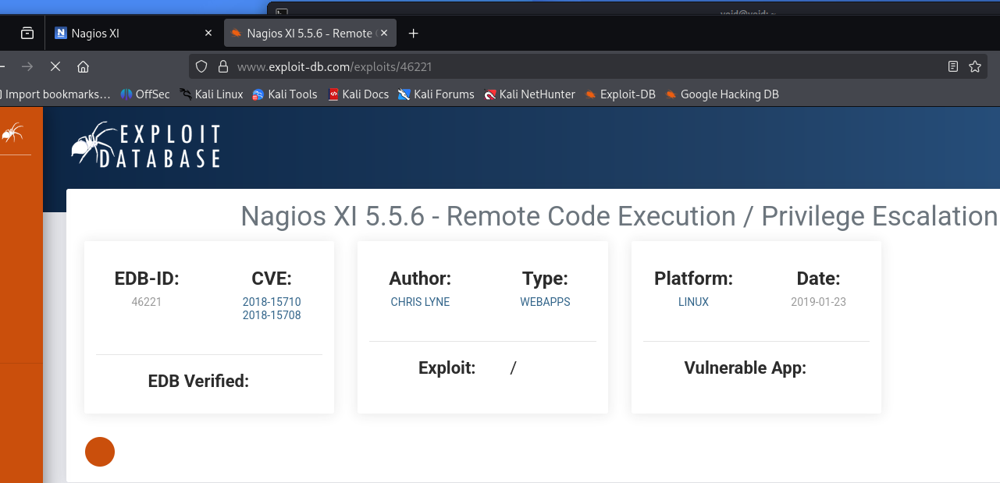

Como o CTF indica para utilizarmos a ferramenta <mark>Metasploit</mark>, procuramos por um _exploit_, selecionamos e alteramos o necessáiro  

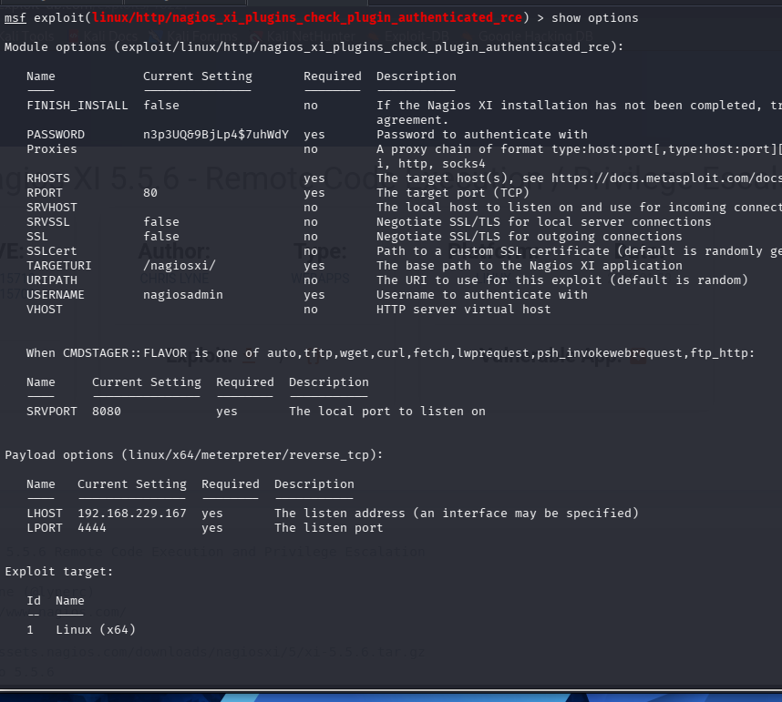

Basta digitar _shell_ e temos acesso _root_
