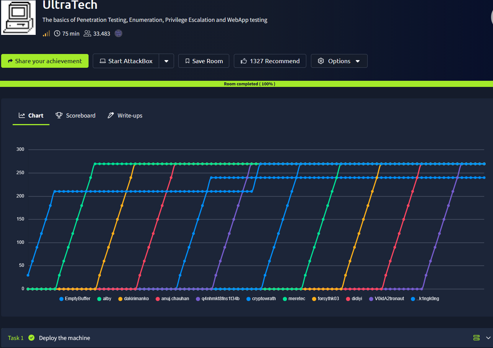
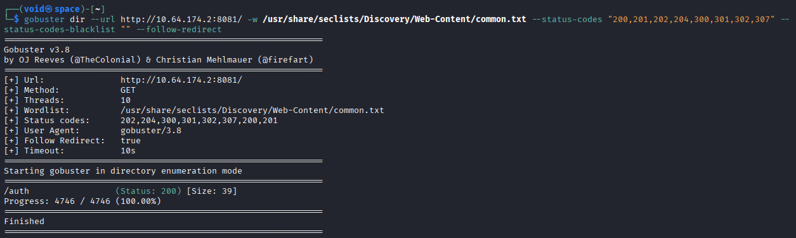
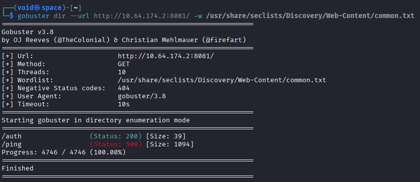
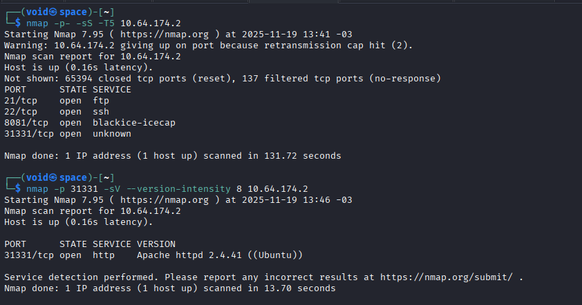
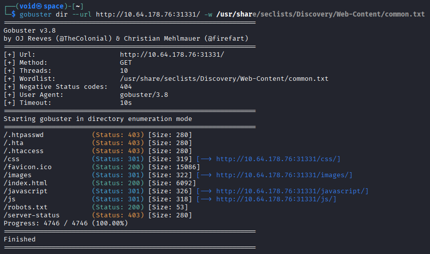
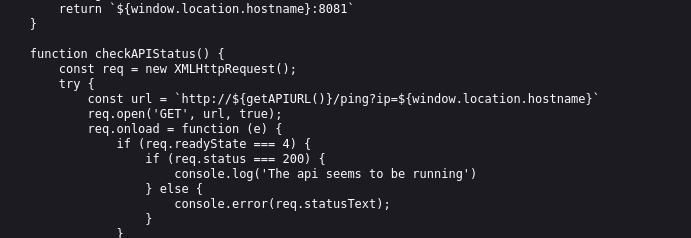
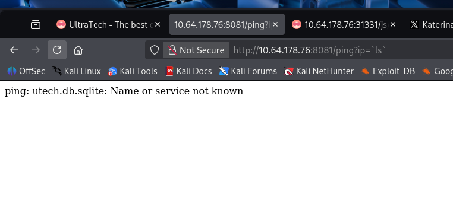
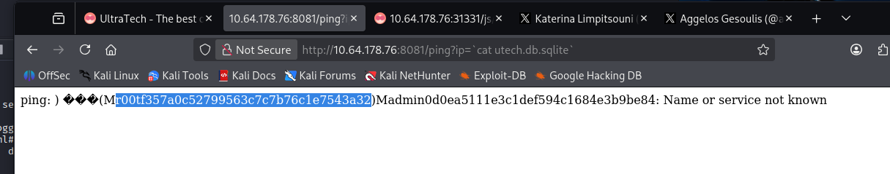
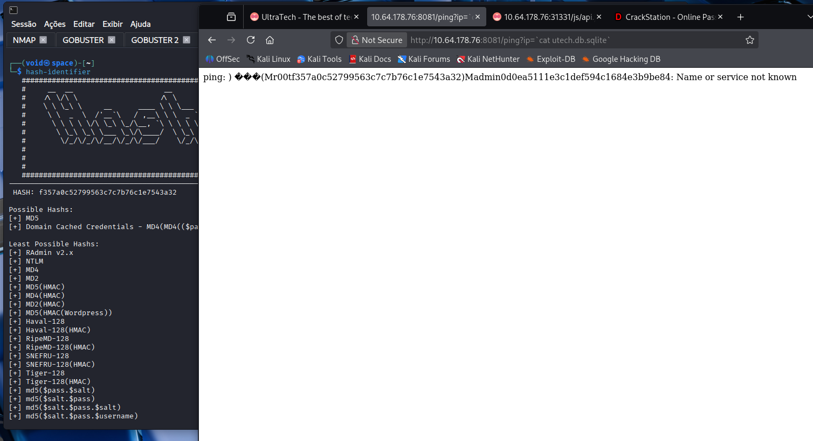
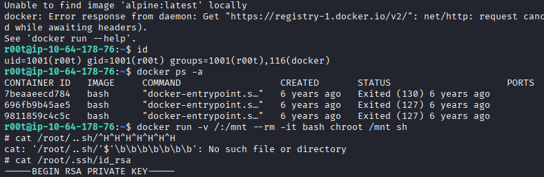

# _**UltraTech CTF**_


## _**Enumeração**_
Primeiro, vamos começar com um scan de redes com <mark>Nmap</mark>
> ```bash
> nmap [ip_address]
> nmap -p [ports_discovered] -sV -O [ip_address]
> ```


Temos 3 serviços:
* **FTP**
* **SSH**
* **WEBSITE**

Vamos tentar realizar login via **FTP** como _anonymous_ e nenhuma senha  
> ```bash
> ftp [ip_address]
> ```
Sem sucesso  
Vamos partir para o _website_  

Pesquisando sobre o que encontramos no scan de redes: <mark>Node.js Express framework</mark>, sabemos que  
* é uma ferramenta popular para criar aplicações web com Node.js,
* simplifica tarefas comuns como gerenciamento de rotas, requisições HTTP e respostas
* facilita a integração com outros componentes

O que nos leva a crer, ter outro serviço em outra porta
Seguindo, nossa investigação vai para as ferramentas de desenvolvedor com F12  
Nada de útil em primeira vista    
Vamos tentar buscar por diretórios escondidos com <mark>Gobuster</mark>
> ```bash
> gobuster dir --url http://[ip_address]:8081/ -w ../seclists/Discovery/Web-Content/common.txt --status-codes "200,201,202,204,300,301,302,307" --status-codes-blacklist "" --follow-redirect
> gobuster dir --url http://[ip_address]:8081/ -w ../seclists/Discovery/Web-Content/common.txt
> ```
  



Temos dois diretórios  
Ao tentar acessar um deles, requer autenticação com usuário e senha  
O outro, código 500, temos alguns textos de erro do próprio serviço  
Vamos continuar nossa enumeração com <mark>Nmap</mark> e ver se existem outras portas abertas
> ```bash
> nmap -p- -sS -T5 [ip_address]
> nmap -p 31331 -sV [ip_address]
> ```


Parece que temos uma outra porta para uma conexão a um website  
Por termos este novo website, vamos realizar um scan com **Gobuster** novamente, enquanto investigamos o restante  
> ```bash
> gobuster dir --url http://[ip_address]:31331/ -w ../seclists/Discovery/WebContent/common.txt
> ```


Temos diversos diretórios descobertos desta vez  
Além destes, outros 2 que nos levam para contas no _twitter_  
* https://x.com/ninalimpi --> provavelmente alguma informação
* https://x.com/anges244 --> nenhuma informação

Começando com os diretórios descobertos e que nos retornaram código 200, temos algo interessante em _robots.txt_  
Um novo diretório: _**/utech_sitemap.txt**_  
Neste novo diretório, três novos:
* **index.html**
* **what.html**
* **partners.html**

Em _partners.html_, temos uma página de login  


Voltando aos diretórios descobertos, acessamos _/js_ e encontramos 3 arquivos  
Um deles tem informações muito relevantes  



Parece ser para realizar ```ping```  
Vamos tentar _loopback_ e ver o que retorna  
Sucesso no retorno  
Aqui, podemos tentar realizar uma requisição diferente, como, ```http://[ip_address]:8081/ping?ip=`ls` ```  
Também temos retorno, mas um pouco diferente  



Por se tratar de um arquivo, e sabemos que, temos injeção de comandos via URL, podemos executar o seguinte: ```http://[ip_address]:8081/ping?ip=`cat utech.db.sqlite`  
Temos uma hash!  



Utilizando <mark>Hash-Identifier</mark> e removendo a parte _r00t_, conseguimos saber que é **MD5**  



## _**Ganhando acesso**_
Agora, podemos tentar realizar login em alguns serviços, como o website, SSH ou FTP  
Temos login tanto no site, SSH e FTP  

## _**Escalando privilégios**_
Vamos executar alguns comandos como ```find / -perm -u=s -type f 2>/dev/null``` para encontrar algum binário que podemos explorar  
Nada  
Verificamos quem somos, _root_, mas não conseguimos acessar **id_rsa**  
Uma informação chama a atenção  
Estamos dentro de um _docker_  
Para escalarmos privilégios, vamos utilizar **GFTOBins**  
Tentando o comando que nos foi dado, ```docker run -v /:/mnt --rm -it alpine chroot /mnt sh```, encontramos um erro  
Verificando algumas informações com ```docker ps -a```, constatamos que ao invés de _alpine_, é _bash_  
Alterando o comando para: ```docker run -v /:/mnt --rm -it bash chroot /mnt sh```, conseguimos escalar privilégios  
Atrás da última resposta  


