# _**Willow CTF**_
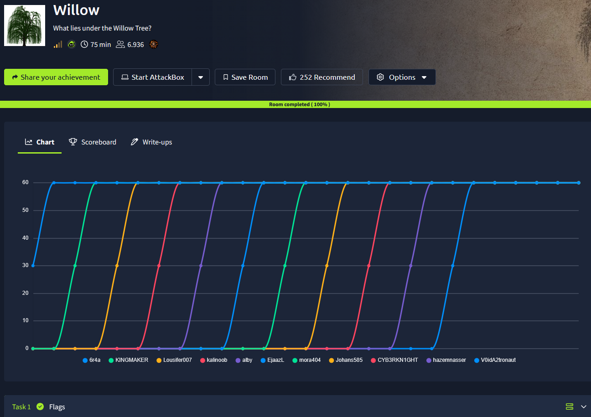

## _**Enumeração**_
Primeiro, vamos começar com um scan <mark>Nmap</mark>
> ```bash
> nmap [ip_address]
> nmap -sS -p- -T5 [ip_address]
> nmap -p [ports_discovered] -A [ip_address]
> ```
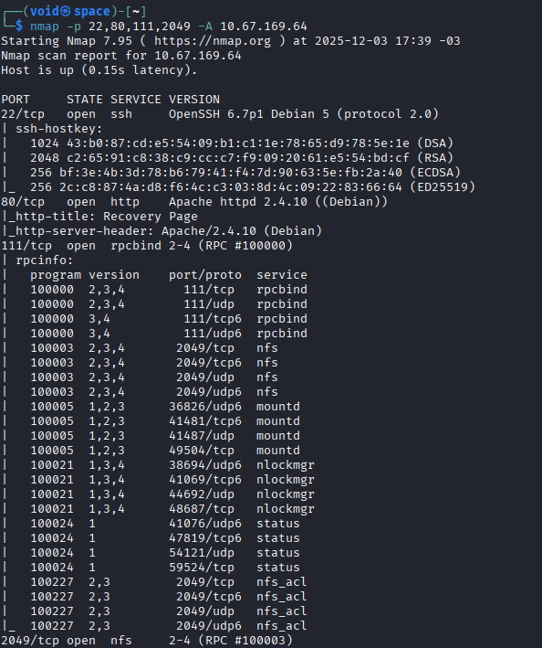

Temos 4 serviços de interesse:
* **SSH**
* **Página web**
* **RPCBIND**
* **NFS**

Primeiro, vamos enumerar o serviço **NFS** com os comandos abaixo  
> ```bash
> showmount -e [ip_address]
> showmount -a [ip_address]
> showmount -d [ip_address]
> ```
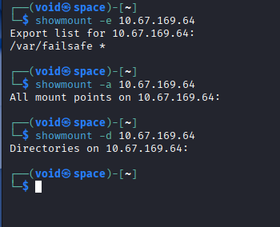

Conseguimos descobrir um diretório com o símbolo ```*```  
Isso significa que este diretório pode ser exportado para _qualquer usuário da rede_  
Permissões estão em modo _default_  
Vamos tentar exportar para nossa máquina com os comandos abaixo e verificar se obtivemos sucesso
> ```bash
> sudo mkdir /mnt/nfs_exploit
> sudo mount -t nfs [ip_address]:/var/failsafe /mnt/nfs_exploit
> mount | grep nfs_exploit
> ls -la /mnt/nfs_exploit
> ```
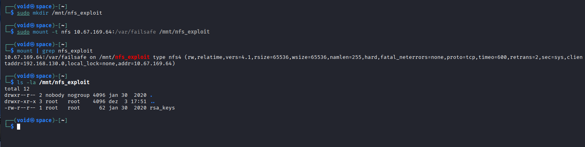

Temos um arquivo com nome **rsa_keys**, parece promissor  
Lendo o arquivo, temos o seguinte
* Public Key Pair: (23, 37627)
* Private Key Pair: (61527, 37627)

Esse é um exemplo de um par de criptografia de chave pública RSA  
Os dois pares de números são conhecidos como **Expoentes** e **Módulo**  
Ainda não sei o que posso fazer com eles, então voltamos para enumeração  
Agora, vamos verificar a página web  
Visitando, é uma longa _string_ de números  
Parece que teremos que usar os números descobertos junto dessa _string_  
Após algum tempo quebrando a cabeça, utilizamos <mark>Cyberchef</mark> para descriptografar a string que nos revela o seguinte  

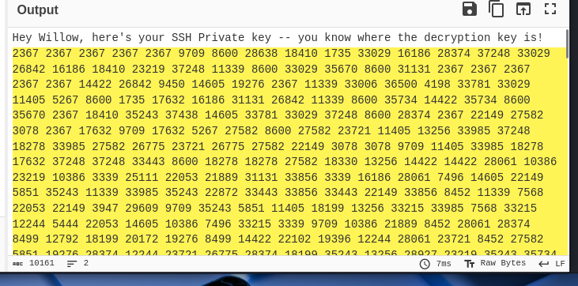

Temos uma mensagem  
Já sabemos quais são os valores de chave para criptografar e descriptografar  
Acessando (https://www.cs.drexel.edu/~popyack/Courses/CSP/Fa17/notes/10.1_Cryptography/RSA_Express_EncryptDecrypt_v2.html)[este link], podemos gerar a real chave  
Em seguida, vamos utilizar <mark>John the Ripper</mark> para tentar um ataque de força bruta
> ```bash
> ssh2john [filename] > [hash_filename]
> john -w=[wordlist_path] [hash_filename]
> ```
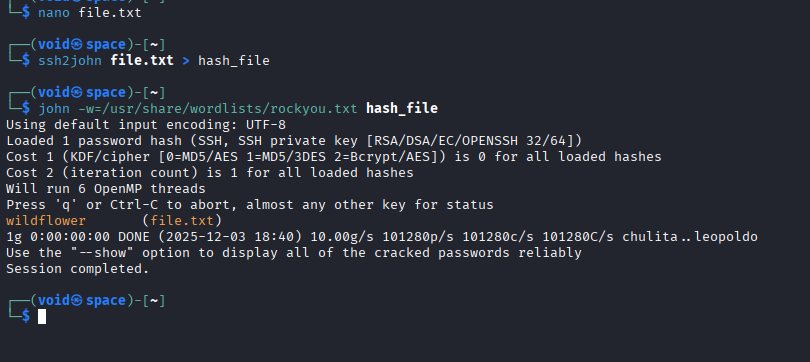

Agora, vamos utilizar o comando para realizar login via SSH
> ```bash
> ssh -i [filename] willow@[ip_address] -o PubkeyAcceptedKeyTypes=+ssh-rsa
> ```
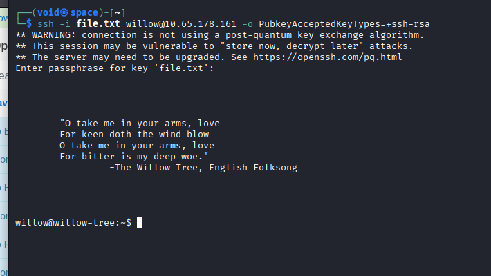

## _**Escalando privilégios**_
Vasculhando o diretório em que estamos, temos um arquivo _.jpg_ que podemos verificar após transferir para a nossa máquina com **SCP**
> ```bash
> scp [username]@[ip_address]:/path/to/file /local/path
> ```
Obtemos a primeira flag  
Tentando escalar privilégios, nosso comando ```sudo -l``` nos levou a um comando que poderiamos executar e obter _root_  

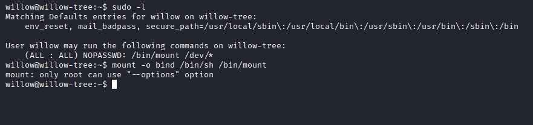

Após quebrar a cabeça por um tempo, nada foi obtido  
Continuando nossa enumeração, encontramos um arquivo de nome _hidden_backups_  
Nisso, podemos usar _mount_ para poder obter acesso a este arquivo, já que não temos permissão no momento  
Tentamos:
> ```bash
> mkdir /home/willow/dir
> sudo mount /dev/hidden_backup /home/willow/dir
> ```
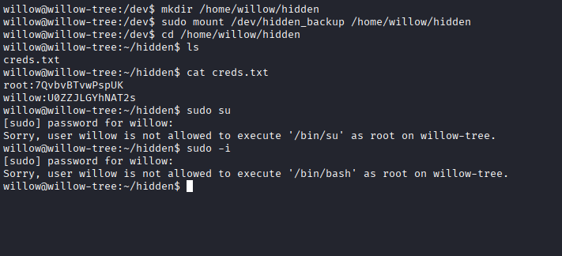

Realmente não podemos realizar login via estes comandos  
Vamos como root em SSH  
Também sem sucesso  
Tentando o comando ```sudo mount -o bind /bin/sh /bin/mount && sudo mount``` dado pelo GFTOBins, também não  
Por fim, com ```su root``` e a senha dada, conseguimos!

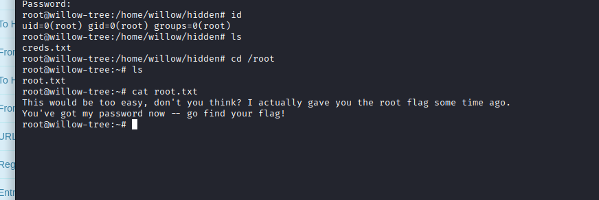

Parece que saímos do tradicional  
A flag não está em /root/root.txt  
Continuando a vasculhar, mas nada, nenhum arquivo relacionado ou pista  
A não ser a imagem que extraímos  
Ao tentar abri-la, manualmente, não foi possível  
Tentamos então, extrair para ver se tem algum conteúdo escondido com <mark>steghide</mark>, e encontramos!  

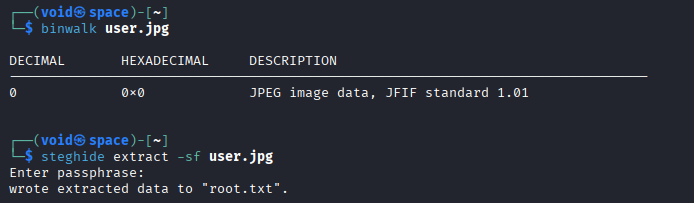
