# _**Poster CTF**_
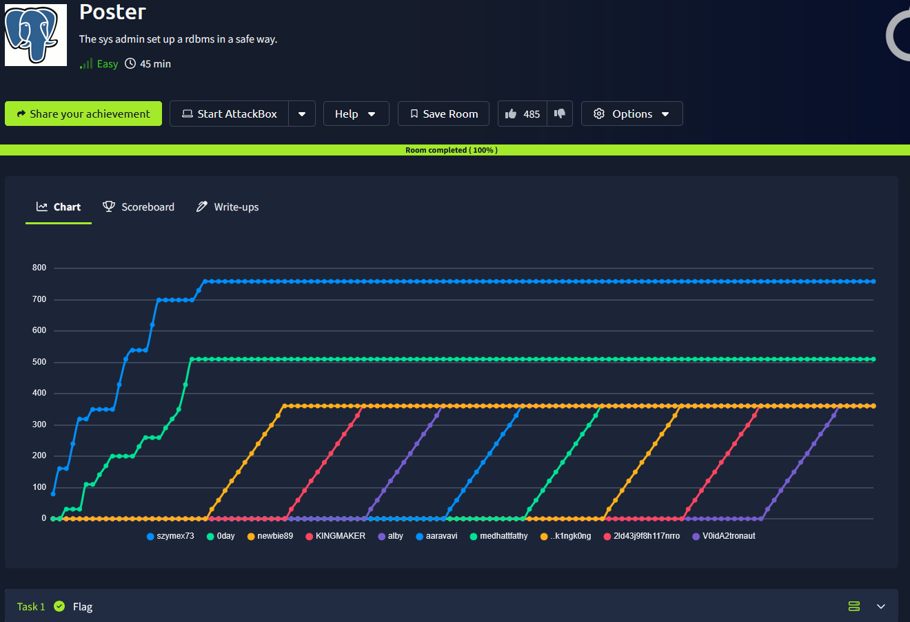

## _**Enumeração**_
Primeiro, vamos começar com um scan <mark>Nmap</mark>
> ```bash
> nmap -p 0-9999 -A -T5 [ip_address]
> ```
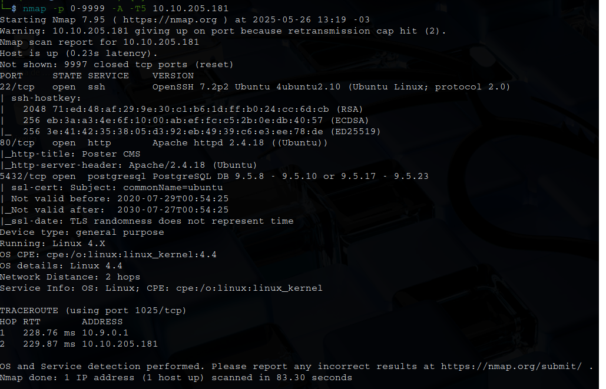

Parece que temos um banco de dados, <mark>PostgresSQL DB</mark> na porta 5432  
Vamos investigar a página web primeiro  
Nada muito relevante  
Após, vamos utilizar o <mark>Metasploit</mark> para encontrar uma vulnerabilidade na aplicação  


As etapas a seguir foram feitas para poder encontrar um módulo de tentativa de enumeração de usuário e senha  

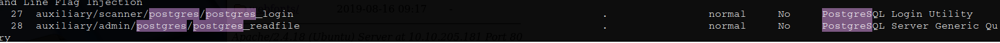  

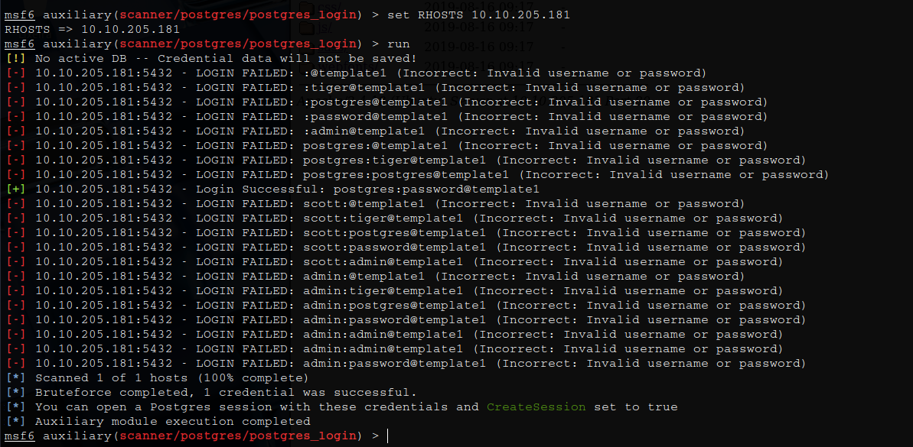  

Conseguimos!  
Vamos agora escolher outro módulo para conseguirmos executar comandos com as credenciais encontradas  

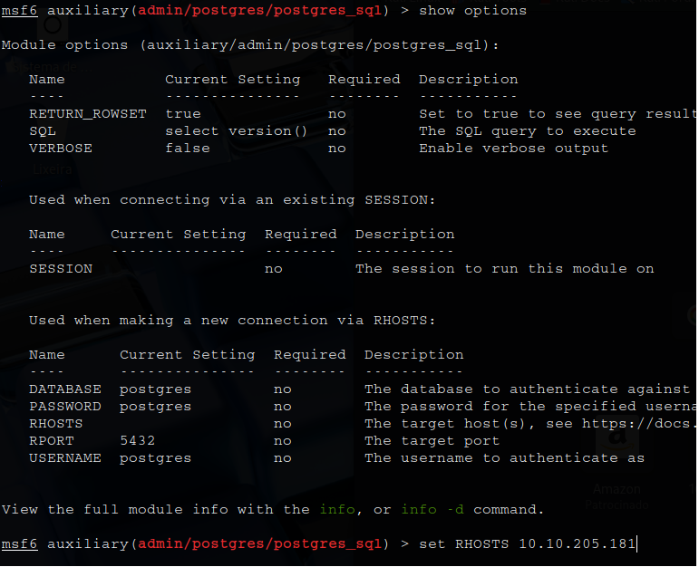

Conseguimos a versão do **banco de dados**

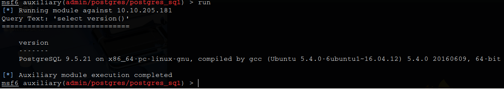

Vamos procurar um módulo para extrair hashes de usuários  

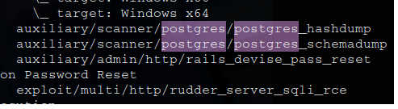

Configurando o módulo para as credenciais essenciais, executamos  

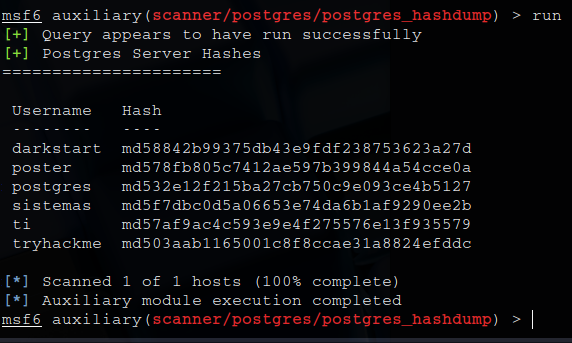

Com mais uma busca, conseguimos encontrar mais dois móudulos dos quais estão sendo requisitados  

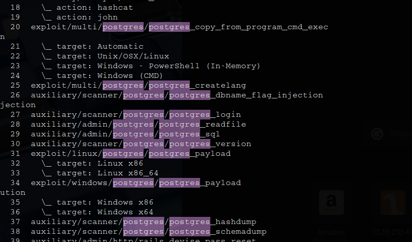

A partir deste último módulo, vamos configurá-lo e executar para podermos obter acesso a máquina-alvo  

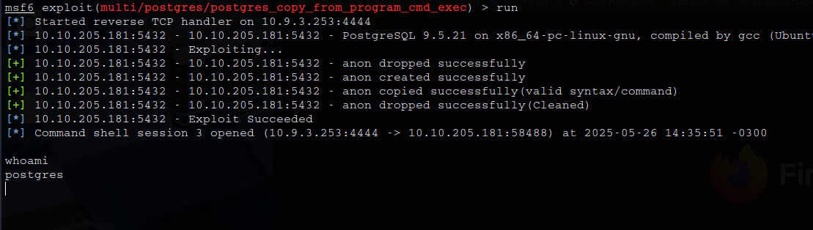

## _**Ganhando acesso**_
Parece que conseguimos encontrar um documento com credenciais de login SSH

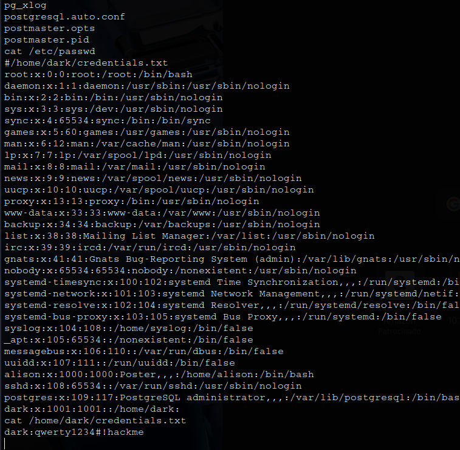

Vamos conseguir realizar com sucesso!

## _**Escalando privilégios**_
Para conseguirmos escalar privilégios, executamos alguns comandos como ```sudo -l``` e ```find```, mas sem muito sucesso  
Vamos tentar com [LinEnum.sh](https://github.com/rebootuser/LinEnum)  
Após a execução, investigando, temos o seguinte arquivo com credenciais!  

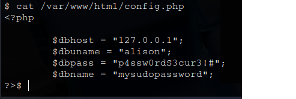

Conseguimos login!  
Agora, vamos escalar privilégios para _root_  
Primeiro, ```sudo -l```

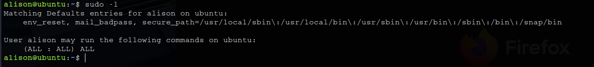

Parece que apenas um ```sudo su``` e temos _root_  
Basta agora buscar as flags!
