# __*Year of the rabbit**_
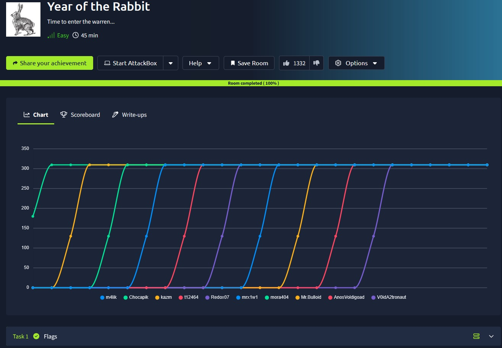

## _**Enumeração**_
Primeiro, vamos começar com um scan <mark>nmap</mark>
> ```bash
> nmap --open -A -T5 [ip_address]
> ```
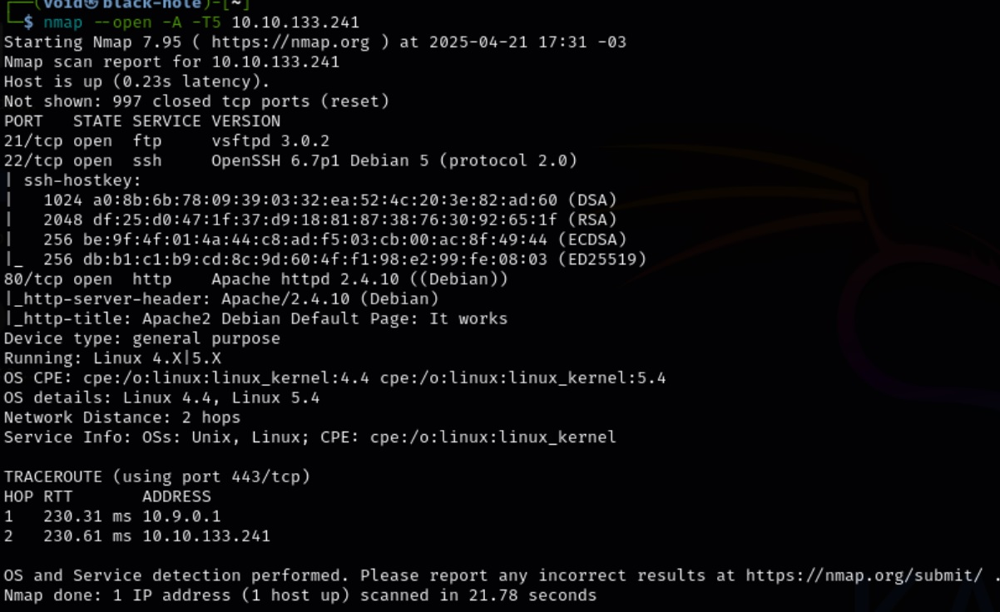

Também, vamos realizar um scan de diretórios com <mark>Gobuster</mark>
> ```bash
> gobuster dir --url [ip_address] -w ../seclists/Discovery/Web-Content/common.txt
> ```
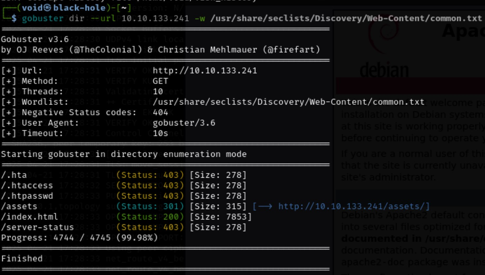

Vamos verificar os diretórios:  
<mark>/assets</mark>  

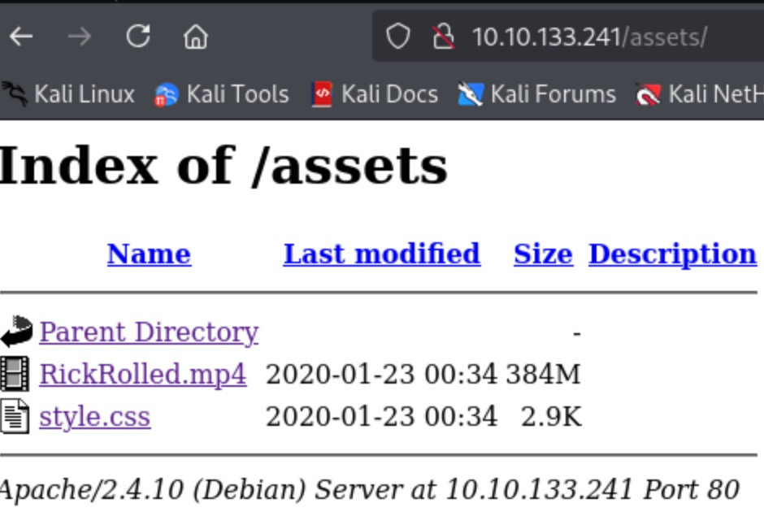

<mark>RickRolled.mp4</mark>  
É literalmente o vídeo da música, porém, existem trechos de áudio alterados:
> “está procurando no lugar errado”

<mark>/Style.css</mark>  

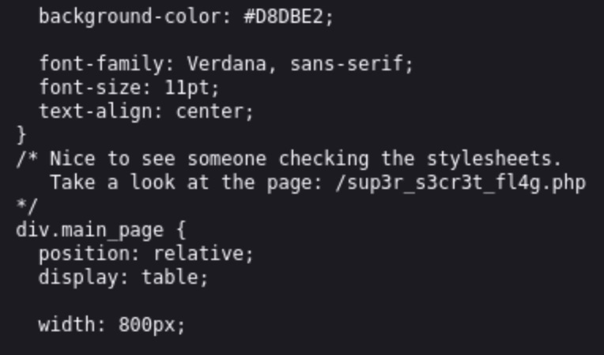

Investigando o link  

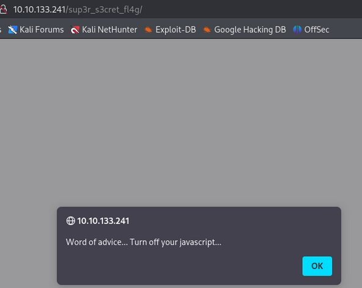

Investigando o link novamente com o JS desativado  


Acredito que não será a última vez que verei isto  
Vamos continuar  
Tentei novamente desabilitando o JavaScript e consegui chegar nesta página  

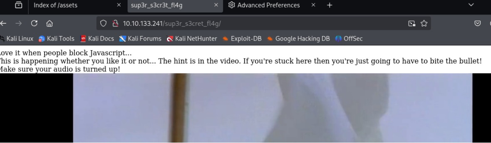

Realizei o download do vídeo com ```wget```  
Vamos verificar para ofuscação de dados no vídeo com <mark>binwalk</mark>
> ```bash
> binwalk -e RickRolled.mp4
> ```  
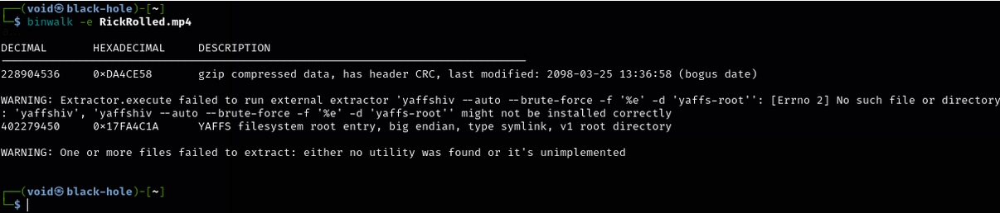

Extração feita com sucesso!  
Temos o seguinte:  

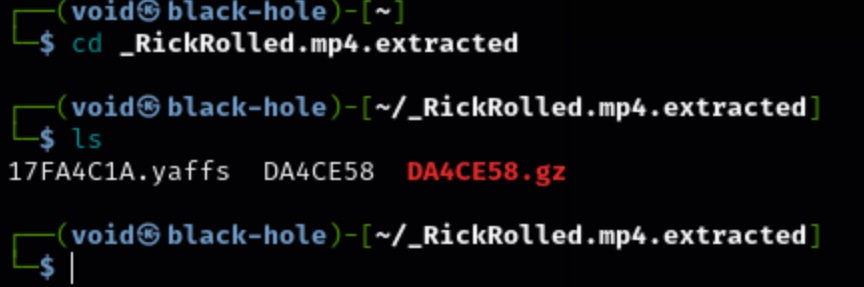

Investigando um pouco o que foi encontrado...  
Isto não leva a nada  
Vamos tentar com outra ferramenta, <mark>exiftoot</mark>  

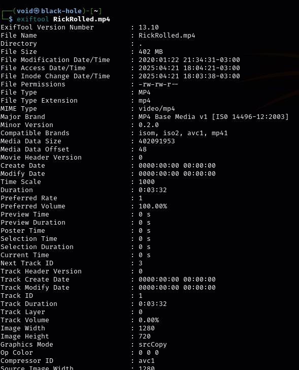

Parece não ter nada também  
Vamos analisar as requisições feitas pelo site com Burp Suite ao acessar os diretórios descobertos  
Afinal, DEVE ter algo escondido por ali  

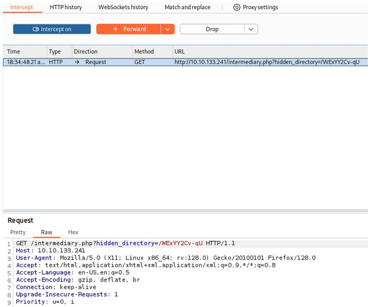

Temos um diretório escondido  
Vamos verificar ele  

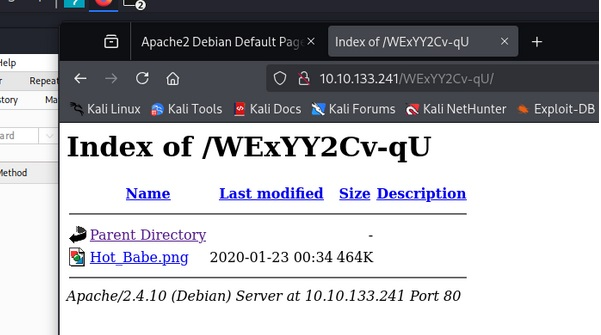

Vamos realizar o download da imagem com ```wget```  
Como steghide não aceita entradas do tipo _.png_, vamos tentar extrair seu conteúdo com <mark>binwalk</mark>  
> ```bash
> binwalk -e Hot_Babe.png
> ```  
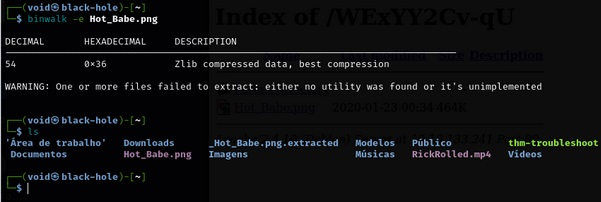

Não levou a nada  
Vamos tentar com <mark>exiftool</mark>  

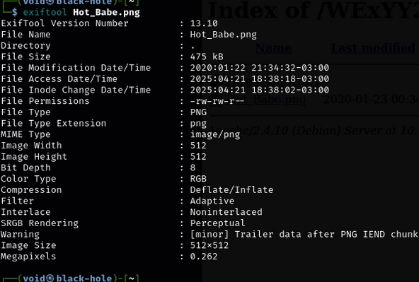

Nada também  
Vamos com a próxima, a ferramenta <mark>strings</mark>  

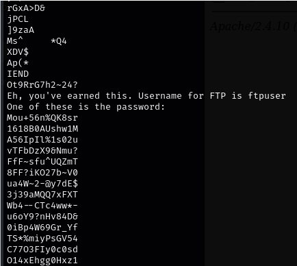

## _**Ganhando acesso**_
Temos um usuário: <mark>ftpuser</mark>  
E uma grande possibilidade de senhas  
Mas não é problema  
Vamos copiar elas para um arquivo _.txt_ e usar o <mark>hydra</mark> para realizar um ataque de força bruta com ele
> ```bash
> hydra -l ftpuser -p [passwd.txt] ftp://[ip_address]
> ```  
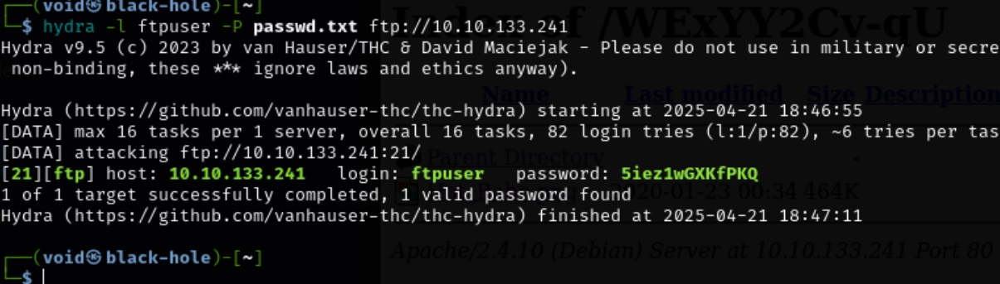

Conseguimos!  
Vamos realizar login  
Temos um arquivo  
Extraímos ele para nosso computador e verificamos com ```cat```  

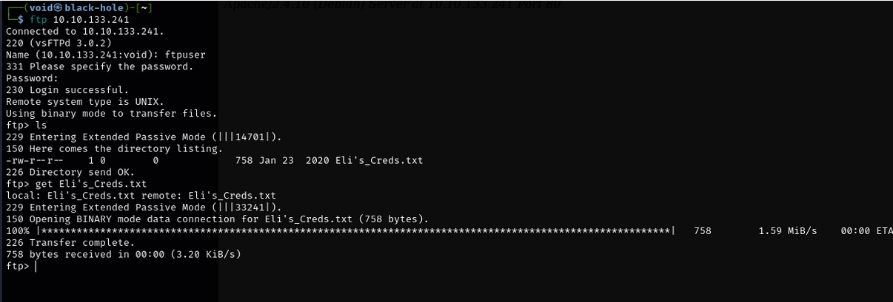  

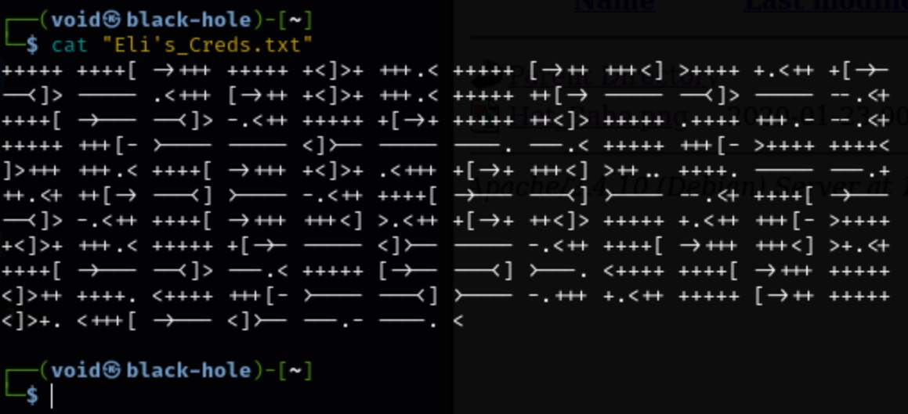  

Essa simbologia é conhecida, linguagem de programação _**brainfuck**_  
Vamos usar um decodificador online  

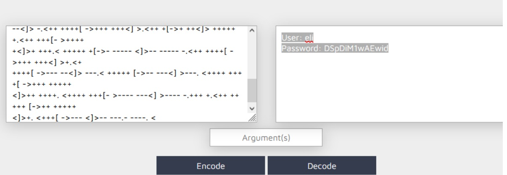

Temos usuário e senha!  
Vamos tentar login via _ssh_  

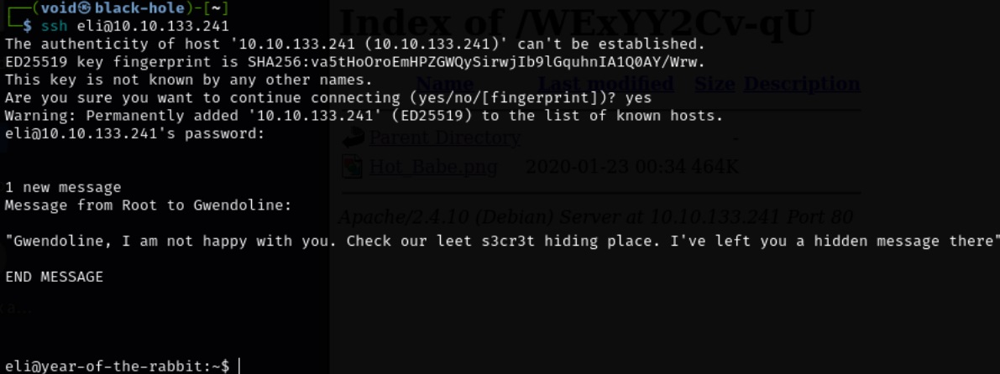

Vamos usar o comando find para tentar encontrar a primeira flag em _user.txt_
> ```bash
> find / -name user.txt 2>/dev/null
> ```  
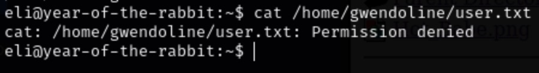

Vamos tentar buscar algo através da mensagem de banner deixada por _root_
> ```bash
> find / -name “secret” 2>/dev/null
> ```
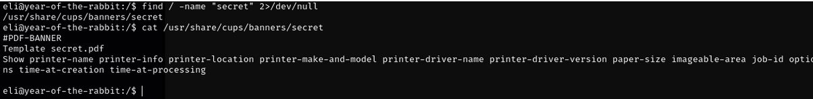

Vamos tentar de outra maneira
> ```bash
> find / -name s3cr3t 2>/dev/null
> ```
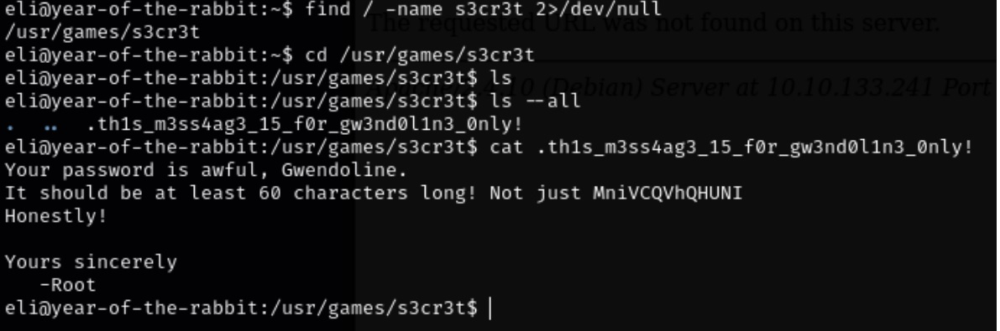

E assim, conseguimos a primeira _flag_  

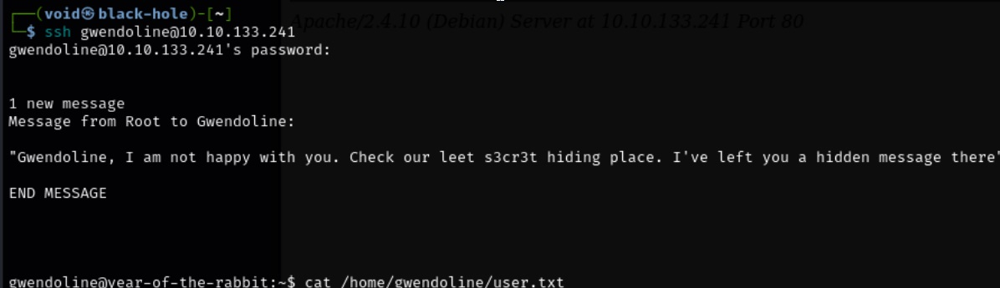

## _**Escalando privilégios**_
Vamos começar com um comando ```find```
> ```bash
> find / -writable -type f -name "*.sh" 2>/dev/null
> ```
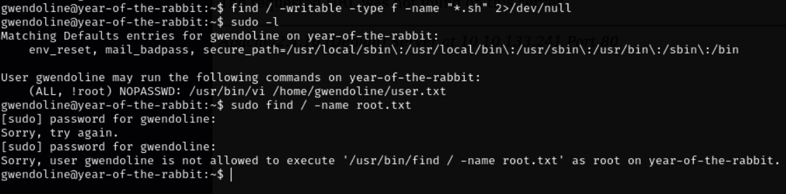

Apesar de existir a possibilidade de execução de comandos no arquivo, não foi possível escalar privilégios  
Vamos ter que buscar outros meios  
Pesquisando na Internet, encontramos a [CVE-2021-4034](https://nvd.nist.gov/vuln/detail/cve-2021-4034)  
Inicia-se o servidor python após baixar o exploit, transfere-se para a máquina-alvo, concede permissões e executa o exploit  

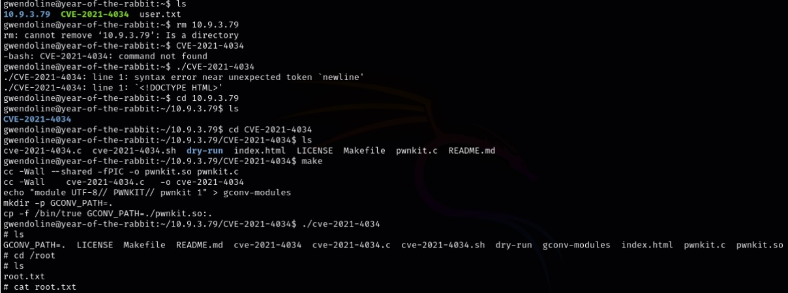

Conseguimos a última flag!
